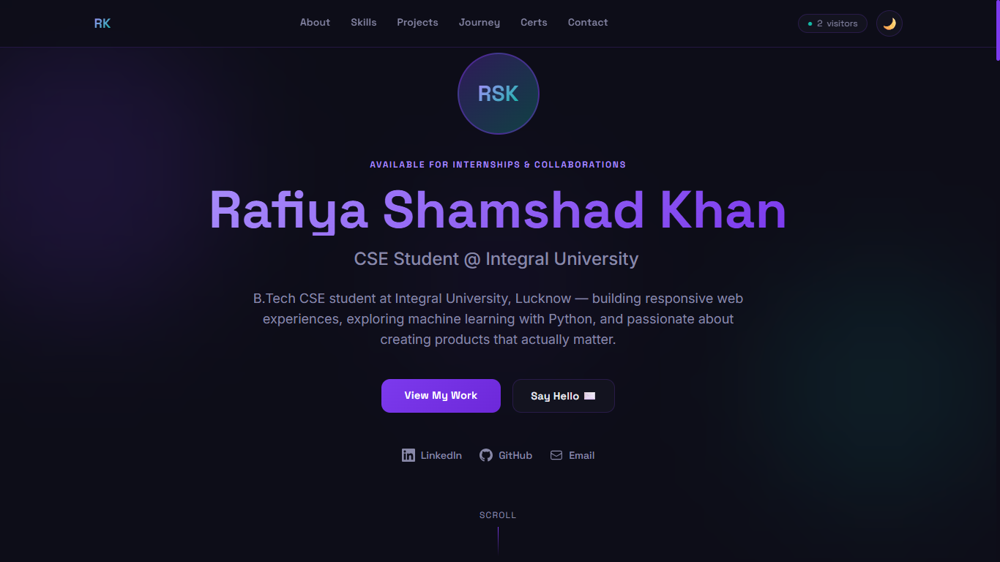
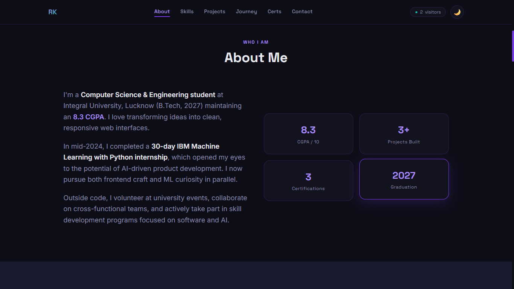
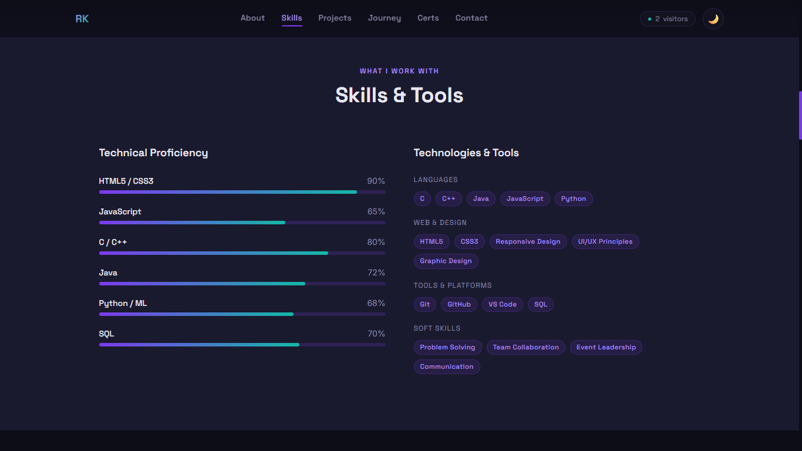
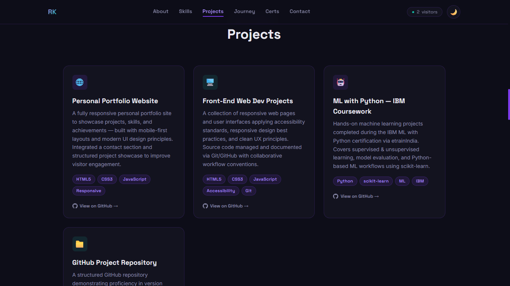
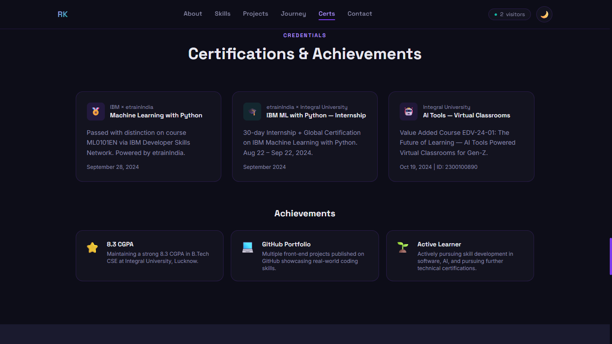

# Day 10 – AI Portfolio Website Generator

## Objective

The objective of this task was to build a complete personal portfolio website using Claude AI. The goal was to understand how AI can assist in front-end development by generating a professional, responsive, and visually appealing portfolio website from a well-structured prompt. This exercise also focused on learning how prompt quality impacts the quality of generated code and design.

## Prompting Strategy Used

I used a detailed and structured portfolio website prompt that included personal information, professional title, skills, projects, achievements, education details, social media links, and design preferences. By providing clear requirements such as responsive design, dark/light mode support, animations, and modern UI elements, Claude was able to generate a comprehensive portfolio website tailored to the provided information.

## What Claude Generated

Claude generated a complete single-page portfolio website that included:

* A responsive and modern user interface.
* Hero section with name, title, and social media links.
* About Me section highlighting personal and professional background.
* Skills section with categorized technical and soft skills.
* Projects showcase with descriptions and technology stacks.
* Achievements and certifications section.
* Contact section with direct contact information and a contact form.
* Smooth scrolling navigation and interactive UI elements.
* Mobile-friendly design with responsive layouts.
* Dark and light mode toggle functionality.
* SEO-friendly HTML structure and metadata.

---

## Files and Assets Included

### Generated HTML File

The following file was generated and tested:

* `portfolio.html` – Complete portfolio website containing HTML, Tailwind CSS, and JavaScript in a single file.

### Screenshots Added

The following screenshots were captured and uploaded to demonstrate the functionality and design of the portfolio website:

1. **Homepage / Hero Section Screenshot**
   
     

   * Displays the introduction, professional title, and navigation menu.

2. **About Me Section Screenshot**

     
   
   * Highlights personal background, interests, and career goals.

3. **Skills Section Screenshot**

     
   
   * Shows technical skills, tools, and soft skills with visual indicators.

4. **Projects Section Screenshot**

     
   
   * Displays project cards with descriptions and technology stacks.

5. **Key Milestones Screenshot**

     

6. **Achievements & Certifications Screenshot**

     
   
   * Highlights certifications, awards, hackathons, and accomplishments.

9. **Contact Section Screenshot**

     
   
   * Shows contact information and communication options.

---

## Key Learnings

### 1. AI Can Generate Complete Websites

One of the biggest takeaways from this exercise was seeing how Claude can generate a fully functional portfolio website from a single prompt. The generated output included structure, styling, responsiveness, and interactive elements without requiring extensive manual coding.

### 2. Better Inputs Produce Better Outputs

The quality of the generated website was directly influenced by the quality of the information provided. Detailed descriptions, project information, and design preferences resulted in a more personalized and professional portfolio.

### 3. HTML, CSS, and JavaScript Integration

Claude successfully combined HTML, Tailwind CSS, and JavaScript into a single file. This demonstrated how AI can simplify front-end development by generating integrated solutions that are ready to run immediately.

### 4. Rapid Prototyping and Development

Traditionally, creating a portfolio website can take several hours or even days. Using Claude significantly reduced development time by generating a working prototype within minutes, allowing more time for customization and refinement.

### 5. Importance of Testing and Refinement

Although the generated website was functional, testing was necessary to ensure responsiveness, proper alignment, and content accuracy. Small adjustments improved the overall user experience and presentation.

### 6. Portfolio Customization and Deployment

The generated website can be further customized with additional projects, animations, and branding elements. It can also be deployed on platforms such as Vercel or Netlify, making it publicly accessible to recruiters and potential employers.

---

## Challenges Faced

During the implementation process, a few challenges were encountered:

* Some content required manual customization to better reflect personal achievements and experiences.
* Minor UI adjustments were needed to improve spacing and responsiveness.
* Certain sections required refinement to align with personal branding preferences.
* Testing across different screen sizes was necessary to ensure a consistent user experience.

---

## Outcome

Successfully generated, customized, and tested a personal portfolio website using Claude AI. This activity demonstrated how AI can accelerate web development workflows by generating production-ready code while still allowing room for personalization and creativity. The project also reinforced the importance of effective prompting, testing, and iterative improvements when working with AI-generated solutions.

---

## Conclusion

This exercise provided hands-on experience in using AI for web development and personal branding. By leveraging Claude AI, I was able to quickly create a professional portfolio website, understand the impact of prompt engineering, and explore how AI can be used as a productivity tool in modern software development workflows.

---
