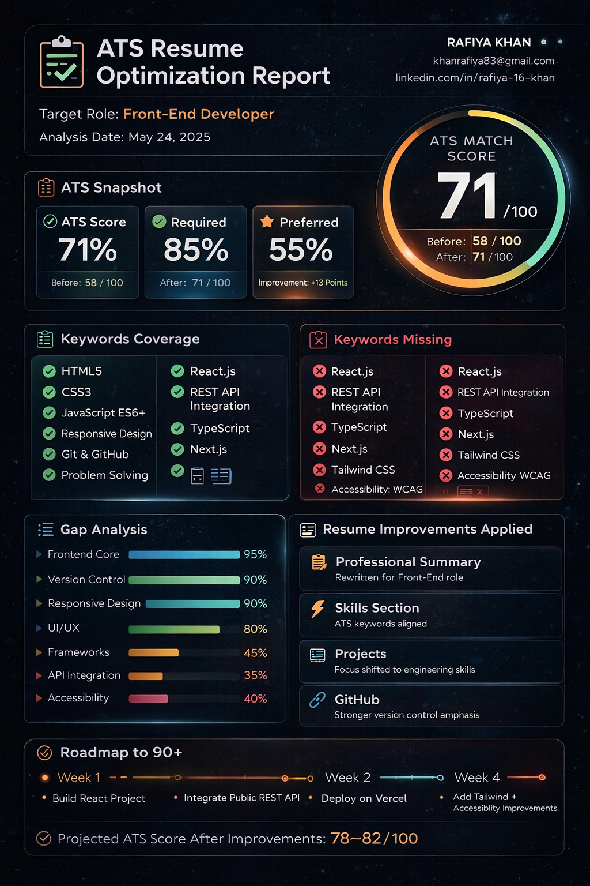
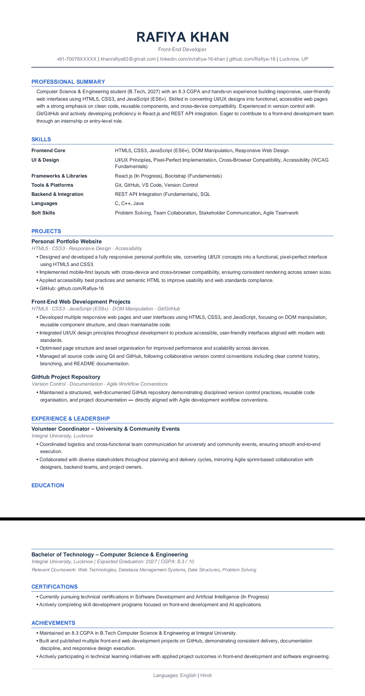

# Day 11 – ATS Resume Optimization with Claude

## Objective

The goal of this task was to understand how Applicant Tracking Systems (ATS) evaluate resumes, identify keyword gaps, optimize resume content according to a target job description, and improve recruiter visibility.

---

## Tools Used

- Claude AI
- Resume
- Front-End Developer Job Description
- GitHub

---

# Target Role: Front-End Developer

## Responsibilities

- Develop responsive and user-friendly web applications.
- Convert UI/UX designs into functional web interfaces.
- Build reusable frontend components.
- Integrate frontend applications with APIs.
- Optimize applications for performance and accessibility.
- Ensure cross-browser compatibility.
- Collaborate with developers, designers, and stakeholders.

## Required Skills

- HTML5
- CSS3
- JavaScript (ES6+)
- Responsive Web Design
- Git & GitHub
- REST API Integration
- DOM Manipulation
- Cross-Browser Compatibility
- Version Control
- Problem Solving

## Preferred Skills

- React.js
- Tailwind CSS
- Bootstrap
- TypeScript
- Next.js
- Accessibility (WCAG)
- Web Performance Optimization

---

# ATS Analysis Results

## ATS Match Score

| Metric | Score |
|----------|----------|
| ATS Match Score | 71 / 100 |
| Required Skills Match | 85% |
| Preferred Skills Match | 55% |
| Resume Readability | 92% |

### Analysis Summary

My resume showed strong alignment with Front-End Development roles because it already included HTML5, CSS3, JavaScript, Git/GitHub, responsive design, and problem-solving skills.

The primary gaps were related to advanced frontend technologies and modern development practices such as React.js, REST API Integration, Tailwind CSS, TypeScript, Accessibility, and Performance Optimization.

---

# Gap Analysis

## Missing Keywords

- REST API Integration
- DOM Manipulation
- Cross-Browser Compatibility
- ES6+
- Reusable Components
- Pixel-Perfect Implementation
- Performance Optimization
- Accessibility (WCAG)
- Agile Development
- TypeScript
- Next.js
- Tailwind CSS
- Bootstrap

## Missing Skills

- React.js Project Experience
- API Integration Experience
- Component-Based Architecture

## Improvement Opportunities

### Professional Summary

- Rewritten to align with Front-End Developer requirements.
- Added modern frontend terminology.

### Skills Section

- Reorganized according to ATS standards.
- Included frontend-specific keywords.

### Projects Section

- Reframed project descriptions to emphasize:
  - DOM Manipulation
  - Responsive Design
  - Accessibility
  - Cross-Browser Compatibility
  - Maintainable Code

### GitHub Projects

- Highlighted version control practices.
- Added stronger emphasis on project documentation and collaboration.

---

# ATS Dashboard

## ATS Optimization Report

## ATS Optimization Resume

---

# Resume Optimization Highlights

## Professional Summary Improvements

Added:

- HTML5
- CSS3
- JavaScript (ES6+)
- Responsive Design
- Accessibility
- Reusable Components
- React.js (In Progress)
- REST API Integration (Fundamentals)

## Skills Improvements

Added:

- DOM Manipulation
- Cross-Browser Compatibility
- Accessibility Fundamentals
- UI/UX Principles
- REST API Integration
- Agile Teamwork

## Project Improvements

Projects were rewritten to demonstrate:

- Front-End Engineering Skills
- Responsive Development
- Maintainable Code Practices
- Performance Awareness
- Industry-Relevant Development Standards

---

# Key Learnings

### 1. ATS Systems Prioritize Keywords

A resume may be technically strong but still score lower if important keywords from the job description are missing.

### 2. Projects Matter More Than Skill Lists

Listing a technology is not enough. Recruiters and ATS systems prefer seeing skills demonstrated through project descriptions.

### 3. Role Alignment Is Critical

The same resume can score very differently depending on the target role.

### 4. Front-End Development Is My Strongest Match

Compared to Data Analyst roles, my existing projects and skills align more naturally with Front-End Development opportunities.

### 5. Continuous Improvement Matters

Small additions such as a React project or REST API integration can significantly improve ATS performance.

---

# Future Action Plan

## Week 1

- Build a React.js project.

## Week 2

- Integrate a public REST API into a project.

## Week 3

- Deploy projects using Vercel.

## Week 4

- Implement accessibility improvements and Tailwind CSS.

### Expected ATS Score After Improvements

**78–82 / 100**

---

# Conclusion

This task helped me understand how ATS systems evaluate resumes, identify skill gaps, optimize resume content, and align my profile with Front-End Developer job requirements. The exercise demonstrated the importance of keyword optimization, project-based skill validation, and role-specific resume customization.

---
