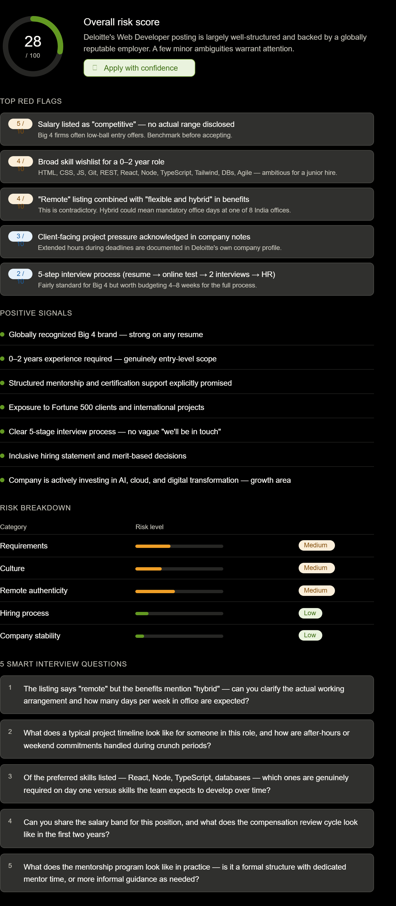

# Day 14 – AI Job Red Flag Detector

## Objective

Analyze a real-world job opportunity using AI to identify potential risks, evaluate company credibility, assess hiring transparency, and generate targeted interview questions.

---

## Selected Company

**Deloitte**

## Selected Role

**Web Developer**

---

## Overall Risk Score

**28 / 100**

### Verdict

✅ **Apply with Confidence**

The role is offered by a globally recognized Big 4 consulting firm with strong career growth opportunities, structured mentorship, and exposure to enterprise-scale projects. While a few minor concerns exist, the overall risk level remains low.

---

## Top Red Flags Identified

### 1. Salary Transparency

* Compensation listed as "competitive"
* No salary range disclosed
* Candidates should benchmark market salaries before accepting an offer

### 2. Broad Skill Expectations

The role expects familiarity with:

* HTML
* CSS
* JavaScript
* Git
* REST APIs
* React
* Node.js
* TypeScript
* Tailwind CSS
* Databases
* Agile

This is a relatively wide skill set for a 0–2 year position.

### 3. Remote vs Hybrid Ambiguity

* Job listing mentions remote work
* Benefits mention hybrid work
* Actual office attendance requirements may vary

### 4. Client Project Pressure

* Client-facing consulting projects can occasionally require extended hours during critical deadlines.

### 5. Multi-Stage Hiring Process

* Resume Screening
* Online Assessment
* Technical Interviews
* HR Round

The process may take several weeks to complete.

---

## Result Image

---

## Positive Signals

✅ Globally recognized Big 4 organization

✅ Genuine entry-level opportunity

✅ Structured mentorship programs

✅ Certification support and learning resources

✅ Exposure to Fortune 500 clients

✅ Clearly defined hiring process

✅ Inclusive and merit-based hiring practices

✅ Strong investment in AI, Cloud, and Digital Transformation

---

## Risk Breakdown

| Category            | Risk Level |
| ------------------- | ---------- |
| Requirements        | Medium     |
| Culture             | Medium     |
| Remote Authenticity | Medium     |
| Hiring Process      | Low        |
| Company Stability   | Low        |

---

## Smart Interview Questions Generated

### Question 1

The listing mentions remote work while benefits mention hybrid work. Can you clarify the expected working arrangement?

### Question 2

What does a typical project timeline look like, and how are overtime or weekend commitments handled during peak delivery periods?

### Question 3

Which preferred skills are required on Day 1, and which can be learned after joining?

### Question 4

Can you share the salary band for this position and explain the compensation review cycle?

### Question 5

How does the mentorship program work in practice for new hires?

---

## Key Learnings

* AI can effectively evaluate job opportunities before applying.
* Company research provides important context beyond the job description.
* Salary transparency remains an important factor when assessing opportunities.
* Structured hiring processes often indicate organizational maturity.
* Interview preparation becomes more focused when based on role-specific risk analysis.
* Data-driven decision making can improve career planning and job selection.

---

## Outcome

Successfully used Claude AI to analyze a Web Developer opportunity at Deloitte, identify potential red flags, assess company credibility, evaluate hiring transparency, and generate targeted interview questions for better career decision-making.
