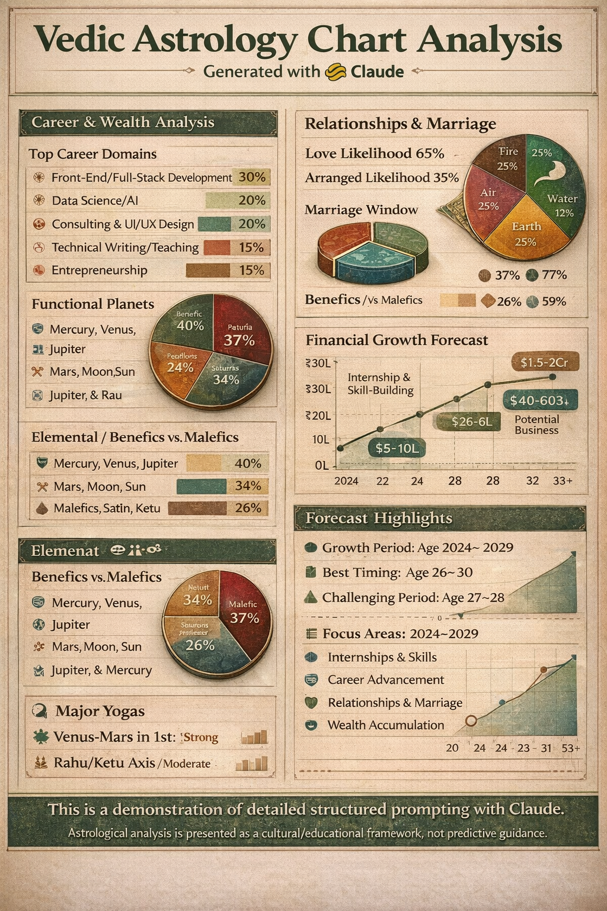

# Day 15 – Advanced Structured Prompting with Claude

## Objective

The goal of this assignment was to explore advanced prompt engineering techniques by generating a large-scale analytical report using Claude AI and transforming the generated information into a professional visual infographic.

---

## Assignment Workflow

### Step 1: Prompt Execution

Created a detailed structured prompt and provided all required inputs.

### Step 2: Report Generation

Claude generated a comprehensive report covering multiple analytical dimensions.

### Step 3: Analysis Review

Reviewed all major report sections and identified key insights.

### Step 4: Visualization

Converted the lengthy report into a visual infographic using charts, metrics, and structured design elements.

### Step 5: Documentation

Documented outcomes, observations, and learnings in this repository.

---

## Report Coverage

### Career Analysis
- Career suitability assessment
- Leadership potential
- Employment vs entrepreneurship analysis
- Professional growth opportunities

### Wealth Analysis
- Financial behavior framework
- Wealth accumulation insights
- Investment perspectives
- Long-term financial planning concepts

### Life Pattern Analysis
- Personality framework
- Behavioral observations
- Growth opportunities
- Development areas

### Relationship Analysis
- Communication tendencies
- Relationship dynamics
- Compatibility considerations

### Forecast Framework
- Multi-year outlook structure
- Opportunity mapping
- Challenge identification
- Development timelines

### Recommendation Section
- Career recommendations
- Learning recommendations
- Productivity improvements
- Personal development suggestions

---

## Result Image
 

---

## Infographic Highlights

The generated infographic summarizes:

📊 Report Section Distribution

📈 Analysis Category Coverage

🎯 Career & Growth Focus Areas

💡 Recommendation Categories

📚 Learning Outcomes

📋 Structured Prompting Workflow

---

## Skills Practiced

### Prompt Engineering
Learned how prompt structure significantly impacts:

- Response quality
- Information depth
- Consistency
- Context retention

### AI Report Generation
Observed how Claude can:

- Generate long-form outputs
- Maintain structure across large responses
- Follow hierarchical instructions
- Organize complex information

### Information Visualization
Practiced converting extensive text into:

- Infographics
- Charts
- Visual summaries
- Presentation-ready content

### Documentation
Improved skills in:

- Technical writing
- Report summarization
- Project presentation
- Knowledge organization

---

## Key Learnings

- Detailed prompts generate significantly better outputs.
- Structured inputs produce more organized reports.
- AI can effectively assist in large-scale report creation.
- Visual representations improve information accessibility.
- Prompt engineering is becoming an increasingly valuable skill for working with modern AI systems.

---

## Outcome

Successfully generated a comprehensive AI-powered analytical report using Claude and transformed the results into a professional infographic demonstrating advanced prompt engineering and information visualization techniques.

---

## Educational Disclaimer

This project demonstrates advanced structured prompting and AI-generated report creation using Claude AI.

The astrological content included in the generated report was used solely as a cultural and educational framework for exploring AI capabilities and should not be interpreted as predictive guidance or used for real-life decision-making.

---

## Status

✅ Completed Successfully