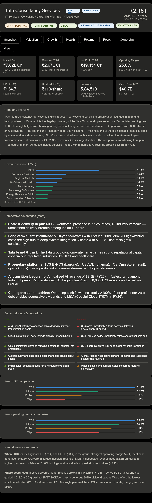

# Day 16 – Custom Skill: Stock Fundamental Research

## Objective

The objective of today's task was to create a reusable Claude Custom Skill capable of performing structured stock fundamental analysis. The skill was designed to analyze companies using financial statements, valuation metrics, profitability ratios, ownership patterns, competitive advantages, risk factors, and growth prospects.

---

## Skill Created

**Skill Name:** stock-fundamental-research

### Description

Analyze Indian and global listed companies using fundamentals, financial statements, business quality, competitive advantages, valuation, risks, and growth prospects. Generate evidence-based research reports and investor-friendly summaries. Never provide direct buy, sell, or hold recommendations.

---

## Tasks Completed

* Created a new Claude Custom Skill
* Added custom description and detailed instructions
* Configured multiple analysis modes:

  * Quick Take
  * Deep Dive
  * Compare
  * Pros & Cons
  * Portfolio Fit
* Tested the skill on:

  * Tata Consultancy Services (TCS)
  * Infosys
  * HDFC Bank
* Generated comparative stock research reports
* Reviewed valuation metrics, profitability, ownership trends, and risk factors
* Captured screenshots of the generated outputs
* Verified skill reusability without re-entering prompts

---

## Stock Analysis Performed

### TCS Analysis

Key observations:

* Revenue FY26: ₹2.67 Lakh Cr
* Net Profit FY26: ₹49,454 Cr
* Operating Margin: 25%
* Dividend: ₹110/share
* AI Revenue Annualized: $2.3 Billion

### Competitive Advantages

* Large global delivery network
* Strong Tata brand value
* High client retention
* Strong cash generation
* Leadership in AI transformation initiatives

### Risks Identified

* Global IT spending slowdown
* Currency fluctuations
* AI-driven industry disruption
* Margin pressure due to wage inflation

---

## TCS vs Infosys Comparison

### Metrics Compared

* CMP
* Market Cap
* P/E Ratio
* P/B Ratio
* EV/EBITDA
* Revenue Growth
* Profit Growth
* EBITDA Margin
* ROE
* ROCE
* Debt-to-Equity
* Dividend History
* Ownership Trends

### Findings

#### Where TCS Leads

* Higher profitability
* Higher ROE and ROCE
* Better operating margins
* Stronger cash generation
* Larger market capitalization

#### Where Infosys Leads

* Lower valuation multiples
* Strong recent growth momentum
* Aggressive AI adoption strategy
* Shareholder-friendly buyback programs

---

## HDFC Bank Analysis

### Key Highlights

* India's largest private-sector bank
* Strong retail banking franchise
* Healthy balance sheet
* Stable profitability
* Strong institutional ownership

### Watch Points

* Post-merger integration
* Deposit growth momentum
* Margin sustainability

---

## Key Learnings

### Reusable AI Workflows

Custom Skills eliminate repetitive prompting and provide consistent outputs.

### Structured Financial Research

AI can organize complex financial information into an easy-to-read format.

### Fundamental Analysis Framework

Learned how to evaluate:

* Business Quality
* Valuation
* Profitability
* Growth
* Ownership Patterns
* Competitive Moats
* Risk Factors

### AI for Financial Research

Claude Custom Skills can significantly improve research productivity while maintaining structured analysis.

---

## Results

### TCS Research Report

### TCS vs Infosys Comparison

[View PDF Report](./TCSvsInfosysComparison.pdf)

---

## Conclusion

Successfully built and tested a reusable stock-fundamental-research skill in Claude. The project demonstrated how AI can automate stock research workflows, generate structured financial analysis, and improve productivity through reusable custom skills.
