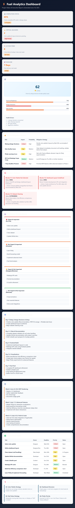
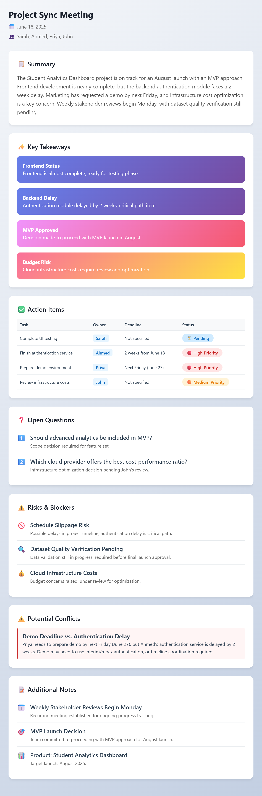
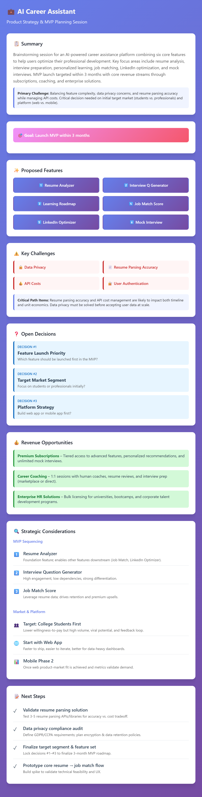

# Day 18 – Brain Dump Action Planner Custom Skill

## Overview

Today I built and tested a reusable Claude Custom Skill called **Brain Dump Action Planner**.

The objective was to transform unstructured information such as meeting notes, brainstorming sessions, project discussions, class notes, and voice memo transcripts into actionable project plans, executive summaries, risk assessments, and interactive dashboards.

---

## Custom Skill

**Skill Name:** brain-dump-action-planner

### Purpose

The skill automatically:

* Generates executive summaries
* Extracts action items
* Identifies risks and blockers
* Detects dependencies and conflicts
* Creates priority matrices
* Produces project health scores
* Generates interactive dashboards
* Structures outputs into reusable formats

---

## Test Scenarios

### Test 1: Project Sync Meeting

Input:

* Product launch discussion
* Backend delays
* Infrastructure budget concerns
* MVP planning

Output Generated:

* Executive Summary
* Action Item Tracker
* Open Questions
* Risk Assessment
* Conflict Detection
* Stakeholder Insights

---

### Test 2: AI Career Assistant Brainstorming Session

Input:

* Product ideation notes
* Feature brainstorming
* Revenue opportunities
* MVP roadmap

Output Generated:

* Strategic Planning Dashboard
* Feature Prioritization
* Revenue Analysis
* Challenge Identification
* Product Roadmap
* Execution Recommendations

---

## Key Insights

### Meeting Intelligence

The skill successfully identified:

* Schedule risks
* Dependency conflicts
* Resource bottlenecks
* Ownership assignments
* Launch blockers

### Product Strategy Intelligence

The skill successfully identified:

* MVP sequencing strategy
* Revenue opportunities
* Technical risks
* Market entry recommendations
* Feature prioritization

---

## Dashboard Features

### Executive Summary Section

Provides a concise overview of project status and major decisions.

### Action Item Management

Tracks:

* Tasks
* Owners
* Deadlines
* Priorities
* Status

### Risk & Blocker Analysis

Highlights:

* Project risks
* Technical blockers
* Operational concerns
* Mitigation strategies

### Strategic Decision Support

Identifies:

* Open questions
* Business decisions
* Product priorities
* Execution plans

---

## Skills Demonstrated

* Prompt Engineering
* AI Workflow Design
* Project Analysis
* Business Intelligence
* Dashboard Generation
* Risk Assessment
* Strategic Planning
* Productivity Automation

---

## Screenshots

### Action Items & Risk Analysis

### Project Meeting Dashboard

### AI Career Assistant Dashboard

---

## Key Learnings

* Custom Skills eliminate repetitive prompting.
* Structured workflows improve output consistency.
* AI can function as a project analyst and execution planner.
* Dashboards improve decision-making visibility.
* Reusable skills significantly increase productivity.

---

## Outcome

Successfully created and tested a reusable AI-powered project planning system capable of converting raw information into structured execution plans, strategic recommendations, and professional dashboards.
