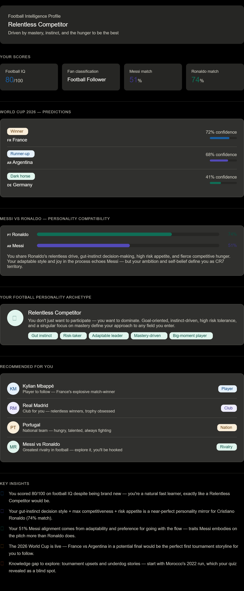

# ⚽ Day 19 – Football Intelligence Hub with Claude AI

## Overview

For Day 19, I explored an AI-powered Football Intelligence Hub that combines football knowledge assessment, personality analysis, sports predictions, and fan profiling into a single interactive experience.

The goal was to understand how AI can personalize sports analytics using quizzes, prediction models, and behavioral analysis.

---

## 🎯 Objectives

- Evaluate Football IQ
- Assess Football Awareness
- Generate FIFA World Cup 2026 Predictions
- Complete Messi vs Ronaldo Personality Match
- Identify Football Personality Archetype
- Receive Personalized Football Recommendations

---

## 📊 Football Intelligence Profile

### Personality Type
🏆 **Relentless Competitor**

> Driven by mastery, instinct, ambition, and a desire to continuously improve.

---

## 📈 Assessment Results

| Category | Score |
|-----------|---------|
| Football IQ | 80/100 |
| Fan Classification | Football Follower |
| Ronaldo Match | 74% |
| Messi Match | 51% |
| Personality Archetype | Relentless Competitor |

---

## 🌍 FIFA World Cup 2026 Predictions

| Prediction | Team | Confidence |
|------------|------|------------|
| Winner | 🇫🇷 France | 72% |
| Runner-Up | 🇦🇷 Argentina | 68% |
| Dark Horse | 🇩🇪 Germany | 41% |

---

## Messi vs Ronaldo Personality Match

### Cristiano Ronaldo Alignment – 74%

- Strong competitive drive
- Goal-oriented mindset
- High self-belief
- Leadership under pressure
- Risk-taking mentality

### Lionel Messi Alignment – 51%

- Adaptability
- Creativity
- Flexible decision-making
- Team-oriented approach

### Analysis

The assessment suggests a stronger alignment with Cristiano Ronaldo’s mentality and competitiveness while retaining some of Lionel Messi’s adaptability and creativity.

---

## 🏅 Football Personality Archetype

### Relentless Competitor

Key Traits:

- ⚡ Gut Instinct
- 🎯 Mastery Driven
- 🚀 Risk Taker
- 👥 Adaptable Leader
- 🏆 Big Moment Performer

---

## ⭐ AI Recommendations

### Player to Follow
- Kylian Mbappé

### Club Recommendation
- Real Madrid

### National Team Recommendation
- Portugal

### Rivalry Recommendation
- Messi vs Ronaldo

---

## 💡 Key Learnings

- AI can personalize sports analytics experiences.
- Personality profiling can be integrated with domain knowledge.
- Predictive models can simulate tournament outcomes.
- Prompt engineering can create engaging and interactive assessments.
- Sports analytics represents a powerful real-world application of AI.

---

## 📸 Screenshots

Add generated screenshots here.

---

## Outcome

Successfully generated a complete Football Intelligence Profile using Claude AI, combining football knowledge evaluation, predictive analytics, and personality-based insights into a personalized sports intelligence report.
