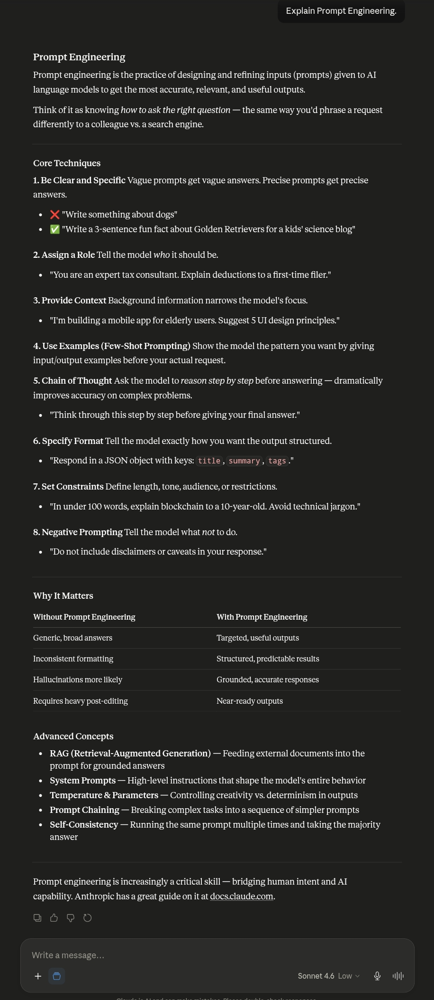
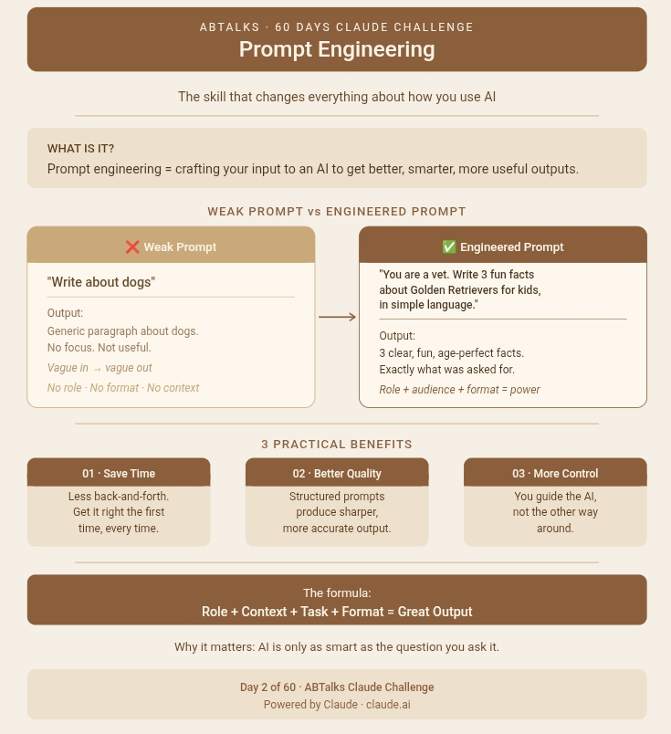

# Day 2 - Prompt Engineering

## Objective

Learn the difference between a weak prompt and an engineered prompt.

---

### Weak Prompt

Explain Prompt Engineering.

---

### Engineered Prompt

You are an AI educator teaching complete beginners.
Explain Prompt Engineering in simple language.

Include:
* What Prompt Engineering is
* Why it matters when using AI tools like Claude
* One example of a weak prompt
* One example of an improved prompt
* Three practical benefits of writing better prompts

Also create a LinkedIn-ready image concept.
Image Requirements:
* Square LinkedIn post (1080×1080)
* Claude-inspired brown, beige and cream colors
* Professional and minimal design
* Main title: "Prompt Engineering"
* Show a visual comparison:
  * Weak Prompt → Basic Output
  * Engineered Prompt → Better Output
* Modern AI and productivity-themed visuals
* Add "ABTalks 60 Days Claude Challenge" in the heading

Output Format:
Section 1: Explanation
Section 2: Weak vs Improved Prompt Example
Section 3: Detailed Image Generation Prompt

---

## Observations

1. The engineered prompt produced a more detailed response.
2. The output was structured into sections.
3. Better examples were included.
4. The AI understood the goal more clearly.
5. The image concept was much more professional.

---

## Key Learnings

- Prompt Engineering means giving AI clear instructions.
- Better prompts produce better outputs.
- Structure, context, and requirements improve AI responses.
- AI tools like Claude perform better with specific prompts.

---

## Work Completed

- Tested a weak prompt.
- Tested an engineered prompt.
- Compared both outputs.
- Generated a LinkedIn-ready image concept.
- Documented learnings.

---

## Screenshots

### Weak prompt

### Engineered prompt
 

---
