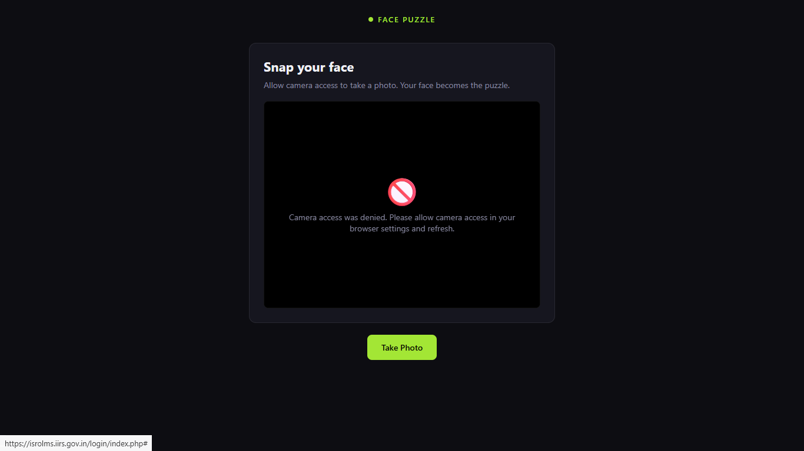
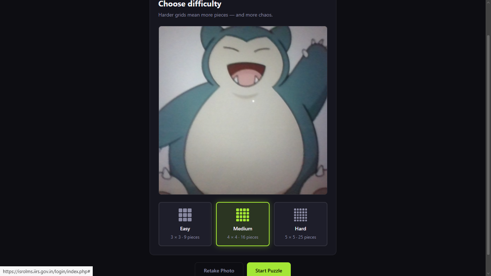
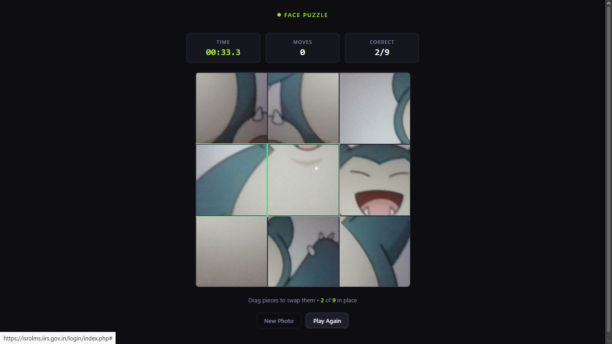
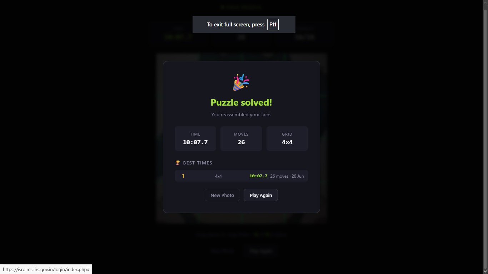

# 🧩 Day 20 – AI-Powered Face Puzzle Game

An interactive browser-based puzzle game that transforms a webcam photo into a challenging puzzle. Users can capture their image, select a difficulty level, and solve the puzzle using drag-and-drop or touch interactions while tracking performance through timers, move counters, and a leaderboard.

---

## 📌 Project Overview

This project was built as part of my Day 20 AI Development Challenge.

The application:

* Captures live images using the webcam
* Generates puzzle pieces from the captured image
* Supports multiple difficulty levels
* Includes drag-and-drop and touch support
* Tracks game statistics
* Maintains a leaderboard using local storage

---

## ✨ Features

### 📸 Webcam Integration
- Real-time camera access
- Instant photo capture
- Browser-based image processing

### 🧩 Dynamic Puzzle Creation
- Easy Mode (3×3)
- Medium Mode (4×4)
- Hard Mode (5×5)

### 🎮 Interactive Gameplay
- Drag-and-drop puzzle mechanics
- Touch support for mobile devices
- Piece swapping functionality
- Real-time progress tracking

### ⏱ Performance Metrics
- Live timer
- Move counter
- Completion statistics

### 🏆 Leaderboard System
- Best-time tracking
- Local storage persistence
- Top performance ranking

### 📱 Responsive Design
- Desktop compatible
- Tablet optimized
- Mobile friendly

---

## 🛠️ Tech Stack

| Technology | Purpose |
|------------|----------|
| HTML5 | Structure |
| CSS3 | Styling & UI |
| JavaScript | Game Logic |
| WebRTC API | Webcam Access |
| Canvas API | Image Processing |
| Local Storage API | Leaderboard Storage |

---

## 📸 Screenshots

### Camera Capture Screen

### Difficulty Selection

### Gameplay

### Puzzle Completion

---

## 🚀 How to Run

1. Download the repository.
2. Open `face-puzzle-game.html` in your browser.
3. Allow camera permissions.
4. Capture your photo.
5. Select a difficulty level.
6. Start solving the puzzle.
7. Track your time and moves.
8. Complete the puzzle and view leaderboard results.

---

## 📚 What I Learned

- Working with the WebRTC Camera API
- Capturing images using Canvas
- Building drag-and-drop interfaces
- Managing game states in JavaScript
- Implementing touch interactions
- Using Local Storage for persistent data
- Creating responsive web applications

---

## 🎯 Challenge Outcome

✅ Built a complete browser-based game

✅ Integrated webcam functionality

✅ Implemented puzzle generation logic

✅ Added timer and move tracking

✅ Created a persistent leaderboard

✅ Enhanced JavaScript DOM manipulation skills

✅ Improved frontend development expertise

---
