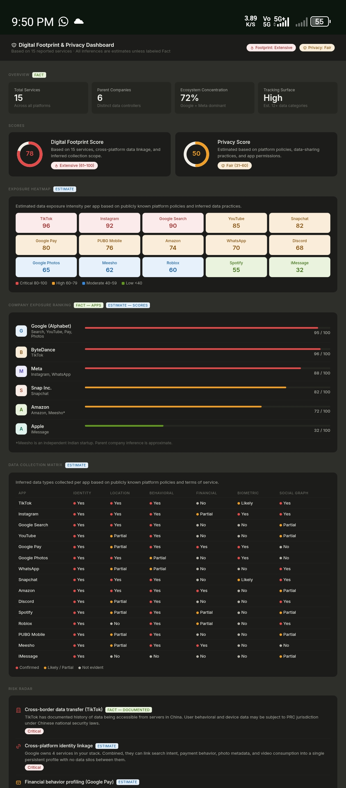

# Day 21 – Digital Privacy Dashboard

Project Overview

Today I built a Digital Privacy Dashboard using AI-assisted development with Claude. The dashboard analyzes a user's digital footprint, privacy exposure, data collection risks, company-level data concentration, and provides actionable recommendations for improving privacy.

The application was generated as a complete HTML dashboard and includes multiple analytical sections such as:

- Digital Footprint Score
- Privacy Score
- Exposure Heatmap
- Company Exposure Ranking
- Data Collection Matrix
- Risk Radar
- Digital Twin Profile
- Most Valuable Data Assets
- Privacy Improvement Simulator
- Final Privacy Verdict

---

Technologies Used

- HTML5
- CSS3
- JavaScript
- Claude AI
- Data Visualization Components
- Responsive Dashboard Design

---

Dashboard Findings

Digital Footprint Score

78 / 100

The analysis classified the digital footprint as Extensive, indicating significant online activity across multiple platforms.

Privacy Score

50 / 100

The privacy level was categorized as Fair, showing room for improvement through privacy-focused settings and behavioral changes.

Key Statistics

Metric| Value
Total Services| 15
Parent Companies| 6
Ecosystem Concentration| 72%
Tracking Surface| High

---

Exposure Heatmap Highlights

Highest estimated exposure levels:

Platform| Exposure Score
TikTok| 96
Instagram| 92
Google Search| 90
YouTube| 85
Snapchat| 82

Lowest estimated exposure:

Platform| Exposure Score
iMessage| 32
Spotify| 55

---

Company Exposure Ranking

Highest Data Concentration

1. ByteDance – 96/100
2. Google (Alphabet) – 95/100
3. Meta – 88/100
4. Snap Inc. – 82/100
5. Amazon – 72/100

Observation

A large portion of digital activity is concentrated within a small number of companies, increasing cross-platform profiling capabilities.

---

Risk Radar Analysis

Critical Risks

- Cross-border data transfer exposure
- Cross-platform identity linkage
- Centralized behavioral profiling

High Risks

- Financial behavior profiling
- Biometric inference from photos
- Location tracking

Medium Risks

- Social graph exposure
- Purchase history profiling

---

Digital Twin Insights

The dashboard demonstrated how organizations can infer:

- Demographics
- Interests
- Online behavior
- Shopping patterns
- Social relationships
- Device usage habits

This section illustrated the concept of a "Digital Twin" created from accumulated user data.

---

Most Valuable Data Assets

The analysis identified:

1. Financial transaction metadata
2. Location history
3. Search intent history
4. Biometric data
5. Social graph relationships
6. Behavioral patterns

These data categories are considered highly valuable for advertising, personalization, and profiling systems.

---

Privacy Improvement Recommendations

The dashboard suggested:

- Restrict TikTok permissions
- Enable Google Activity Controls
- Use privacy-focused search engines
- Review WhatsApp privacy settings
- Disable Instagram ad tracking
- Turn off face grouping features

Potential Privacy Score Improvement:

50 → 75–80

---

## Screenshot
 

Key Learnings

- Modern applications collect data from multiple categories simultaneously.
- Data aggregation across platforms increases profiling capabilities.
- Privacy risks often emerge from ecosystem concentration rather than a single application.
- Small privacy setting changes can significantly improve privacy scores.
- AI can be used to rapidly generate sophisticated analytical dashboards.

---

Outcome

Successfully generated and tested a fully functional Digital Privacy Dashboard that visualizes privacy exposure, digital footprint risks, and actionable privacy improvement opportunities through an interactive analytics interface.

---