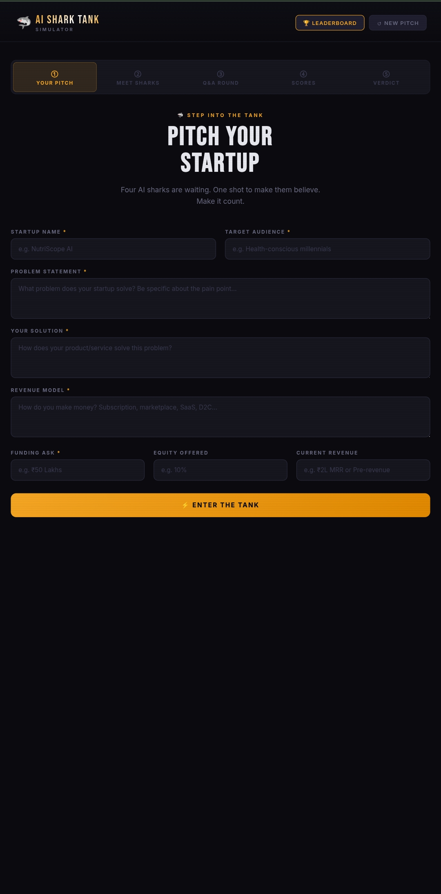
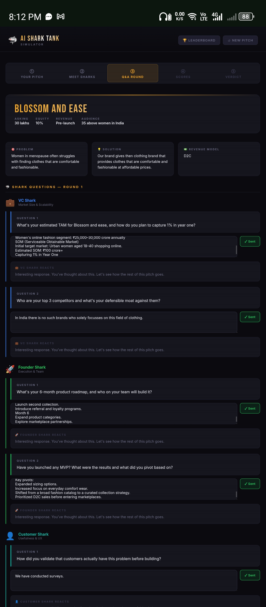
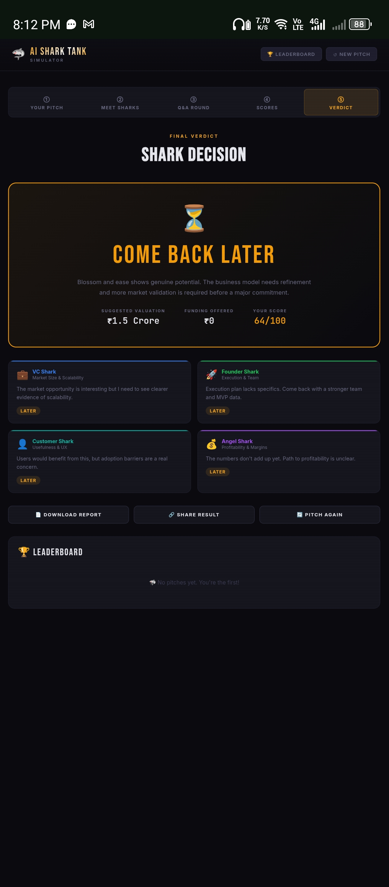

# Day 25 – AI Shark Tank Simulator

## Objective

Build and test an AI-powered Shark Tank Simulator using Claude, evaluate a startup idea, receive investor feedback, and analyze investment readiness.

---

## Startup Evaluated

Blossom & Ease

## Startup Overview

Blossom & Ease is a women's clothing brand focused on women aged 35+ experiencing menopause and looking for clothing that combines comfort, functionality, and style at affordable prices.

---

## Startup Inputs

### Target Audience

Women aged 35+ in India.

### Problem Statement

Women in menopause often struggle to find clothing that is both comfortable and fashionable. Existing options either prioritize comfort without style or style without comfort.

### Solution

Blossom & Ease provides thoughtfully designed clothing that balances comfort, quality, and modern fashion while remaining affordable.

### Revenue Model

Direct-to-Consumer (D2C)

### Funding Ask

₹30 Lakhs

### Equity Offered

10%

---

## Shark Tank Results

### Overall Score

64/100

### Category Scores

Category| Score
Market Potential| 51/100
Innovation| 59/100
Business Model| 74/100
Execution| 62/100
Investment Worthiness| 72/100

### Valuation

₹1.5 Crore

### Funding Offered

₹0

### Verdict

⏳ COME BACK LATER

---

## Investor Feedback

### VC Shark

The market opportunity is interesting but requires stronger evidence of scalability.

### Founder Shark

Execution strategy needs more specificity and stronger MVP validation.

### Customer Shark

The solution addresses a real need, but adoption challenges must be addressed.

### Angel Shark

The financial projections and profitability path require further refinement.

---

## Key Learnings

1. A clear niche audience improves startup positioning.
2. Investors expect strong market validation before funding.
3. Unit economics and profitability must be clearly demonstrated.
4. Scalability is critical for attracting venture investment.
5. MVP testing and customer feedback significantly improve credibility.
6. A detailed growth roadmap strengthens investor confidence.

---

## Improvements for Blossom & Ease

- Launch a pilot collection.
- Gather customer testimonials and reviews.
- Build social media traction.
- Establish manufacturing partnerships.
- Develop detailed financial projections.
- Validate demand through pre-orders.
- Expand product categories based on customer feedback.

---

## Outcome

Successfully completed the AI Shark Tank Simulator exercise and received actionable feedback for improving the investment readiness of Blossom & Ease.

## Screenshot

 
 
 