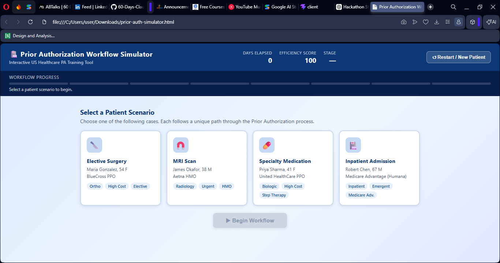
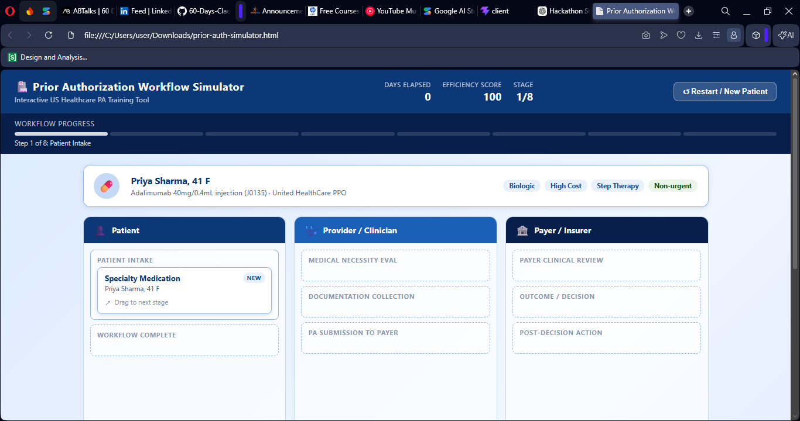
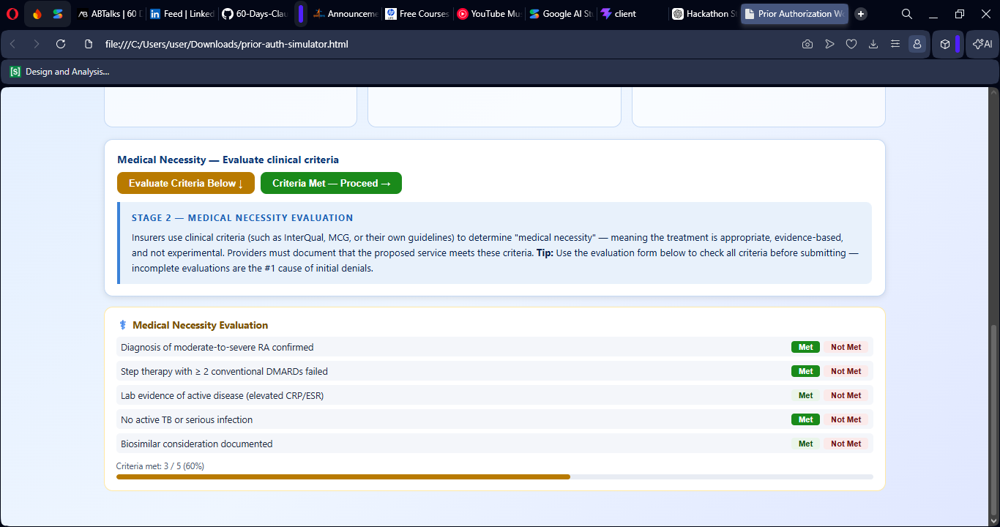
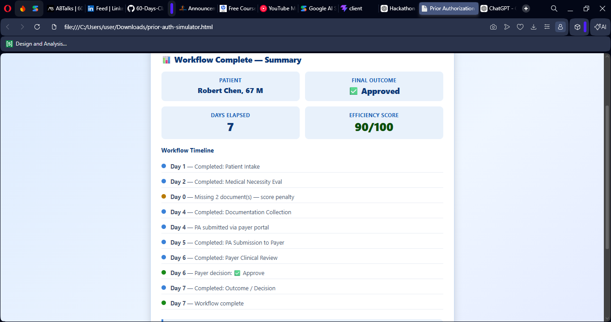
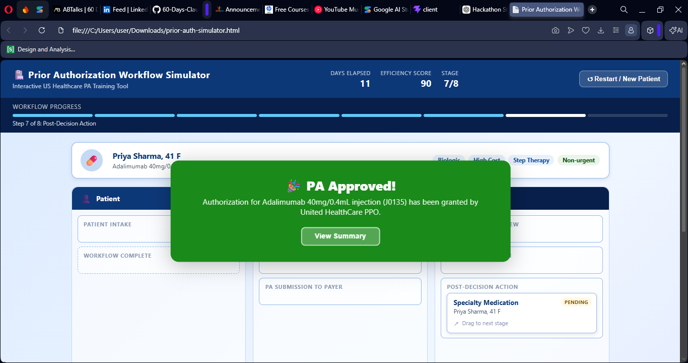

# Day 26 – Prior Authorization Workflow Simulator

## 📌 Project Overview

Today I built an **interactive Prior Authorization (PA) Workflow Simulator** using AI-generated HTML, CSS, and JavaScript.

The simulator recreates the real-world healthcare prior authorization process used by providers, insurance companies, and patients before medical procedures, imaging, medications, or hospital admissions receive approval.

The project demonstrates how healthcare workflows can be transformed into engaging educational simulations using modern web technologies and AI-assisted development.

---

# 🎯 Objectives

* Understand the Prior Authorization lifecycle
* Learn healthcare workflow management
* Simulate provider-payer communication
* Practice drag-and-drop workflow interactions
* Build an educational healthcare application

---

# 🛠️ Technologies Used

* HTML5
* CSS3
* JavaScript (ES6)
* Drag & Drop API
* Responsive Design
* AI-assisted development with Claude

---

# ✨ Key Features

## Patient Scenarios

The simulator includes multiple realistic healthcare cases:

* Elective Surgery
* MRI Scan
* Specialty Medication
* Inpatient Admission

Each scenario contains:

* Patient information
* Insurance plan
* ICD diagnosis
* CPT procedure
* Clinical documentation requirements

---

## Interactive Workflow

Users drag patient cases through multiple workflow stages:

1. Patient Intake
2. Medical Necessity Evaluation
3. Documentation Collection
4. Prior Authorization Submission
5. Payer Clinical Review
6. Outcome Decision
7. Appeal / Peer-to-Peer
8. Workflow Completion

---

## Documentation Checklist

The simulator allows users to:

* Collect required documents
* Track submission completeness
* Reduce denial risks
* Validate documentation before submission

---

## Medical Necessity Evaluation

Clinical criteria can be evaluated interactively through:

* Evidence validation
* Medical necessity checks
* Progress tracking
* Clinical scoring

---

## Payer Decision Simulation

Different outcomes are supported:

* ✅ Approval
* ⏳ Pending
* ❌ Denial
* 📞 Peer-to-Peer Review
* ⚖️ Appeal

Each decision includes educational explanations and next steps.

---

## Dashboard & Analytics

The application tracks:

* Workflow progress
* Days elapsed
* Efficiency score
* Current workflow stage
* Timeline history
* Final workflow summary

---

## Educational Value

The simulator explains:

* Prior Authorization process
* Medical necessity guidelines
* Documentation standards
* Insurance review procedures
* Appeals process
* Healthcare administrative workflow

---

# Learning Outcomes

Through this project I learned:

* Healthcare Prior Authorization workflow
* Interactive workflow simulation
* Drag-and-drop interface implementation
* Dynamic state management
* Educational dashboard development
* Workflow visualization techniques
* Event-driven JavaScript programming
* Responsive UI development

---

# Challenges

* Managing workflow state transitions
* Implementing drag-and-drop interactions
* Handling multiple workflow outcomes
* Maintaining educational context
* Building reusable UI components

---

# Screenshots

* Workflow Dashboard

* Patient Scenario

* Medical Evaluation

* Approval Workflow

* Final Summary

---

# Key Takeaway

Building this simulator demonstrated how AI can accelerate the creation of interactive educational applications while helping developers understand complex real-world healthcare workflows through practical simulation.
---
