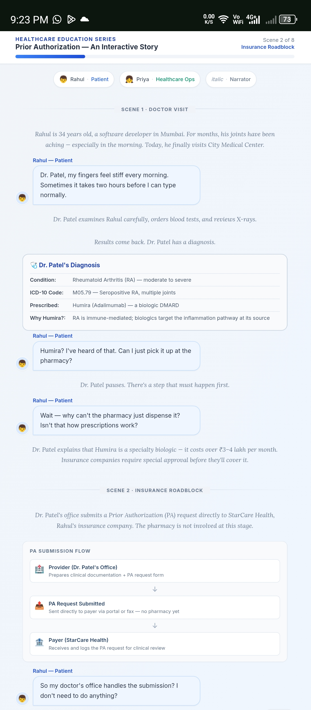
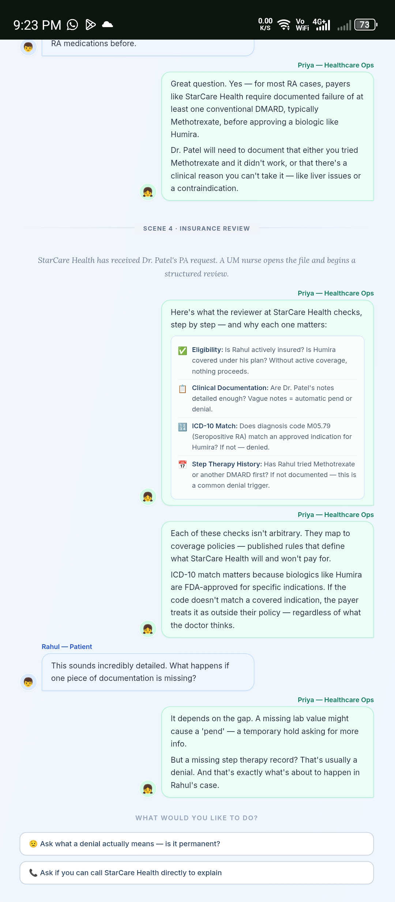
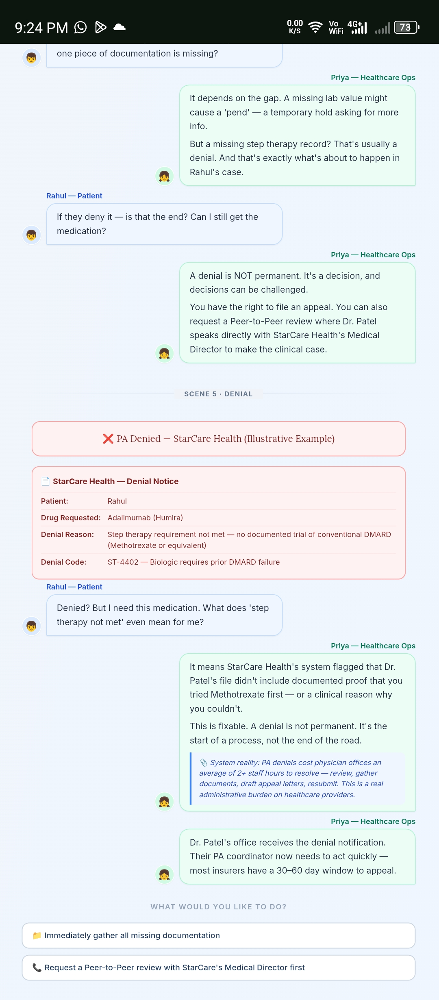
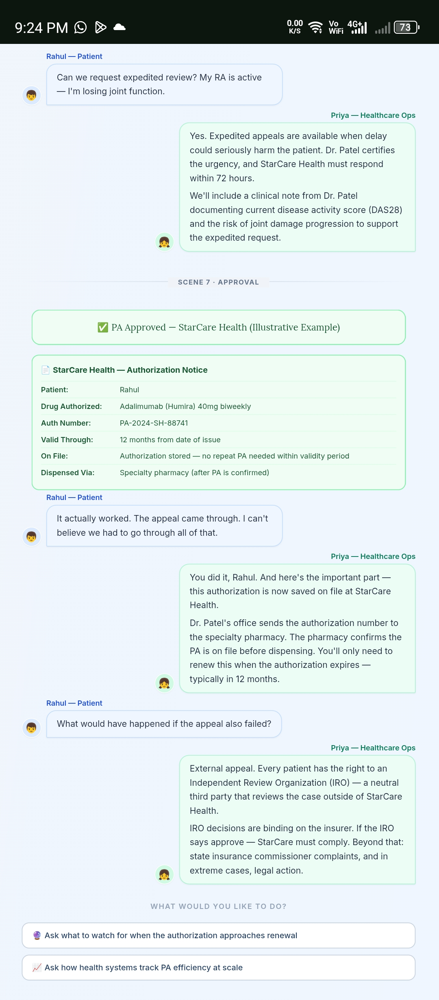
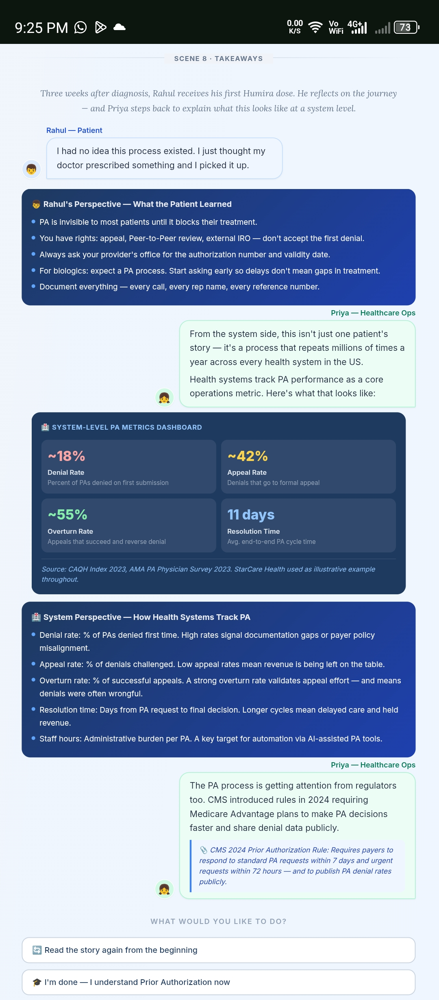

# Day 27 – Prior Authorization Story Simulator

## Objective

Built and explored an interactive healthcare education application that explains the complete Prior Authorization (PA) workflow through a story-based learning experience.

---

## Story Chapters

1. Doctor Visit
2. Insurance Roadblock
3. Understanding Prior Authorization
4. Insurance Review Process
5. Denial
6. Appeal
7. Approval
8. Final Takeaways

---

## Key Learnings

### Understanding Prior Authorization

- Prior Authorization is an insurance approval process performed before certain treatments or medications are covered.
- High-cost specialty medications usually require clinical review.

---

## Healthcare Workflow

- Provider submits the PA request.
- Insurance company reviews clinical documentation.
- Utilization Management verifies eligibility and medical necessity.
- Decision is issued as Approval, Pending, or Denial.

---

## Common Denial Reasons

- Missing documentation
- Step therapy requirements
- Diagnosis mismatch
- Insufficient clinical evidence

---

## Appeal Process

- Gather supporting clinical documents.
- Submit a Letter of Medical Necessity.
- Request Peer-to-Peer review when appropriate.
- External review remains available if internal appeal fails.

---

## Operational Insights

- Prior Authorization significantly impacts treatment timelines.
- Accurate documentation reduces denials.
- Tracking PA metrics improves healthcare operations.
- Automation and AI can streamline administrative workload.

---

## Skills Practiced

- Healthcare workflow understanding
- Prior Authorization lifecycle
- Interactive UI exploration
- Story-driven learning design
- HTML application testing
- GitHub documentation

---

## Outcome

Successfully completed the interactive Prior Authorization Story Simulator, explored multiple decision paths, and gained a practical understanding of the complete insurance authorization process from prescription through approval and appeal.

---

## Screenshots

 

