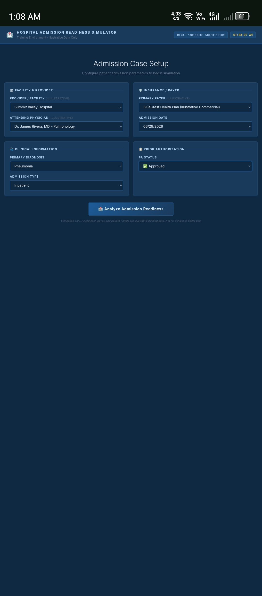
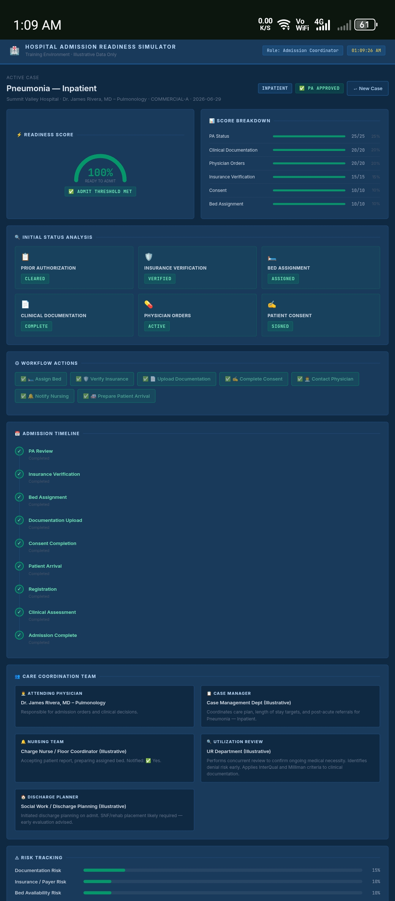
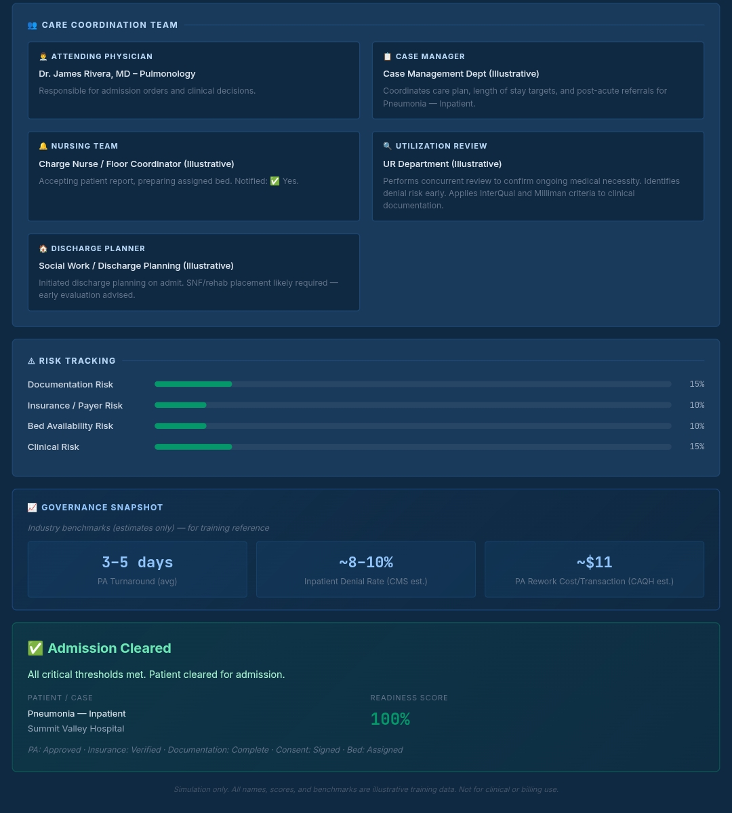

# Day 28 – Hospital Admission Readiness Simulator

## Project

Hospital Admission Readiness Simulator

## Objective

Develop an interactive simulator that models the hospital admission workflow and evaluates admission readiness based on clinical, administrative, insurance, and documentation requirements.

---

## Features

- Interactive Hospital Admission Workflow
- Admission Readiness Score
- Dynamic Risk Assessment
- Prior Authorization Management
- Appeals Workflow
- Insurance Verification
- Clinical Documentation Tracking
- Bed Assignment Workflow
- Care Coordination Dashboard
- Governance Snapshot
- Final Admission Decision Engine
- Responsive UI

---

## Technologies Used

- HTML5
- CSS3
- Tailwind CSS
- JavaScript (ES6)

---

## Key Learnings

- Understood the complete hospital admission lifecycle.
- Learned how Prior Authorization impacts patient admission.
- Explored documentation and insurance verification workflows.
- Implemented dynamic scoring and workflow progression.
- Improved understanding of healthcare administration processes.
- Practiced building complex interactive web applications using AI assistance.

---

## Outcome

Successfully developed and tested a Hospital Admission Readiness Simulator capable of simulating multiple admission scenarios, evaluating readiness, tracking workflow completion, and providing realistic healthcare operations training.

---

## Screenshots

---