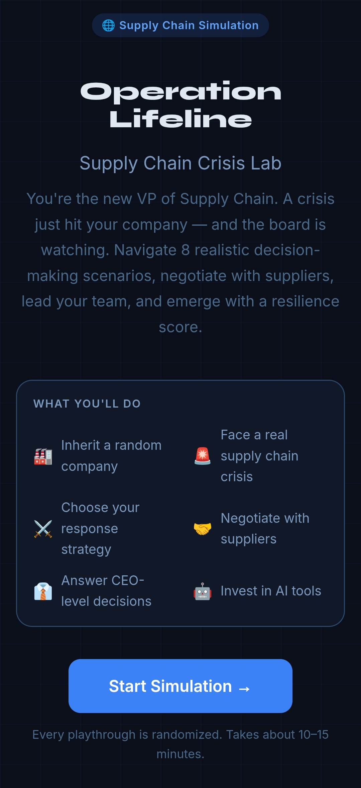
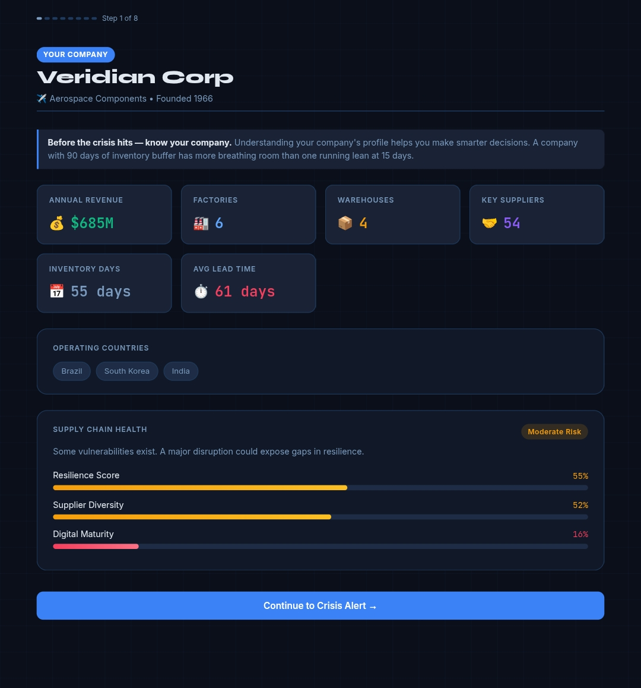
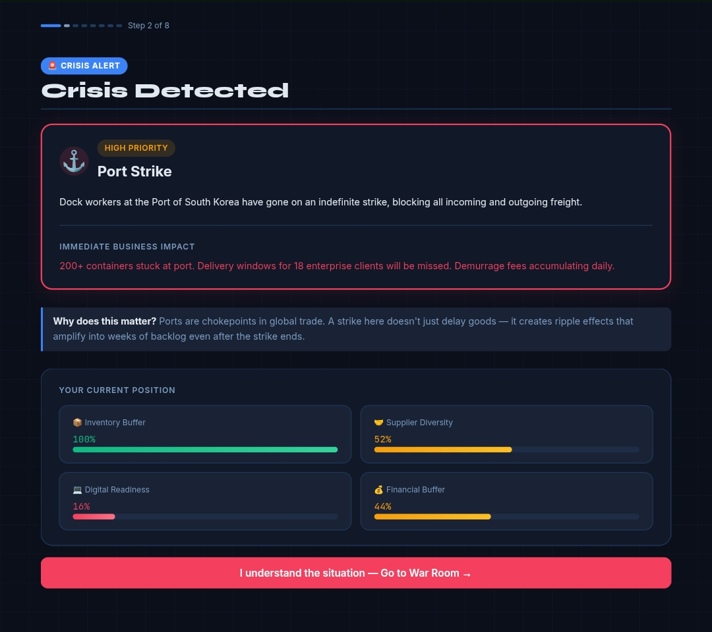
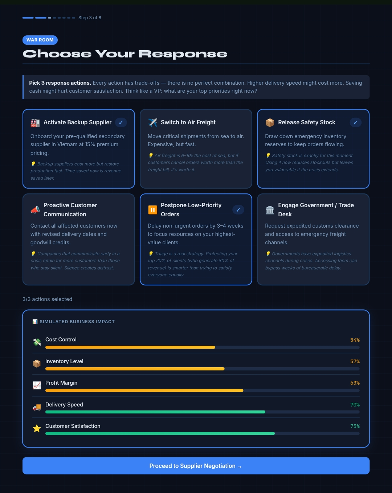
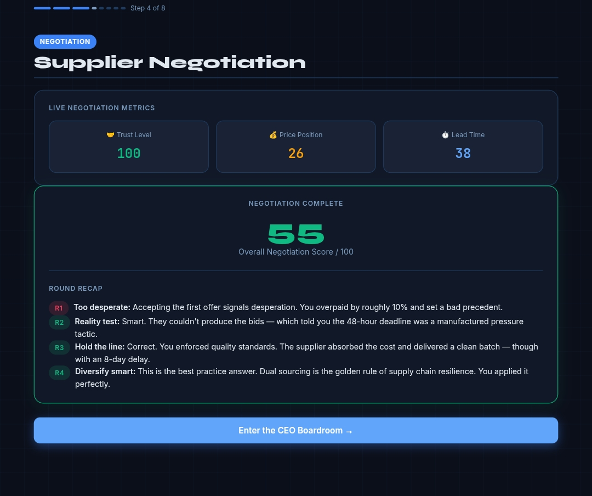
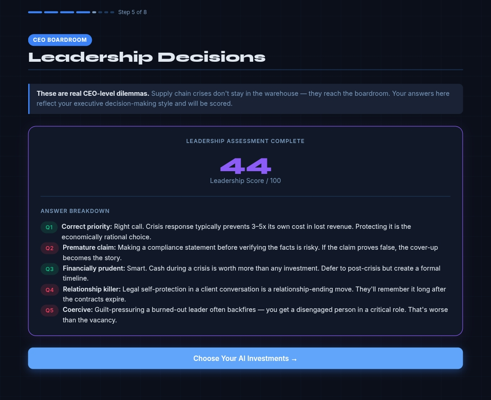
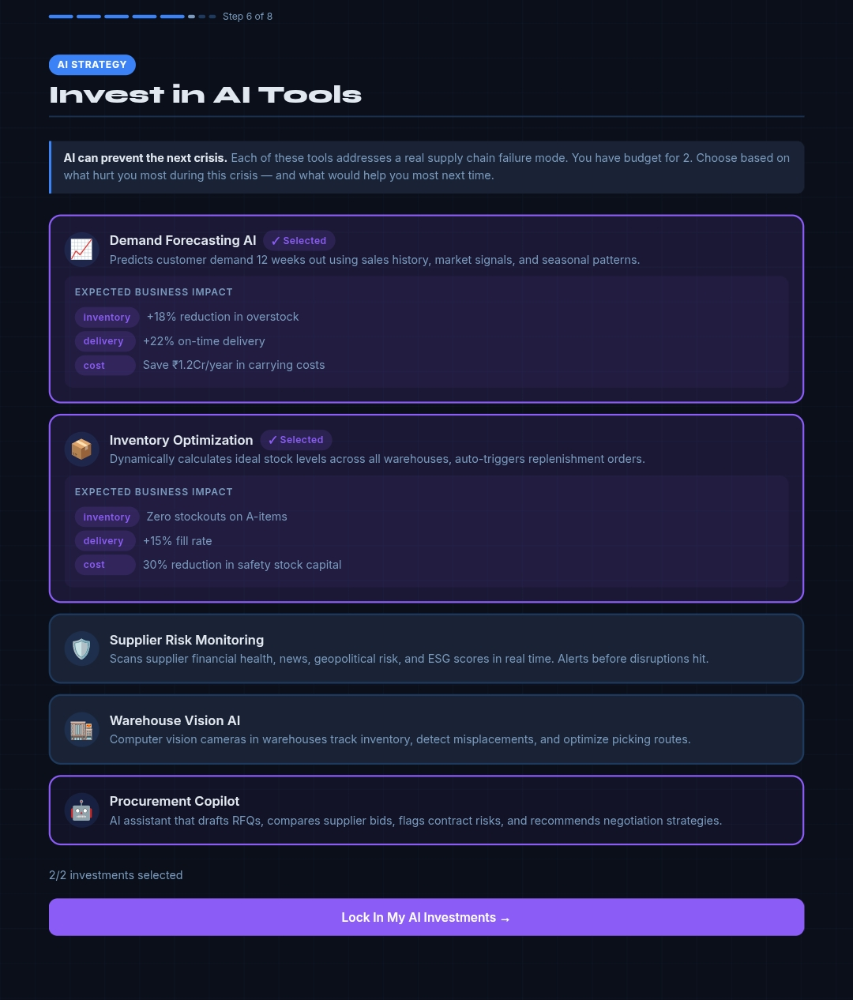
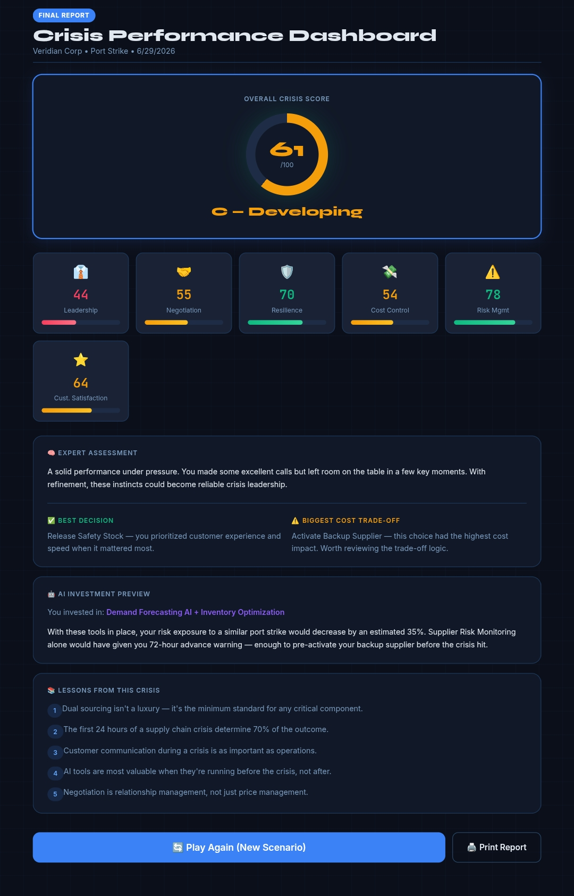

# Day 29 – Operation Lifeline: Supply Chain Crisis Lab

## Objective

Developed and tested the Operation Lifeline: Supply Chain Crisis Lab, an interactive React-based simulation focused on handling real-world supply chain disruptions, crisis management, supplier negotiations, executive decision-making, and AI-driven supply chain optimization.

---

## Final Simulation Results

Overall Crisis Score: 61/100

### Performance Breakdown

- Leadership: 44
- Negotiation: 55
- Resilience: 70
- Cost Control: 54
- Risk Management: 78
- Customer Satisfaction: 64

---

## Best Decision

Release Safety Stock to maintain customer service during the crisis.

---

## Biggest Trade-Off

Activating the Backup Supplier improved resilience but significantly increased operational costs.

---

## AI Investments Selected

- Demand Forecasting AI
- Inventory Optimization

These technologies are estimated to reduce future supply chain risk by approximately 35%.

---

## Key Learnings

- Dual sourcing is essential for supply chain resilience.
- The first 24 hours of a crisis determine most operational outcomes.
- Transparent customer communication builds trust during disruptions.
- AI delivers maximum value when implemented before crises occur.
- Strong supplier relationships are built through collaboration rather than price negotiation alone.

---

## Technologies Used

- React
- HTML5
- CSS3
- JavaScript

---

## Outcome

This project strengthened my understanding of supply chain resilience, strategic decision-making, supplier negotiation, executive leadership, and the practical application of AI in modern supply chain management.

---

## Screenshots

 
 
 
 
 
 
 
 
