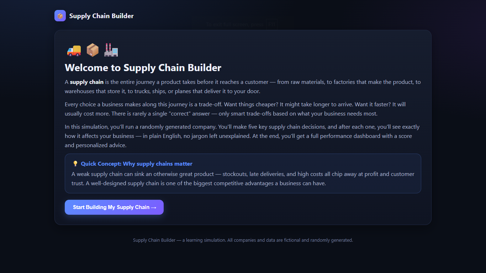
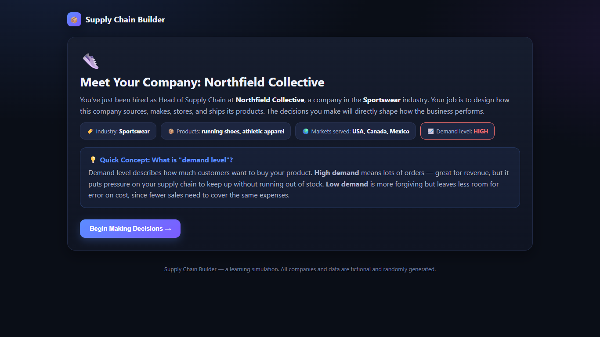
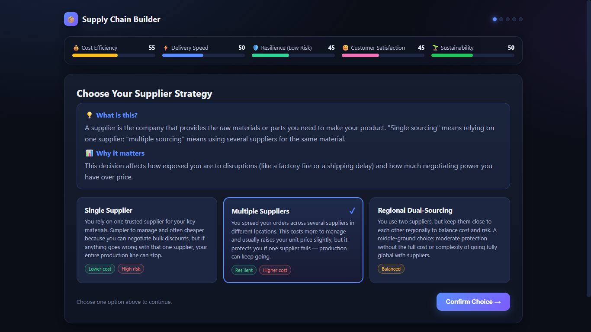
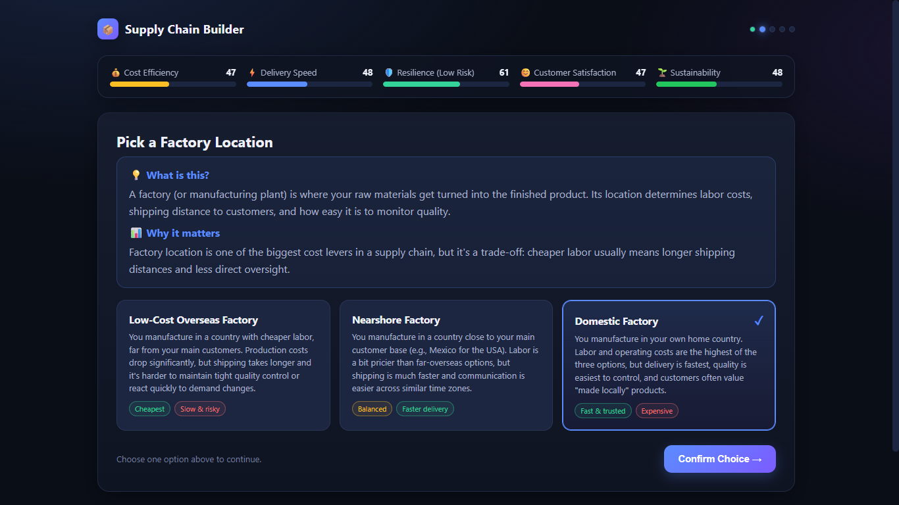
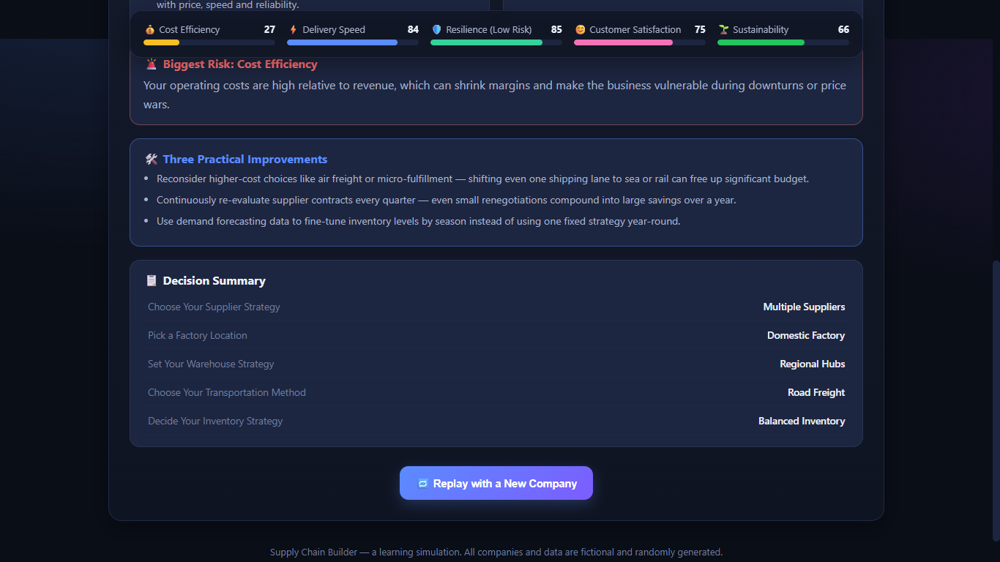
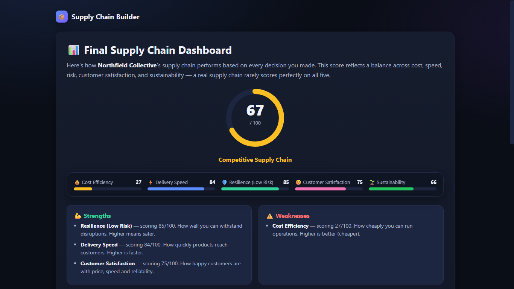

# Day 30 – Supply Chain Builder & Optimizer

## Overview

Today I developed an interactive **Supply Chain Builder & Optimizer** simulator using React. The application teaches fundamental supply chain concepts through a decision-based simulation where users design an end-to-end supply chain and immediately observe how each decision affects business performance.

---

# Objectives

* Understand supply chain fundamentals.
* Learn the impact of business decisions on operational performance.
* Simulate real-world logistics scenarios.
* Analyze optimization trade-offs.
* Practice building interactive React applications.

---

# Features

* Random company profile generation
* Beginner-friendly introduction
* Interactive decision workflow
* Supplier strategy selection
* Factory location planning
* Warehouse strategy optimization
* Transportation method selection
* Inventory strategy planning
* Live business metrics
* Performance dashboard
* Overall Supply Chain Score
* Strengths & weaknesses analysis
* Risk identification
* Personalized improvement recommendations
* Replay with new randomly generated companies

---

# Business Metrics Tracked

* Cost Efficiency
* Delivery Speed
* Supply Chain Resilience
* Customer Satisfaction
* Sustainability

Each decision dynamically updates these metrics, helping users understand the trade-offs involved in supply chain management.

---

# Technologies Used

* React 18
* HTML5
* CSS3
* JavaScript (ES6)
* Babel

---

# What I Learned

* Supply chains involve balancing cost, speed, and reliability.
* Supplier diversification reduces operational risk.
* Factory location significantly impacts manufacturing costs and delivery speed.
* Warehouse placement affects customer satisfaction.
* Transportation methods influence both cost and sustainability.
* Inventory strategies must balance storage costs with product availability.
* Real-time analytics improve strategic business decision-making.

---

# Project Outcome

Successfully developed an interactive educational simulator that demonstrates how different supply chain strategies influence overall business performance through visual dashboards and live performance metrics.

---

# Screenshots

* Introduction Screen
  
  
* Random Company Profile
   
  
* Decision Screens
  
  
  
* Final Dashboard
  
  
* Overall Supply Chain Score
  

---

# Key Takeaways

* Every business decision involves trade-offs.
* Faster delivery often increases operational costs.
* Lower inventory reduces costs but raises stockout risk.
* A resilient supply chain improves long-term business stability.
* Sustainability should be considered alongside profitability.
* Data-driven optimization leads to better business outcomes.

---
