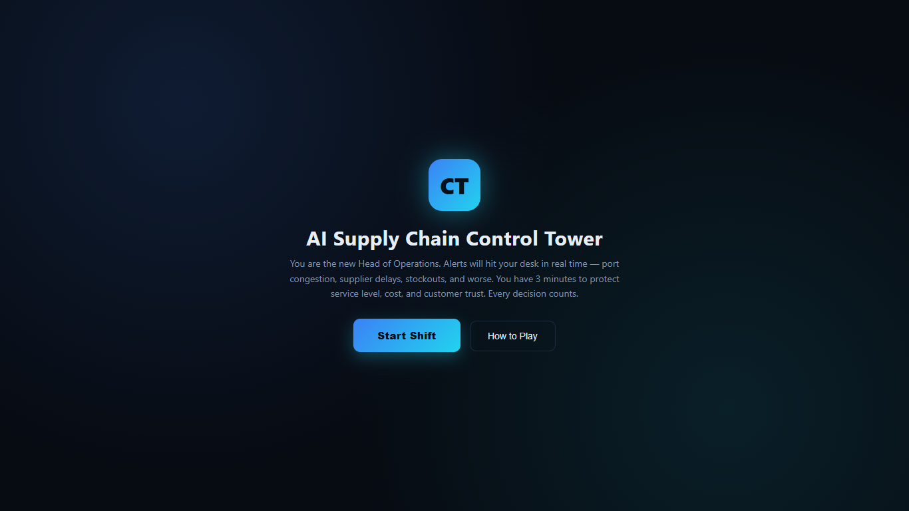
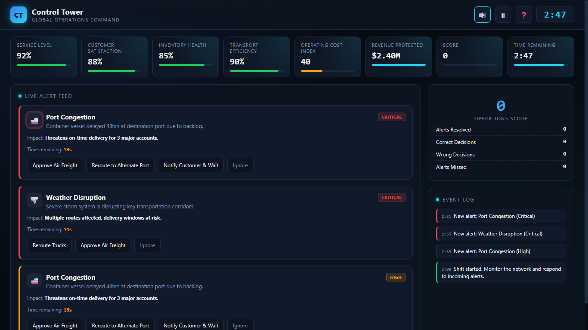
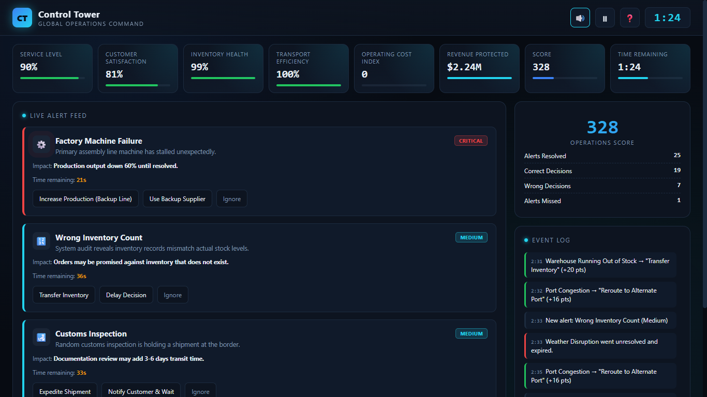
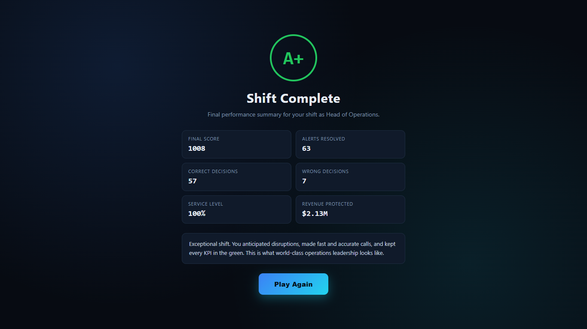

# Day 31 – AI Supply Chain Control Tower

## Project
AI Supply Chain Control Tower

## Objective
Build and interact with an AI-powered Supply Chain Control Tower simulator that monitors real-time operational disruptions, prioritizes incidents, and measures operational performance through KPI tracking.

---

## Features
- Real-time operational alert monitoring
- Multiple simultaneous incident handling
- Priority-based incident classification
- Multiple corrective action options
- Dynamic KPI dashboard
- Operations score tracking
- Event log for decisions
- Performance grading system
- Replay functionality

---

## Key Learnings
- Critical incidents should always be prioritized first.
- Every operational decision directly impacts business KPIs.
- Ignoring or delaying alerts significantly reduces service level and customer satisfaction.
- Multiple concurrent disruptions require effective prioritization.
- Supply chain visibility enables faster and more informed decision-making.
- Balancing service level, operational cost, inventory health, and customer satisfaction is essential.
- AI-powered control towers improve operational resilience through real-time monitoring and analytics.

---

## Technologies Used
- HTML5
- CSS3
- JavaScript (Vanilla)

---

## Screenshots

1. Start Screen
   
2. Live Alert Dashboard
   
3. Multiple Active Alerts
   
4. Final Performance Dashboard
   

---

## Outcome
Successfully completed the AI Supply Chain Control Tower simulation by responding to operational incidents, maintaining KPIs, and analyzing final operational performance.

---
