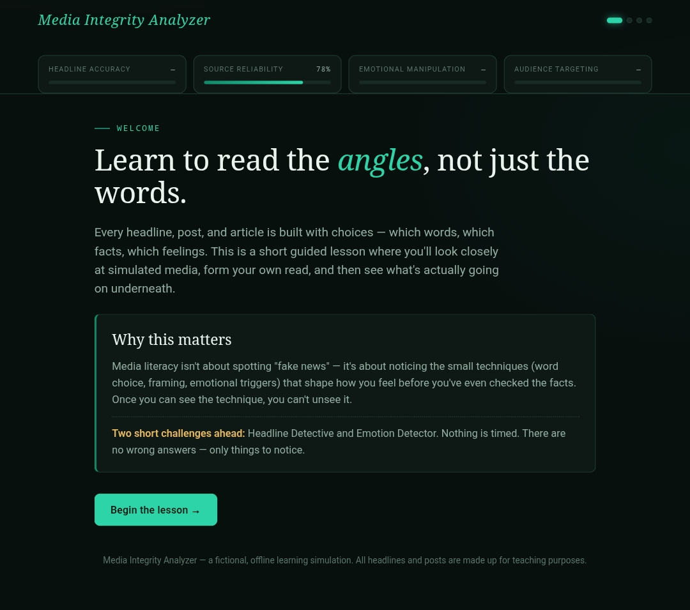
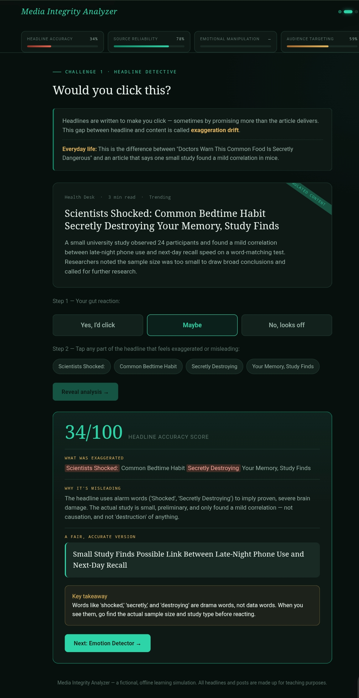
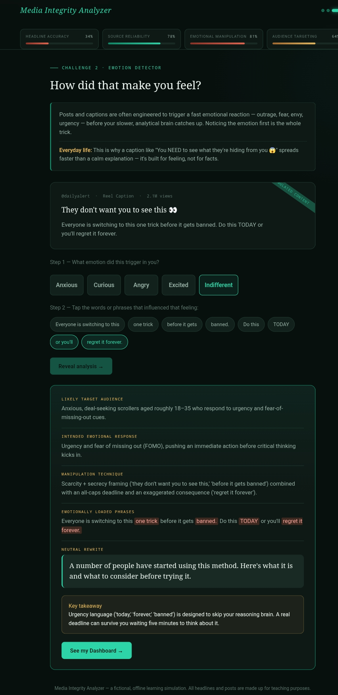
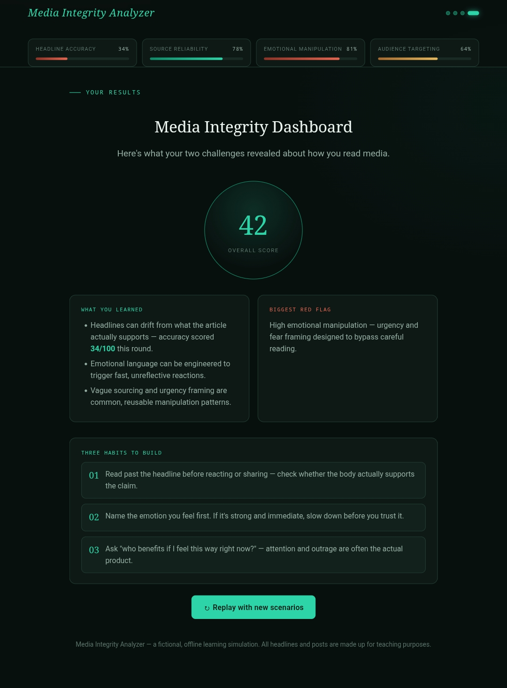

# Day 33 – Media Integrity Analyzer

## Project Overview

Today I built **Media Integrity Analyzer**, an interactive web application that teaches users how to critically evaluate media content by identifying misleading headlines, emotional manipulation, and biased framing.

The application provides a gamified learning experience through multiple challenges and generates a personalized Media Integrity Dashboard based on user interactions.

---

## Features

- 🎨 Multiple color themes
- 📰 Headline Detective Challenge
- 🧠 Emotion Detector Challenge
- 📊 Live Media Integrity Metrics
- ✍️ AI-inspired headline rewriting
- 📈 Final Media Integrity Dashboard
- 🔄 Replay with randomized scenarios
- 📱 Responsive design
- ⚡ Built using HTML, CSS and JavaScript

---

## What I Learned

- How misleading headlines influence readers.
- Identifying emotionally manipulative language.
- Understanding media bias and framing techniques.
- Designing interactive educational experiences.
- Creating dynamic dashboards using JavaScript.
- Updating UI in real time based on user interactions.

---

## Technologies Used

- HTML5
- CSS3
- JavaScript (ES6)

---

## Screenshots

### Theme Selection
 

### Headline Detective

### Emotion Detector

### Media Integrity Dashboard

---

## Outcome

This project strengthened my frontend development skills while demonstrating how technology can be used to improve digital literacy and help users identify misinformation online.

---