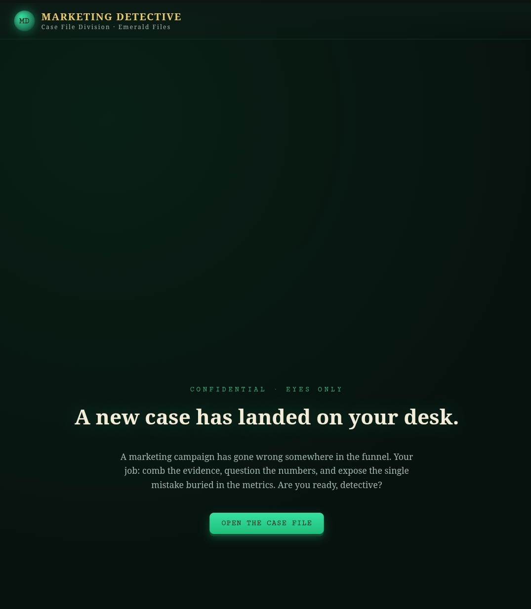
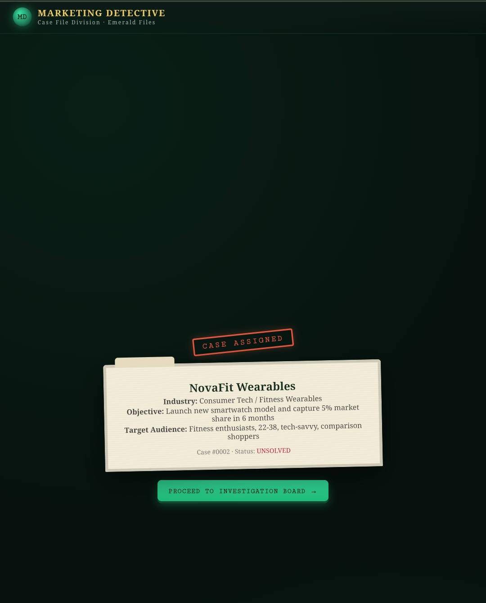
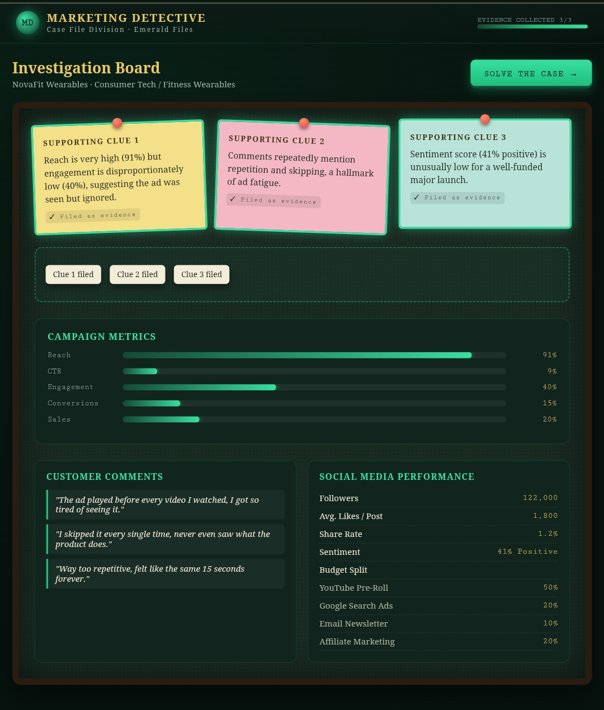
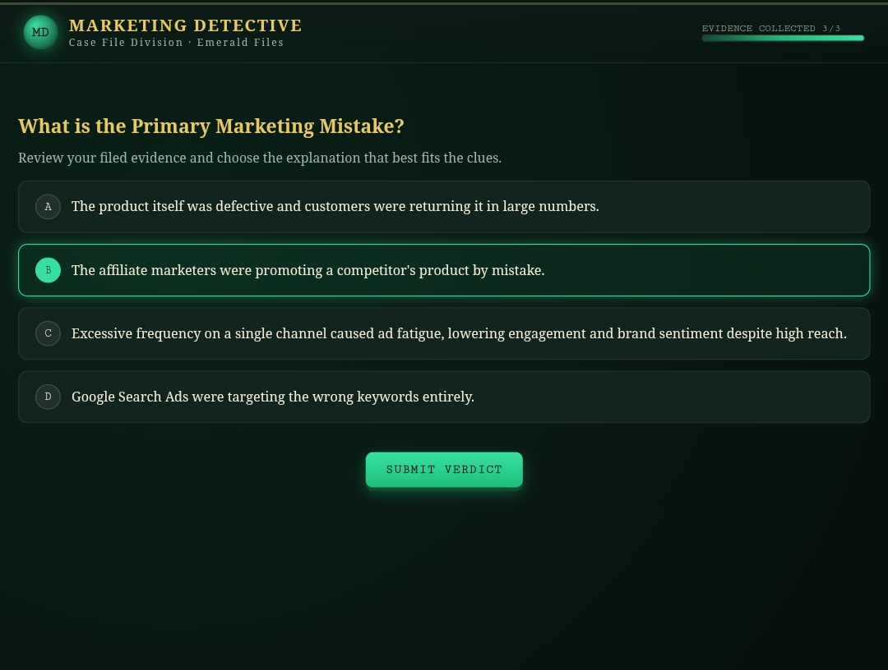
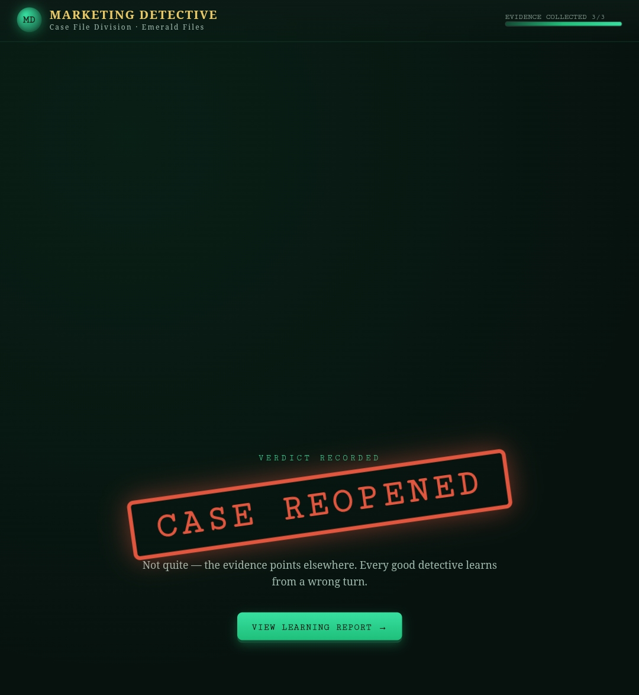
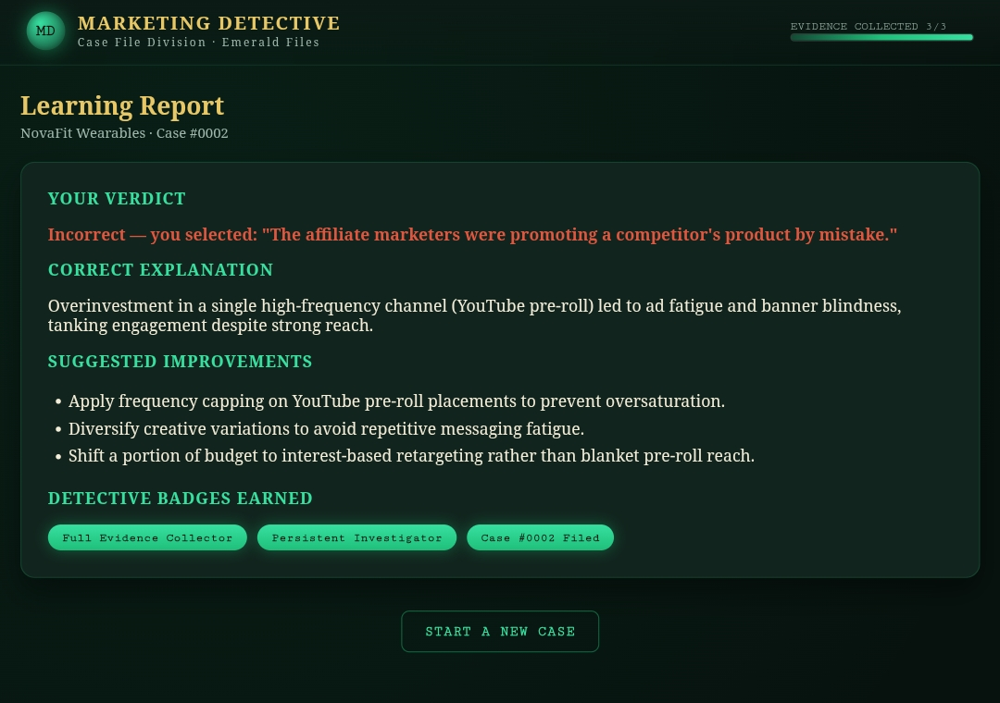

# Day 34 – Marketing Detective

## Project

Marketing Detective is an interactive browser-based learning application where users investigate failed marketing campaigns by analyzing campaign evidence, organizing clues, and identifying the primary marketing mistake.

---

## Features

- Multiple randomized marketing investigation cases
- Theme selection
- Interactive investigation board
- Drag-and-drop evidence collection
- Campaign metrics visualization
- Customer feedback analysis
- Multiple-choice investigation verdict
- Expert explanation after submission
- Marketing Learning Report
- Replay with new randomized cases
- Responsive UI with smooth animations

---

## Technologies Used

- HTML5
- CSS3
- Vanilla JavaScript

---

## Key Learnings

- Built an interactive educational web application.
- Implemented drag-and-drop functionality using JavaScript.
- Improved state management for multi-screen applications.
- Learned to present marketing analytics in an engaging visual format.
- Created reusable randomized case logic for replayability.
- Enhanced user experience with animations and progress tracking.

---

## Screenshots

 

