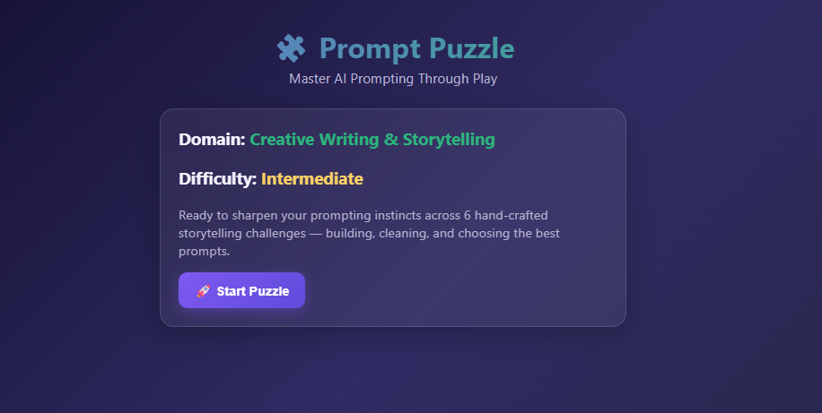
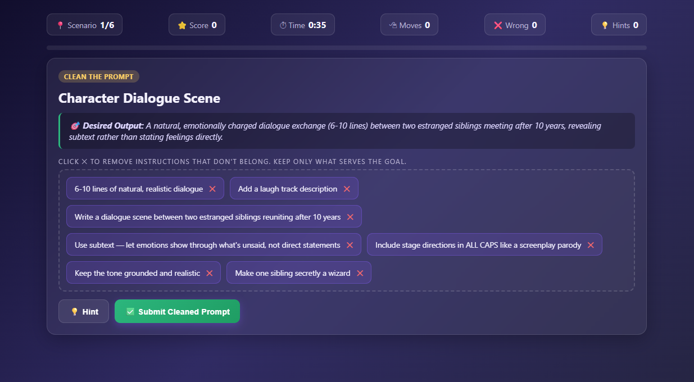
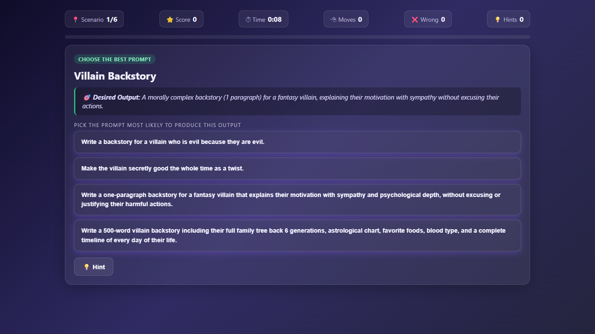
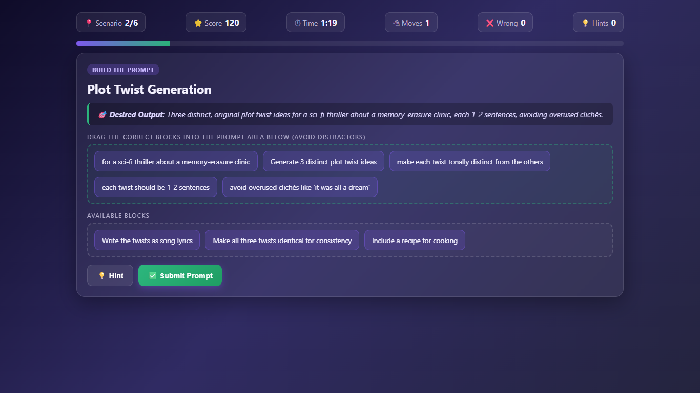
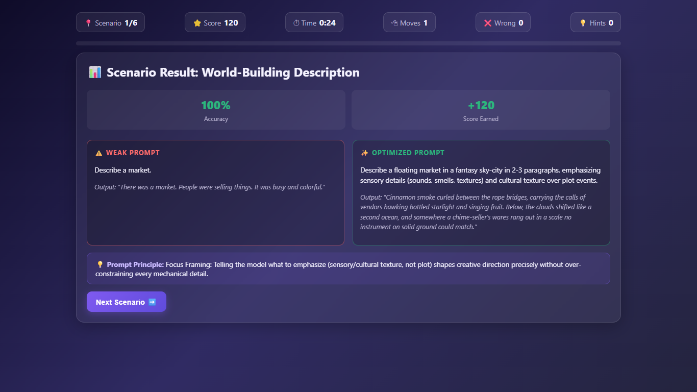
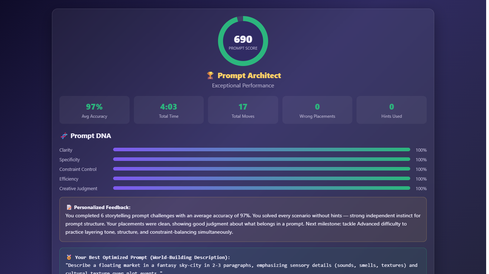

# Day 35 – Prompt Puzzle: Master AI Prompting Through Play

## Overview

Today I built and explored **Prompt Puzzle**, an interactive web application designed to teach effective AI prompting through gamified challenges. The application helps users understand how prompt quality directly influences AI-generated outputs by practicing prompt construction, refinement, and evaluation.

---

## Project Features

* Interactive onboarding experience
* Multiple prompt engineering challenges
* Build the Prompt game
* Clean the Prompt game
* Choose the Best Prompt challenge
* Drag-and-drop interactions
* Prompt quality comparison
* Weak vs Optimized prompt examples
* Prompt engineering principles after every challenge
* Performance scoring system
* Prompt DNA analysis
* Personalized Prompt Performance Report
* Replay functionality
* Fully responsive interface
* Modern glassmorphism UI
* Single-file HTML application (HTML, CSS, JavaScript)

---

## Learning Outcomes

During this project I learned:

* How prompt specificity improves AI responses.
* Why contradictory instructions reduce output quality.
* The importance of balancing constraints without over-engineering prompts.
* How prompt structure affects creativity and accuracy.
* Techniques for designing engaging educational web applications.
* Implementing drag-and-drop functionality using JavaScript.
* Managing application state for multiple interactive challenges.
* Creating a scoring and performance analysis system.

---

## Technologies Used

* HTML5
* CSS3
* Vanilla JavaScript
* Drag & Drop API
* Responsive Design
* Glassmorphism UI

---

## Challenge Workflow

1. Complete onboarding
2. Select challenge
3. Solve all prompt engineering puzzles
4. Review optimized prompts
5. Learn prompt engineering principles
6. Analyze Prompt Performance Report
7. Replay with different scenarios

---

## Screenshots

Add the following screenshots inside this folder:

* Home Screen

* Challenge 1

* Challenge 2

* Challenge 3

* Prompt Comparison

* Final Performance Report

---

## Key Takeaways

Prompt engineering is not just about writing longer prompts—it is about writing **clear, structured, and goal-oriented instructions**. Small improvements in specificity, constraints, and context can significantly improve AI-generated results. This project reinforced the importance of prompt design through hands-on interactive practice.

---
