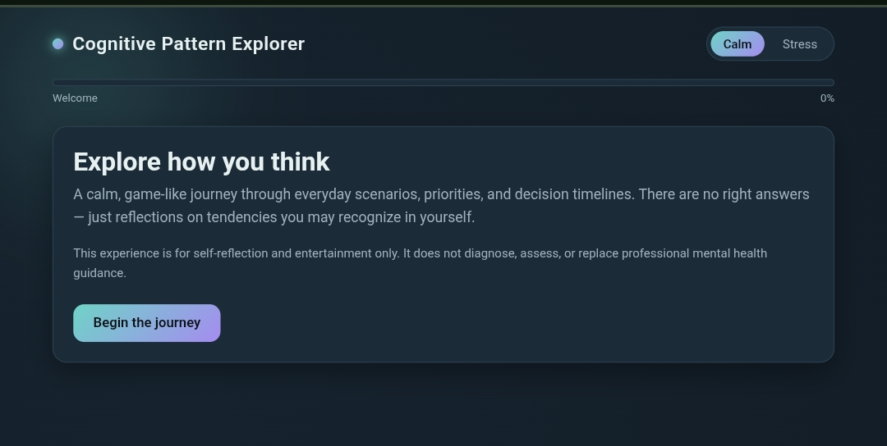
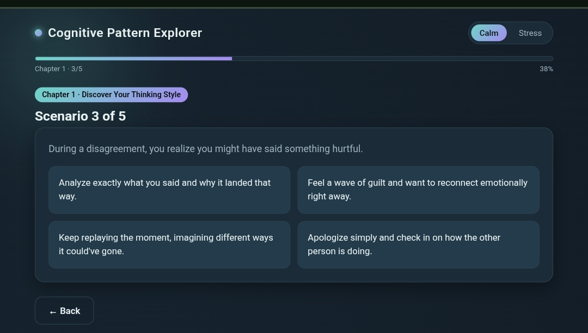
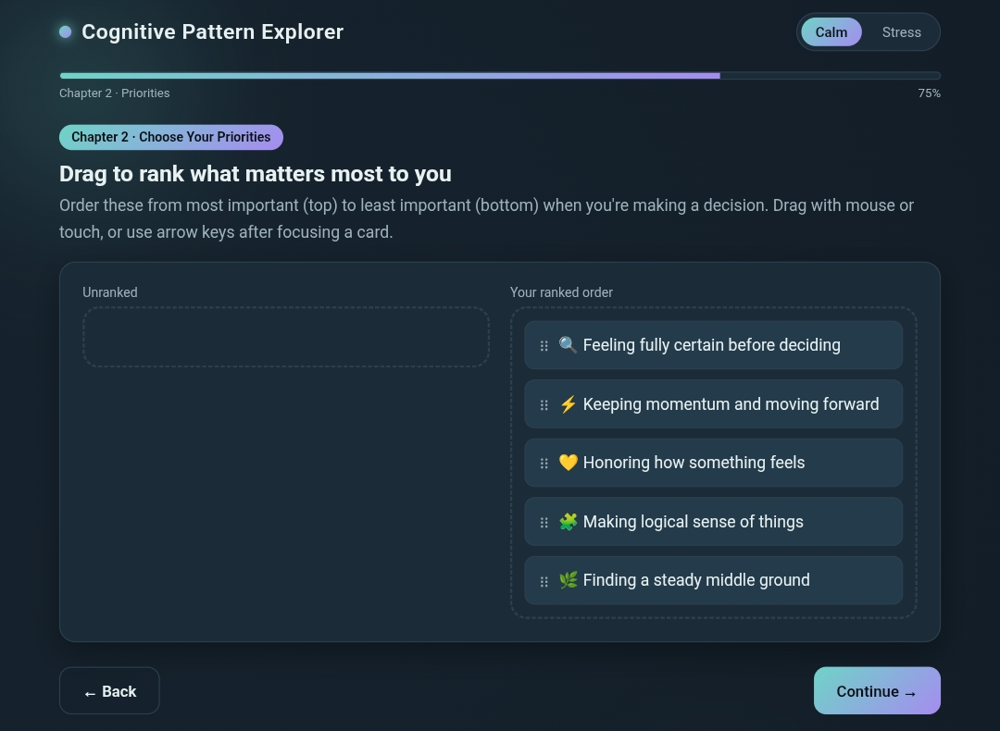
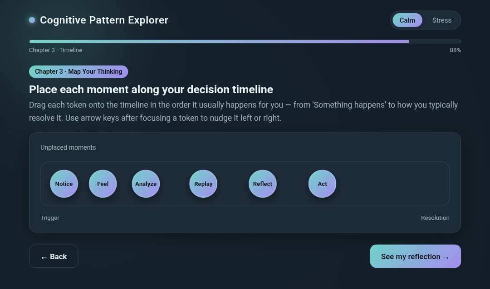
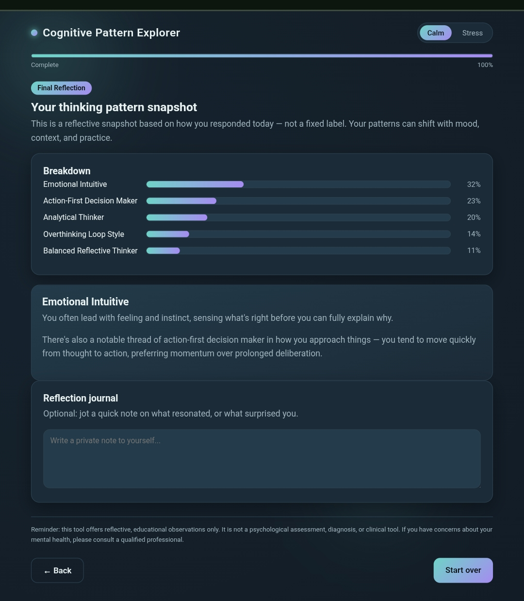

# Day 36 – Cognitive Pattern Explorer

## Project Overview
Today I developed **Cognitive Pattern Explorer**, an interactive web application designed to help users explore their thinking patterns through reflective exercises and decision-making activities.

---

## Features
- Calm Mode and Stress Mode
- Interactive everyday decision scenarios
- Drag-and-drop priority ranking
- Thinking sequence timeline
- Personalized cognitive pattern snapshot
- Reflection Journal
- Animated progress tracking
- Responsive and accessible interface

---

## Technologies Used
- HTML5
- CSS3
- Vanilla JavaScript

---

## What I Learned
- Managing application state in JavaScript
- Creating interactive drag-and-drop interfaces
- Building multi-step user experiences
- Designing responsive layouts
- Implementing progress tracking
- Improving accessibility with keyboard navigation
- Creating dynamic UI updates without frameworks

---

## Challenges
- Maintaining application state across multiple chapters
- Implementing drag-and-drop functionality for both desktop and mobile
- Designing a clean and intuitive user experience
- Calculating personalized reflection results dynamically

---

## Key Takeaways
- Interactive applications significantly improve user engagement.
- Proper state management simplifies multi-step workflows.
- Accessibility should be considered from the beginning of development.
- Small UI animations enhance the overall user experience.

---

## Screenshots

 

---