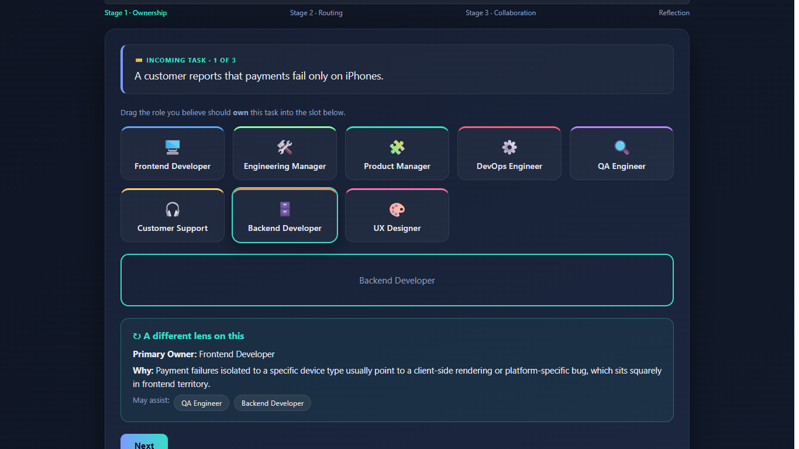
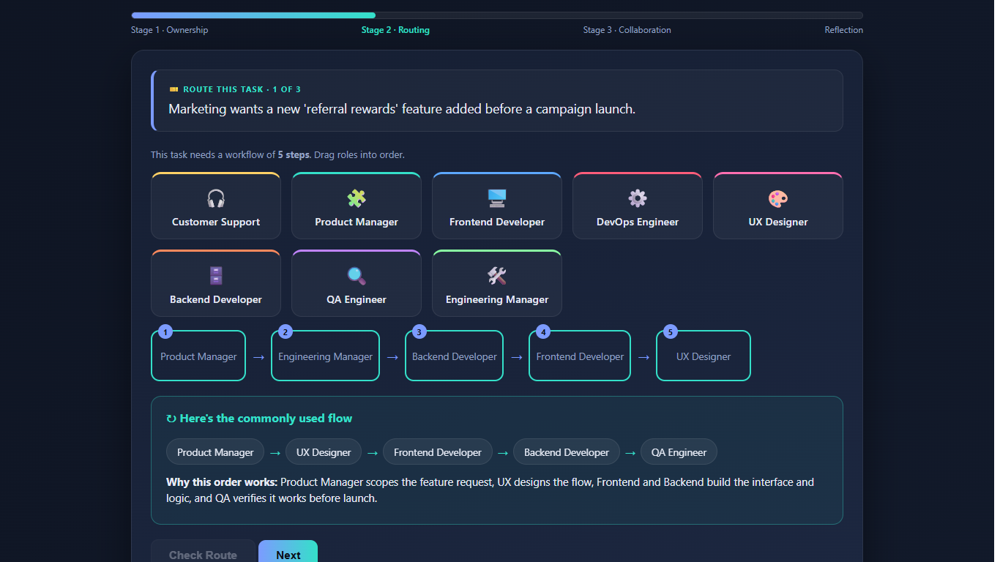
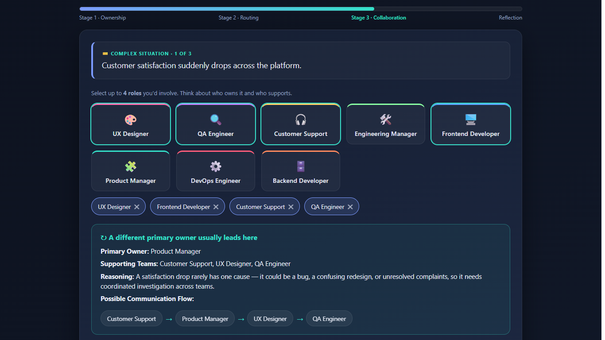
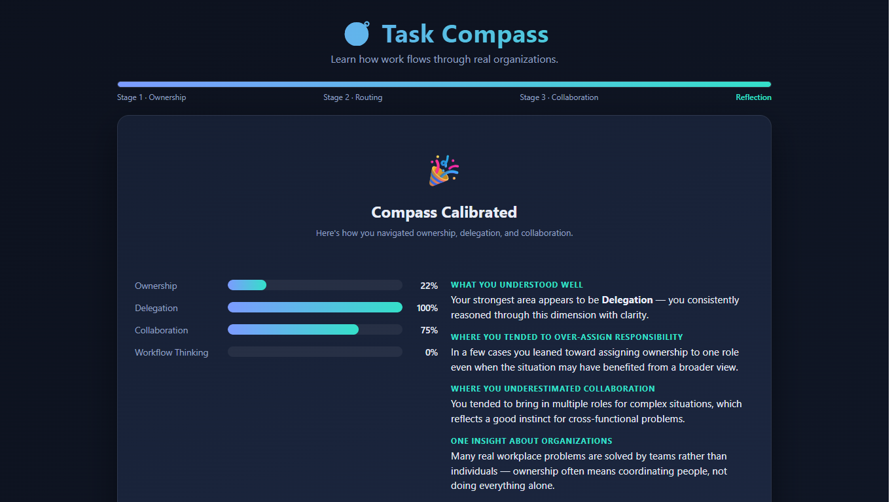

# Day 37 – Task Compass: Organizational Workflow Simulator

## Overview
On Day 37 of the Claude AI Challenge, I built **Task Compass**, an interactive HTML application that teaches organizational workflow, task ownership, delegation, and cross-functional collaboration through realistic workplace scenarios.

The simulator demonstrates how work flows inside an organization by allowing users to make decisions across multiple stages and then providing a performance dashboard with personalized insights.

---

## Objective

The goal of this project was to understand:

- Task ownership
- Responsibility delegation
- Workflow routing
- Cross-functional collaboration
- Organizational decision making

instead of simply assigning every problem to a single employee.

---

## Features

- Interactive multi-stage workflow simulator
- Beautiful modern UI with dark theme
- Drag-and-drop task assignment
- Workplace scenario generator
- Ownership identification
- Workflow routing simulation
- Collaboration challenge
- Animated progress tracker
- Organizational Thinking Dashboard
- Performance analytics
- Reflection-based learning
- Replay with different workplace scenarios

---

## Project Workflow

### Stage 1 – Ownership

Identify the primary owner responsible for solving a workplace problem.

Examples include:

- Payment issues
- API performance
- UX problems
- Customer support
- Infrastructure failures

---

### Stage 2 – Task Routing

Arrange the correct workflow showing how a task moves through different departments.

Examples:

- Customer Support
- QA
- Backend Development
- Product Management
- DevOps

---

### Stage 3 – Collaboration Challenge

Choose multiple stakeholders who should collaborate on solving complex organizational problems.

This stage emphasizes that real business problems require teamwork rather than individual effort.

---

## Technologies Used

- HTML5
- CSS3
- Vanilla JavaScript
- Drag & Drop API
- Flexbox
- CSS Grid
- CSS Animations

No external frameworks or libraries were used.

---

## What I Learned

- Ownership is different from participation.
- Delegation improves organizational efficiency.
- Complex problems require cross-functional collaboration.
- Workflow thinking is an important professional skill.
- Good organizations solve problems through coordinated teams.
- Decision-making improves when responsibilities are clearly defined.

---

## Outcome

Successfully developed a fully interactive organizational workflow simulator that provides users with immediate feedback, performance analytics, and learning insights after completing multiple workplace scenarios.

---

## Screenshots

**Stage 1 – Ownership**
  
**Stage 2 – Task Routing**
   
**Stage 3 – Collaboration**
   
**Organizational Thinking Dashboard**
   

---

## Key Takeaway

> Organizations succeed when ownership is clear, collaboration is intentional, and workflows connect the right people at the right time.
