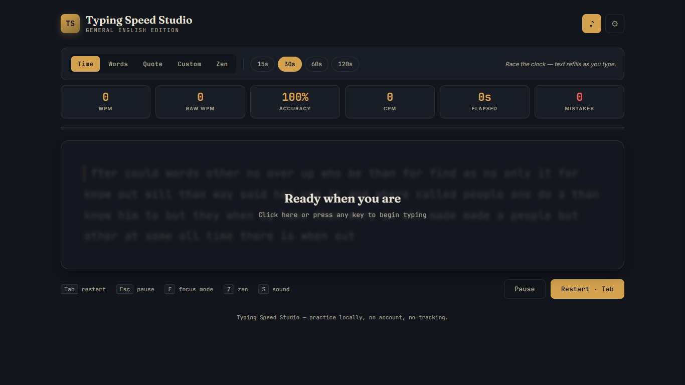
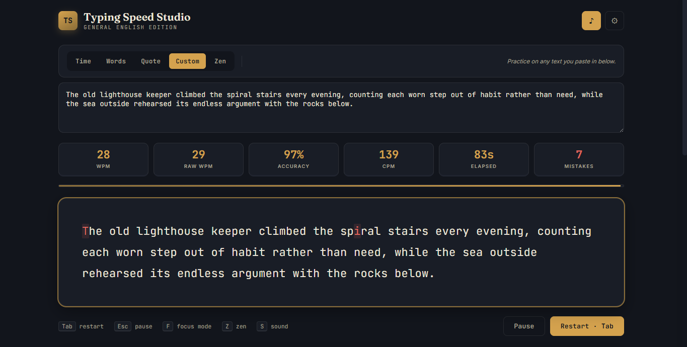
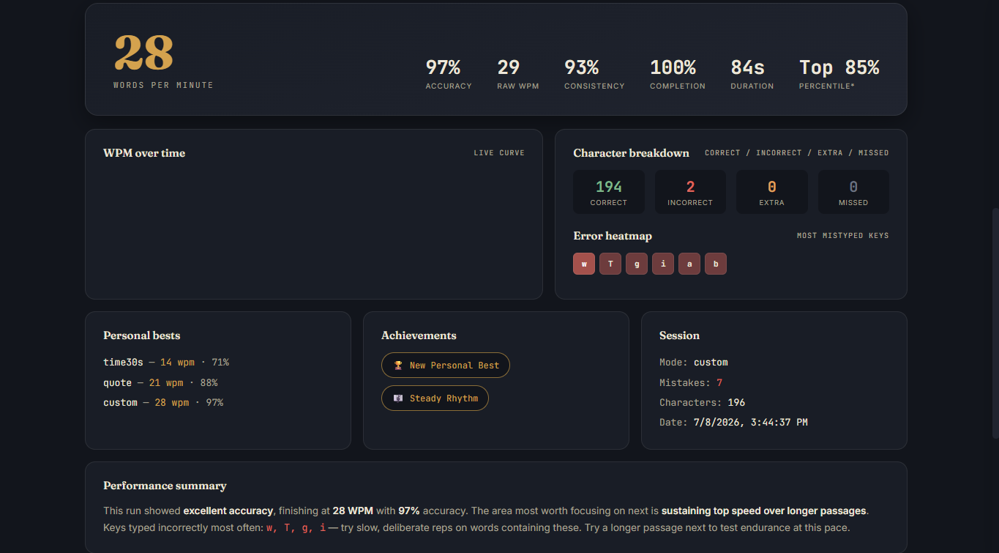

# Day 38 – Typing Speed Studio

## Overview

For Day 38 of the 60 Days of Claude AI Challenge, I built **Typing Speed Studio**, a feature-rich typing practice application generated using Claude AI.

The application provides multiple typing modes, live performance tracking, detailed post-session analytics, customizable settings, and local session history—all within a single HTML file using HTML, CSS, and JavaScript.

---

# Technologies Used

- HTML5
- CSS3
- Vanilla JavaScript
- Local Storage API
- Canvas API
- Responsive Design

---

# Features

## Typing Modes

- Time Mode
- Words Mode
- Quote Mode
- Custom Text Mode
- Zen Mode

---

## Live Statistics

- Words Per Minute (WPM)
- Raw WPM
- Accuracy
- Characters Per Minute (CPM)
- Elapsed Time
- Mistake Counter

---

## Analytics Dashboard

- Final WPM
- Accuracy
- Raw WPM
- Consistency Score
- Completion Percentage
- Duration
- Estimated Percentile
- WPM Progress Graph
- Character Breakdown
- Error Heatmap
- Session Summary
- Personal Best Records
- Achievement Badges
- Session History

---

## Customization

- Theme Switcher
- Font Size Control
- Sound Effects
- Focus Mode
- Zen Mode
- Keyboard Shortcuts
- Progress Bar Toggle

---

# My Performance

## Best Session

- WPM: **28**
- Raw WPM: **29**
- Accuracy: **97%**
- Consistency: **93%**
- Completion: **100%**
- Duration: **84 seconds**
- Mistakes: **7**

### Achievements

- 🏆 New Personal Best
- 🎵 Steady Rhythm

---

# Key Learnings

- Building a complete application using only HTML, CSS, and JavaScript
- Managing typing state and cursor tracking
- Calculating typing speed metrics in real time
- Implementing accuracy and mistake tracking
- Visualizing performance using charts
- Using Local Storage to persist session history
- Designing responsive user interfaces
- Creating configurable user settings
- Structuring large frontend applications efficiently
- Using Claude AI to rapidly generate functional applications

---

# Outcome

Successfully built and tested a complete Typing Speed Studio application featuring multiple practice modes, live performance tracking, detailed analytics, customization options, and persistent session history.

The project demonstrates how AI-assisted development can significantly accelerate the creation of polished, interactive frontend applications while reinforcing core JavaScript concepts.

---

## Screenshots

**Home Page**

**Task Page**

**Result**

---
