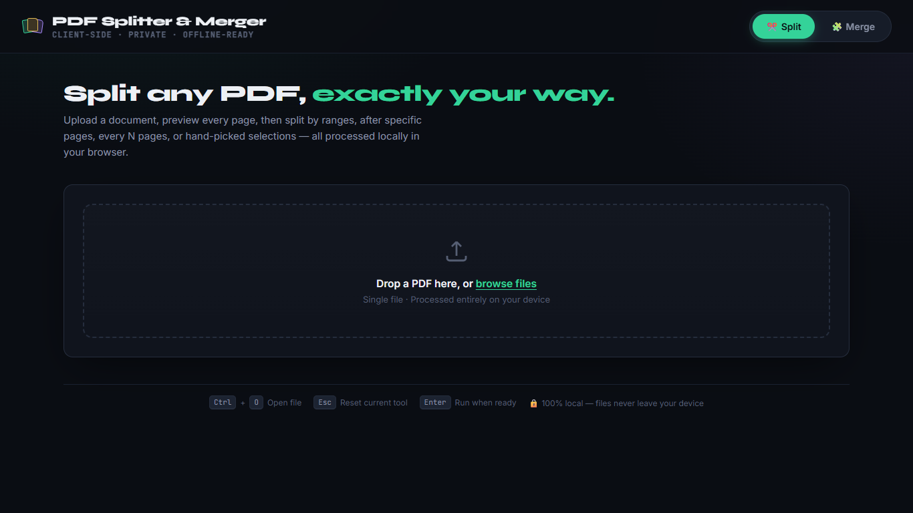
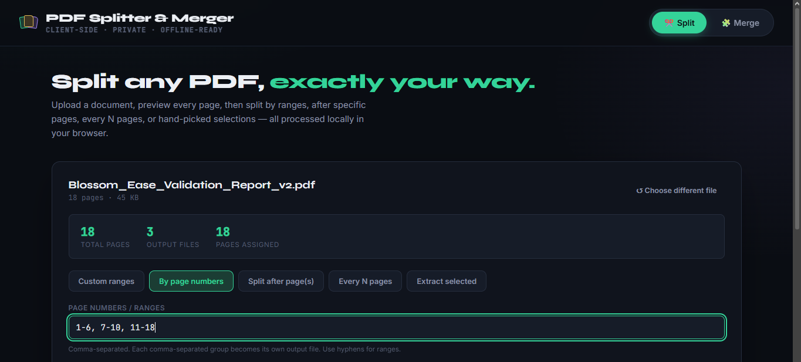
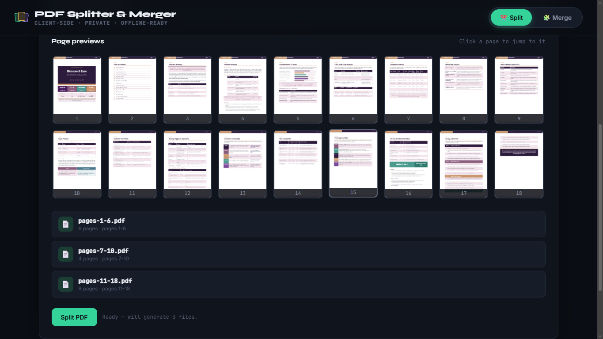
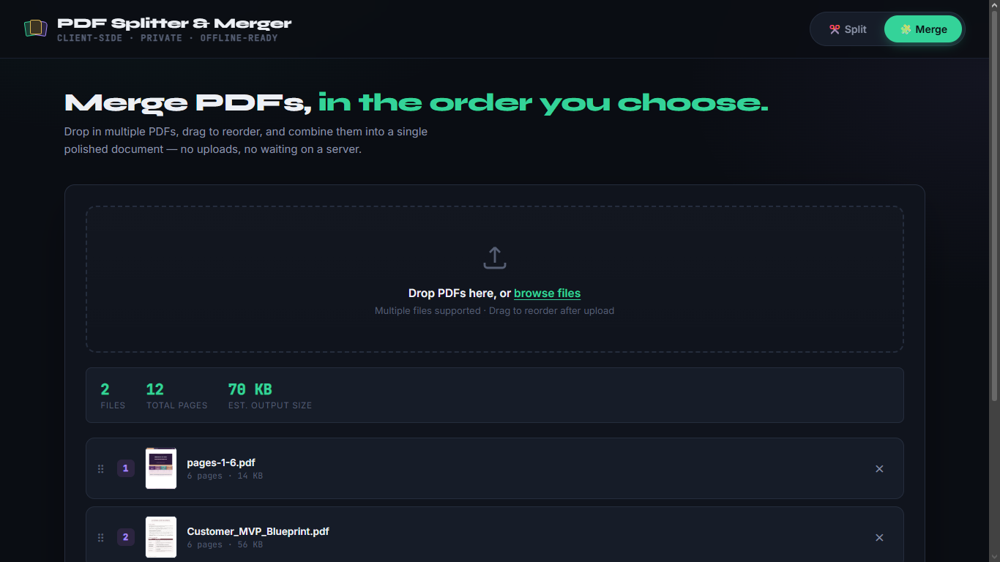

# Day 39 – PDF Splitter & Merger

## Overview

Today I built a fully client-side **PDF Splitter & Merger** using HTML, CSS, and JavaScript. The application allows users to split PDF documents using multiple strategies and merge multiple PDF files into a single document—all processed locally in the browser without uploading files to any server.

This project emphasizes privacy, performance, and a polished user experience while leveraging modern browser APIs and PDF processing libraries.

---

## Objectives

- Build a browser-based PDF utility.
- Implement multiple PDF splitting methods.
- Merge multiple PDFs into a single document.
- Provide page previews before processing.
- Ensure all operations remain completely offline.
- Create an intuitive and responsive UI.

---

## Technologies Used

- HTML5
- CSS3
- JavaScript (ES6+)
- PDF-lib
- PDF.js

---

## Features

### PDF Splitter

- Upload PDF documents
- Preview every page before processing
- Split using custom page ranges
- Split by page numbers
- Split after selected pages
- Split every N pages
- Extract selected pages only
- Preview generated output files
- Download processed PDFs

### PDF Merger

- Upload multiple PDF files
- Drag-and-drop file reordering
- Merge PDFs in custom order
- Display total pages and estimated output size
- Download merged PDF

### User Experience

- Modern dark UI
- Responsive layout
- Drag-and-drop upload
- Keyboard shortcuts
- Loading indicators
- Toast notifications
- Offline-first architecture
- No server required
- Complete client-side processing

---

## Implementation Highlights

### PDF Processing

- Loaded PDFs using PDF.js
- Generated page thumbnails
- Processed pages using PDF-lib
- Created new PDF documents dynamically
- Combined multiple PDFs while preserving page order

### Split Modes Implemented

- Custom ranges
- Page number ranges
- Split after specific pages
- Every N pages
- Extract selected pages

### Merge Workflow

- Multi-file upload
- Drag-and-drop sorting
- Automatic page counting
- Merge preserving selected order
- Single downloadable PDF

---

## Testing Performed

### PDF Split Testing

✅ Uploaded PDF successfully

✅ Previewed all pages

✅ Split using page ranges

✅ Split by page numbers

✅ Generated multiple PDF files

✅ Downloaded processed PDFs

### PDF Merge Testing

✅ Uploaded multiple PDFs

✅ Reordered files

✅ Merged successfully

✅ Downloaded merged document

---

## Key Learnings

- Learned client-side PDF manipulation.
- Understood PDF rendering using PDF.js.
- Used PDF-lib for document editing.
- Improved drag-and-drop interactions.
- Built an offline-first web application.
- Enhanced user experience with previews and progress indicators.
- Gained practical experience handling binary files in JavaScript.

---

## Challenges Faced

- Rendering page thumbnails efficiently.
- Managing multiple split strategies.
- Preserving page order during merging.
- Handling large PDF files smoothly.
- Maintaining responsive UI during processing.

---

## Outcome

Successfully developed a fully functional **PDF Splitter & Merger** that performs all PDF operations locally within the browser. The application provides multiple splitting options, PDF merging with drag-and-drop ordering, page previews, downloadable outputs, and a modern responsive interface while ensuring complete user privacy.

---

## Screenshots

**Home Page**
  
 
**Split Interface**
  
  
**Split Preview**
  
  
**Merge Interface**
  

---
