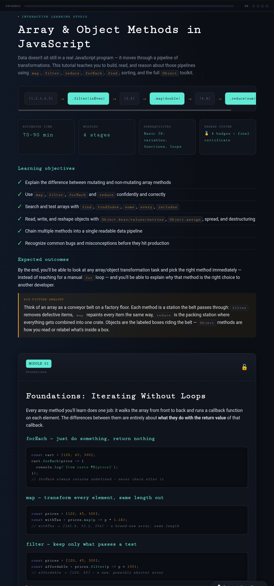
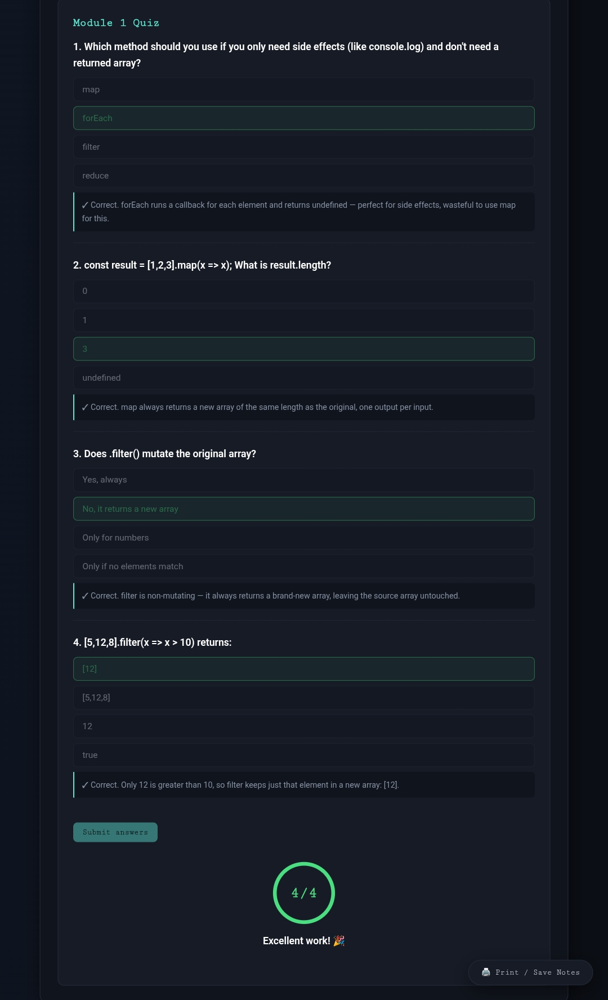
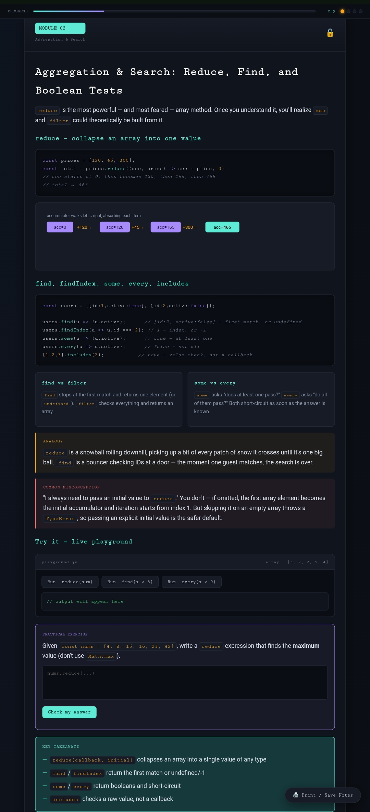
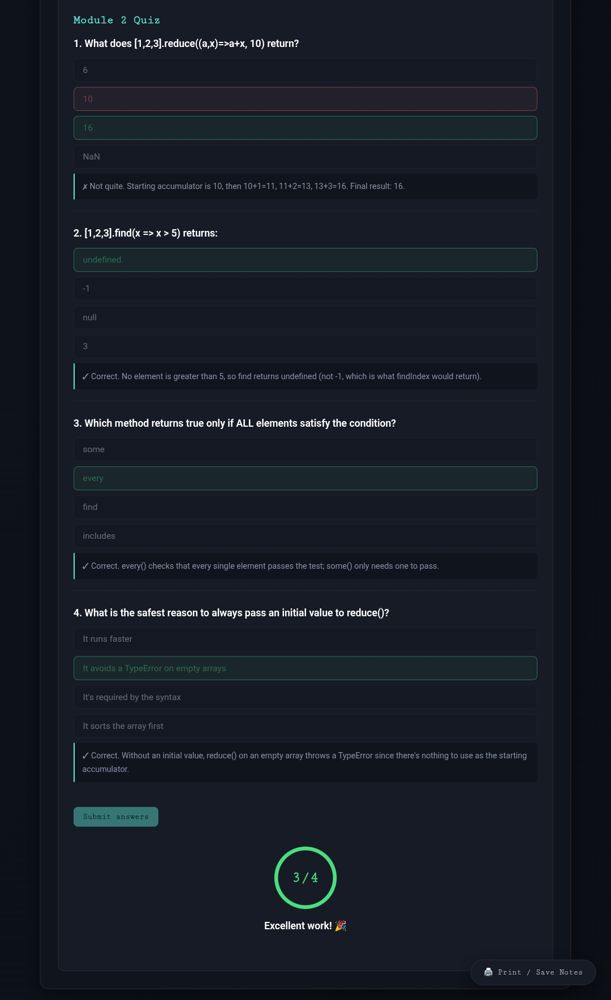
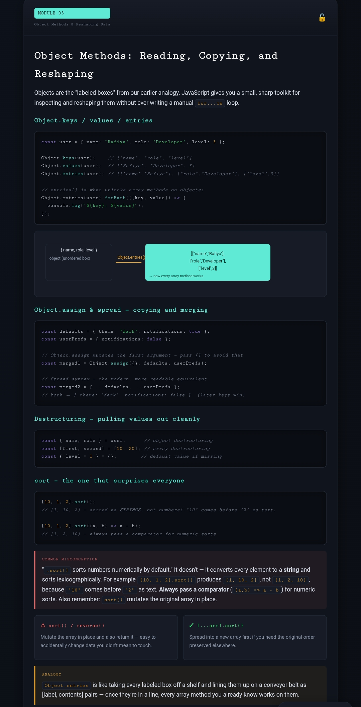
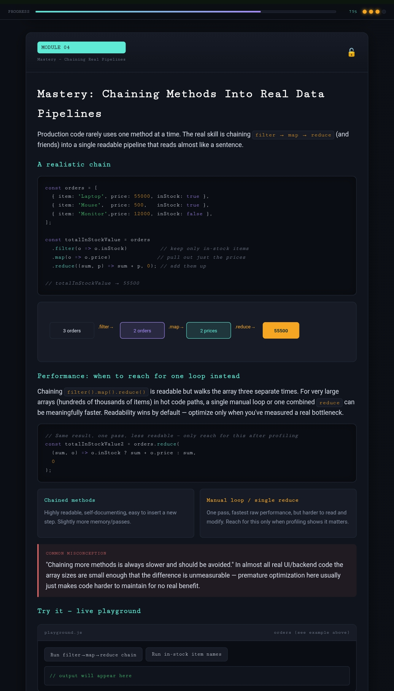
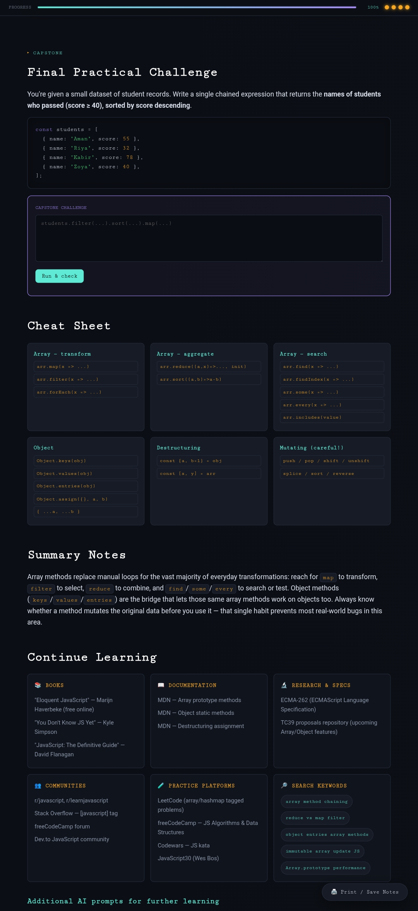

# Day 41 – Interactive Learning Studio: Array & Object Methods in JavaScript

## 📅 Date
July 11, 2026

---

# Overview

Today I built and completed an **Interactive Learning Studio** that teaches JavaScript Array and Object methods through visual explanations, live playgrounds, quizzes, and a final practical challenge.

Instead of learning individual methods separately, this project focuses on building complete data transformation pipelines similar to production JavaScript applications.

---

# Project Highlights

- Interactive multi-module learning experience
- Dark modern UI
- Live JavaScript playground
- Hands-on coding exercises
- Progress tracking
- Module quizzes
- Practical coding challenges
- Final capstone assessment
- Printable learning notes

---

# Learning Modules

## Module 1 – Foundations

Covered:

- forEach()
- map()
- filter()

Key Learnings:

- forEach() is used for side effects.
- map() always returns a new array.
- filter() creates a filtered copy without mutating the original array.
- Understanding callback functions.

---

## Module 2 – Aggregation & Search

Covered:

- reduce()
- find()
- findIndex()
- some()
- every()
- includes()

Key Learnings:

- reduce() collapses an array into one value.
- find() returns the first matching element.
- findIndex() returns the index.
- some() checks if at least one item passes.
- every() verifies every element.
- includes() searches primitive values.

---

## Module 3 – Object Methods & Data Reshaping

Covered:

- Object.keys()
- Object.values()
- Object.entries()
- Object.assign()
- Spread Operator
- Object Destructuring
- Array Destructuring
- Sorting Arrays

Key Learnings:

- Convert objects into iterable arrays.
- Merge objects safely.
- Copy objects without mutation.
- Destructure data cleanly.
- Always use a comparator while sorting numbers.

---

## Module 4 – Chaining Methods

Covered:

- filter()
- map()
- reduce()

Real-world pipeline:

Filter → Transform → Aggregate

Example workflow:

Orders
→ Filter In Stock
→ Map Prices
→ Reduce Total

Key Learnings:

- Method chaining improves readability.
- Pipelines resemble production code.
- Optimize only after profiling.
- Readability is usually more important than micro-optimizations.

---

# Quizzes Completed

## Module 1 Quiz

Score:

✅ 4/4

Topics:

- map()
- filter()
- forEach()

---

## Module 2 Quiz

Score:

✅ 3/4

Topics:

- reduce()
- find()
- every()

---

# Final Practical Challenge

Challenge:

Return the names of students who scored at least 40 marks and sort them by highest score.

Solution:

```javascript
students
  .filter(student => student.score >= 40)
  .sort((a, b) => b.score - a.score)
  .map(student => student.name);
```

Concepts Used:

- filter()
- sort()
- map()
- Method chaining

---

# Skills Practiced

- JavaScript Arrays
- Object Manipulation
- Callback Functions
- Functional Programming
- Method Chaining
- Immutable Updates
- Data Transformation
- Production Pipelines
- JavaScript Best Practices

---

# Screenshots

## Home Page



## Module 1 Quiz


---

## Module 2



## Module 2 Quiz



---

## Module 3



---

## Module 4



---

## Final Challenge



---

# Files

- interactive-learning-studio.html
- day41.md
- Screenshots

---

# Key Takeaways

- Functional programming makes JavaScript code cleaner.
- Method chaining creates readable pipelines.
- Object methods simplify data reshaping.
- Non-mutating methods reduce bugs.
- Understanding callbacks is fundamental for modern JavaScript.
- Real-world applications often combine filter(), map(), reduce(), and sort().

---

# Technologies Used

- HTML5
- CSS3
- Vanilla JavaScript (ES6+)
- Flexbox
- CSS Grid

---

## Day 41 Complete ✅

Interactive Learning Studio successfully completed with all modules, quizzes, playground exercises, and the final practical challenge.
