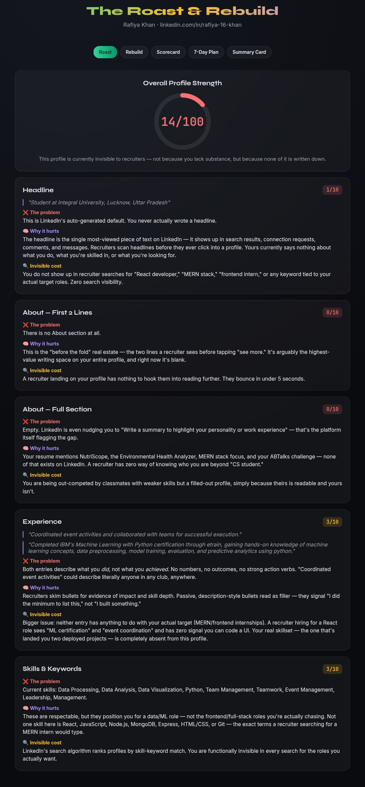
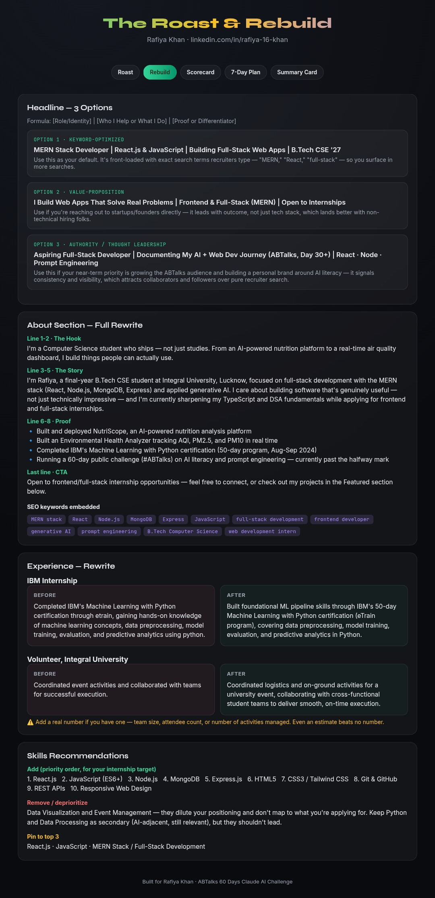
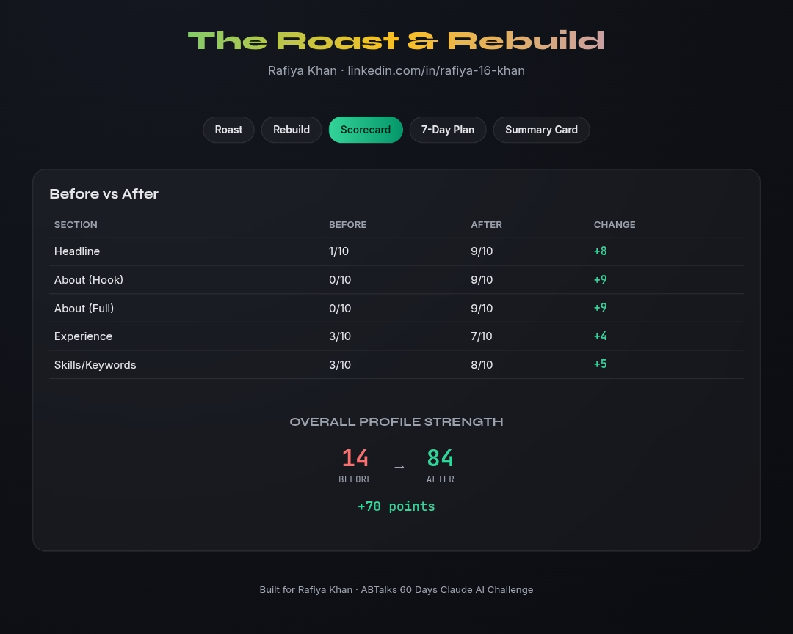
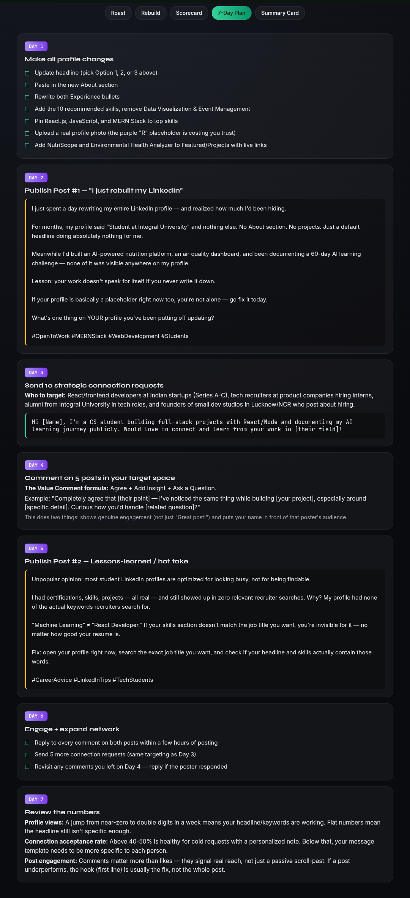
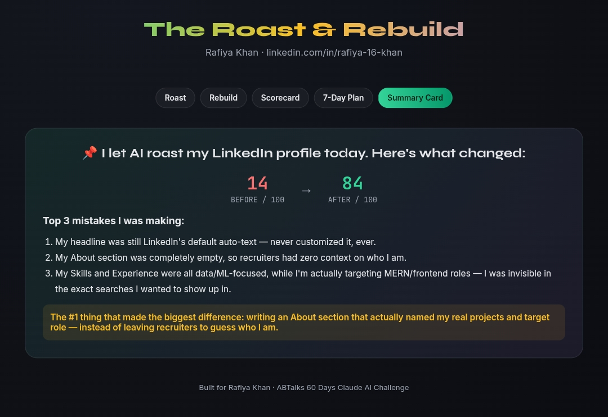

# Day 44 – LinkedIn Roast & Rebuild

## Challenge Overview

Today's challenge was to build an interactive **LinkedIn Roast & Rebuild** application using Claude AI. The application analyzes a LinkedIn profile, identifies weak areas, provides detailed optimization suggestions, generates improved profile content, and creates a practical action plan for improving LinkedIn visibility.

---

## Objective

Build an AI-powered LinkedIn Profile Optimizer that can:

- Roast an existing LinkedIn profile
- Analyze profile strength
- Identify missing sections
- Generate optimized profile content
- Recommend SEO-friendly keywords
- Create a profile improvement roadmap
- Display before vs after score comparison

---

## Features Implemented

### 🔥 Roast Analysis
- Overall profile strength score
- Headline analysis
- About section review
- Experience evaluation
- Skills & keyword analysis
- Recruiter visibility insights

### 🚀 Rebuild Suggestions
- Three optimized headline options
- Complete About section rewrite
- Experience section improvements
- Skills recommendations
- SEO keyword optimization
- Professional positioning guidance

### 📊 Scorecard
- Before vs After comparison
- Section-wise improvement scores
- Overall profile strength improvement
- Performance summary

### 📅 7-Day Action Plan
- Daily profile improvement checklist
- LinkedIn posting strategy
- Networking roadmap
- Engagement recommendations
- Profile optimization tasks

### 📌 Summary Card
- Biggest profile mistakes
- Key improvement highlights
- Profile score transformation
- Quick optimization recap

---

## Technologies Used

- HTML5
- CSS3
- JavaScript
- Responsive Design
- Glassmorphism UI
- SVG Progress Ring
- Google Fonts
- Claude AI

---

## Key Learnings

- Recruiters search profiles using keywords rather than resumes alone.
- A strong LinkedIn headline significantly improves search visibility.
- An optimized About section increases profile engagement.
- Projects should be showcased clearly with measurable impact.
- Skills should align with target job roles.
- Consistent networking and posting help build professional visibility.
- Small profile improvements collectively create a major impact.

---

## Outcome

The application transformed a weak LinkedIn profile into a recruiter-friendly profile by providing actionable improvements and structured recommendations.

### Overall Improvement

**Before:** 14/100

**After:** 84/100

**Improvement:** +70 Points

---

📸 Application Screenshots

## Roast Analysis

---

## Rebuild Suggestions

---

## Scorecard

---

## 7-Day Action Plan

---

## Summary Card

---

## Conclusion

This project demonstrated how AI can be used to provide personalized LinkedIn profile feedback, generate professional profile content, improve recruiter visibility, and create an actionable roadmap for career growth. It also reinforced prompt engineering skills and practical AI-assisted application development.
