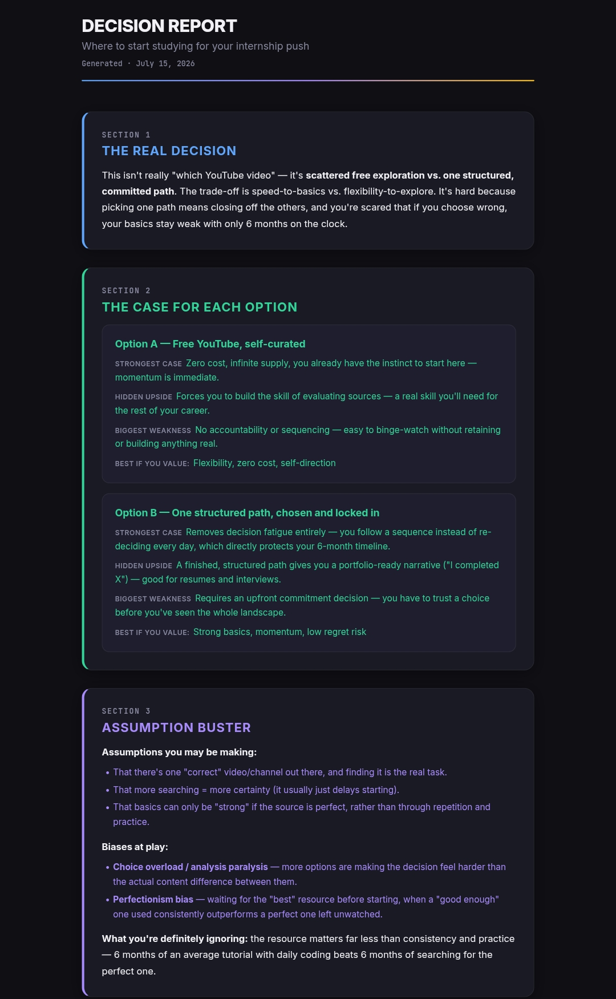
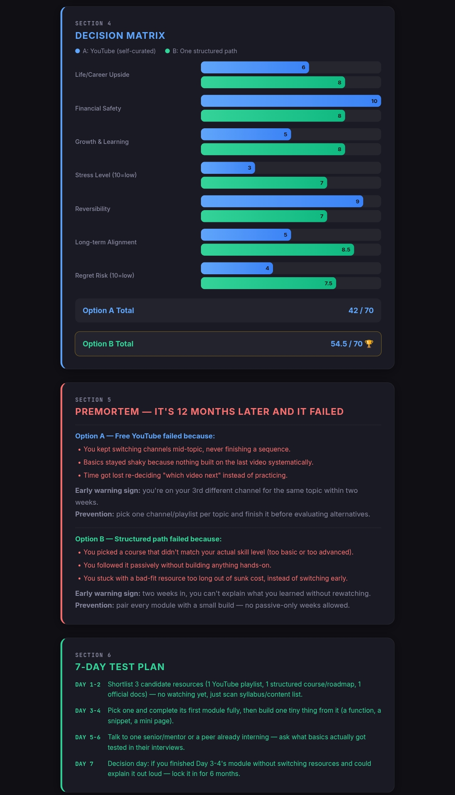
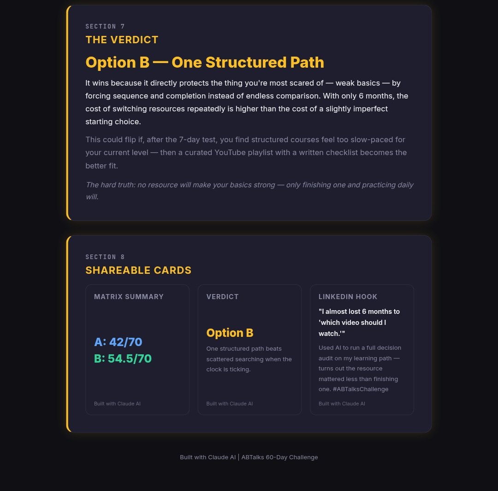

# Day 45 – AI Decision Report Generator

## 📌 Challenge Overview

Day 45 of the **ABTalks 60 Days Claude Challenge** focused on building an **AI-powered Decision Report Generator** using Claude.

The application helps users evaluate difficult decisions through structured reasoning instead of relying on emotions or endless comparisons. It analyzes multiple options, identifies biases, compares choices using a weighted decision matrix, performs a premortem analysis, creates a practical action plan, and delivers a final AI verdict.

This project demonstrates how AI can assist with structured decision-making and critical thinking.

---

## 🚀 What I Built

An interactive Decision Report web application that:

- 🧠 Identifies the real decision behind the question
- ⚖️ Compares multiple options objectively
- 📊 Generates a weighted Decision Matrix
- 🎯 Detects assumptions and cognitive biases
- 💥 Performs Premortem Failure Analysis
- 📅 Creates a practical 7-Day Action Plan
- 🏆 Generates an AI Verdict with reasoning
- 📱 Includes Shareable Summary Cards
- 💻 Responsive single HTML application

---

## 🛠 Tech Stack

- HTML5
- CSS3
- Vanilla JavaScript
- Claude AI
- Prompt Engineering

---

## 📷 Project Screenshots

### 🖼️ Screenshot 1 – Decision Report Overview

### 🖼️ Screenshot 2 – Decision Matrix & 7-Day Test Plan

### 🖼️ Screenshot 3 – Final Verdict & Shareable Cards

---

## 🎯 Key Learnings

- AI can simplify complex decision-making using structured frameworks.
- A decision matrix provides objective comparison instead of emotional judgment.
- Premortem analysis helps identify possible failures before execution.
- Small action plans reduce decision paralysis.
- Prompt engineering can generate professional analytical reports with minimal code.

---

## 💡 Challenge Outcome

✅ Read the provided resources

✅ Watched the solution walkthrough

✅ Used Claude AI

✅ Generated the complete HTML application

✅ Tested the complete workflow

✅ Captured screenshots

✅ Uploaded project files to GitHub

---

## 📈 Skills Practiced

- Prompt Engineering
- AI-Assisted Development
- Critical Thinking
- Decision Analysis
- HTML/CSS
- UI Design
- Workflow Design

---

## 🔥 Final Thoughts

This project showed that AI is more than a coding assistant—it can also function as a structured thinking partner. Instead of chasing the "perfect" choice, the Decision Report emphasized committing to one well-reasoned path supported by analysis and consistent execution.

---
