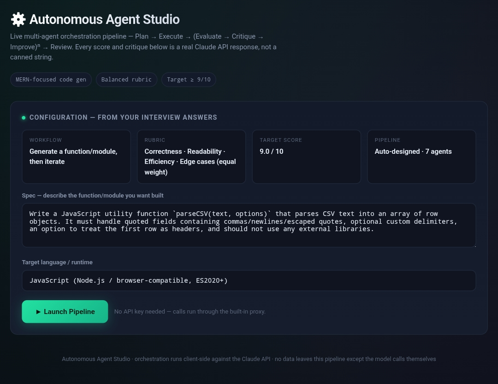
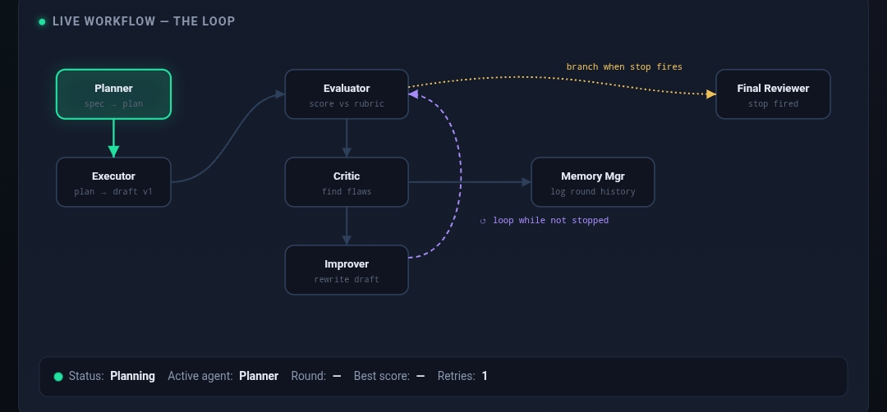

# Day 46 – Autonomous Agent Studio

## 🚀 Project Overview

Today I built and explored an **Autonomous Agent Studio**, a browser-based multi-agent orchestration system that demonstrates how AI agents can collaborate to iteratively solve complex programming tasks.

The application visualizes the complete autonomous workflow from planning to execution, evaluation, improvement, memory management, and final review.

---

# 🎯 Objectives

- Understand autonomous AI agent orchestration
- Generate production-ready code through multiple AI agents
- Observe iterative improvement cycles
- Learn stopping conditions used in autonomous systems
- Analyze execution history and refinement loops

---

# 🧠 AI Workflow

```
User Specification
        │
        ▼
 Planner Agent
        │
        ▼
 Executor Agent
        │
        ▼
 Evaluator Agent
        │
        ▼
 Critic Agent
        │
        ▼
 Improver Agent
        │
        ▼
 Memory Manager
        │
        ▼
 Stop Condition Check
        │
   Yes ─────────► Final Reviewer
        │
   No
        │
   Repeat Loop
```

---

# 🤖 Agents Used

## 🧭 Planner
- Reads project specification
- Designs implementation strategy
- Identifies edge cases

---

## ⚙️ Executor
- Generates first working implementation
- Converts plan into code

---

## 📊 Evaluator
Scores code on

- Correctness
- Readability
- Efficiency
- Edge Cases

---

## 🔍 Critic

Finds

- Bugs
- Weak implementations
- Missing validations
- Performance issues

---

## ✨ Improver

Uses evaluator + critic feedback to

- Rewrite code
- Increase quality
- Fix detected problems

---

## 🧠 Memory Manager

Maintains

- Iteration history
- Previous scores
- Improvement trajectory

---

## ✅ Final Reviewer

Produces

- Final review
- Readiness assessment
- Remaining limitations

---

# 🔄 Autonomous Loop

The application continuously performs

Plan

↓

Execute

↓

Evaluate

↓

Critique

↓

Improve

↓

Repeat until:

- Target score reached
- Plateau detected
- Maximum iterations exceeded

---

# 🛑 Stopping Conditions

The pipeline automatically stops when one of these conditions is met:

- Target quality score achieved
- Score improvement plateaus
- Hard iteration limit reached

---

# 📈 Key Features

- Multi-agent collaboration
- Live workflow visualization
- Iteration history
- Activity log
- Memory management
- Automatic stopping logic
- Final quality review
- Browser-based execution

---

# 📸 Screenshots

## Dashboard



## Workflow Execution



---

# 💡 Key Learnings

- Multi-agent systems divide complex work into specialized responsibilities.
- Feedback loops significantly improve solution quality.
- Memory enables agents to avoid repeating mistakes.
- Autonomous stopping conditions prevent unnecessary computation.
- Agent orchestration provides a structured approach to iterative software development.

---

# 🛠️ Technologies

- HTML5
- CSS3
- JavaScript
- Claude API
- Multi-Agent Architecture

---

# 📁 Files Included

- ✅ HTML Application
- ✅ Screenshots
- ✅ Execution Logs
- ✅ Learning Notes

---

# 🎯 Outcome

Successfully created and tested an Autonomous Agent Studio capable of orchestrating multiple AI agents through planning, execution, evaluation, critique, refinement, and final review while visualizing the complete autonomous decision-making workflow.
