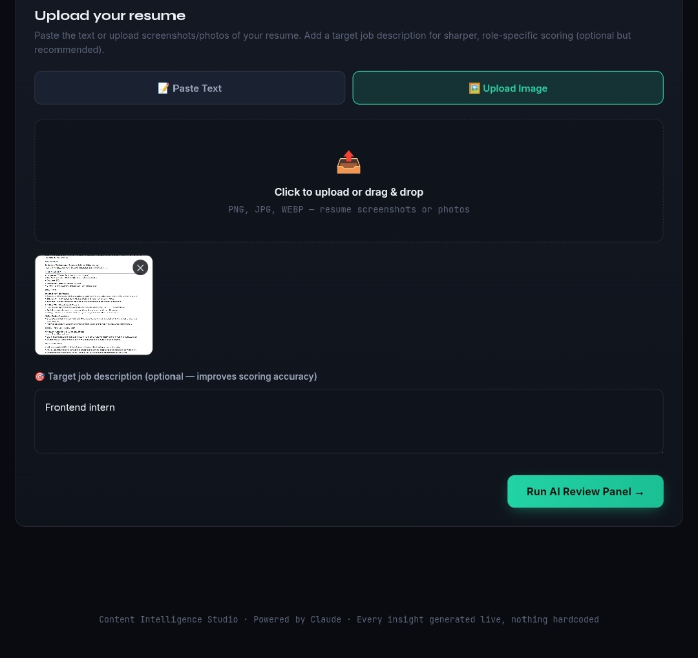
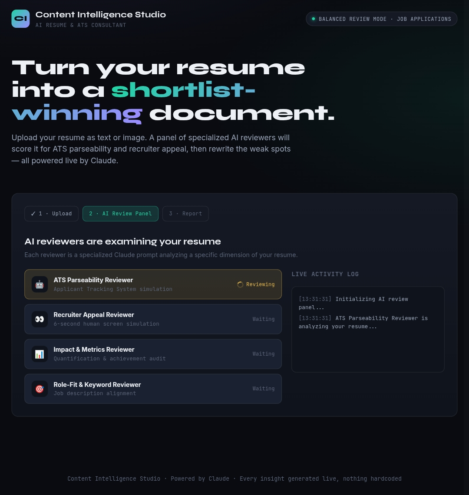

# Day 47 – Content Intelligence Studio

## 🚀 Challenge
Built an AI-powered **Content Intelligence Studio** that analyzes resumes using multiple AI reviewer personas and generates detailed ATS, recruiter, impact, and role-fit recommendations.

## 📌 Objective
Create a complete HTML application capable of:
- Uploading resume text or images
- Running multiple AI reviewer analyses
- Providing ATS compatibility insights
- Generating recruiter-focused recommendations
- Suggesting impactful resume rewrites
- Producing an executive summary and improvement roadmap

---

## 🛠️ Features

### 📄 Resume Input
- Paste resume text
- Upload resume screenshots/images
- Drag & Drop support
- Multiple image uploads

### 🤖 AI Review Panel
- ATS Parseability Reviewer
- Recruiter Appeal Reviewer
- Impact & Metrics Reviewer
- Role-Fit & Keyword Reviewer

### 📊 AI Analysis
- Overall Resume Score
- ATS Score
- Recruiter Score
- Impact Score
- Keyword Match Score
- Executive Summary
- Improvement Suggestions

### ✨ Resume Optimization
- Resume Bullet Rewrites
- Better Professional Summary
- Alternative Resume Headlines
- Before vs After Comparison
- Publishing Checklist

### 📈 Interactive Dashboard
- Animated Score Ring
- Progress Tracking
- Category-wise Analysis
- Activity Log
- Deep Dive Tabs

---

# 📷 Screenshots

## Home Screen

## Resume Upload

## AI Review Panel

---

# Key Learnings

- Multi-agent AI review workflow
- ATS optimization principles
- Resume content analysis
- Prompt engineering with specialized AI roles
- Interactive dashboard design
- HTML/CSS/JavaScript architecture
- AI-powered content recommendations
- Resume scoring systems
- User experience improvements

---

## Tech Stack

- HTML5
- CSS3
- JavaScript
- Claude API
- Prompt Engineering

---

## Outcome

Successfully developed an AI-powered Resume Content Intelligence Studio capable of generating professional ATS analysis, recruiter feedback, resume rewrites, and personalized recommendations.

---
