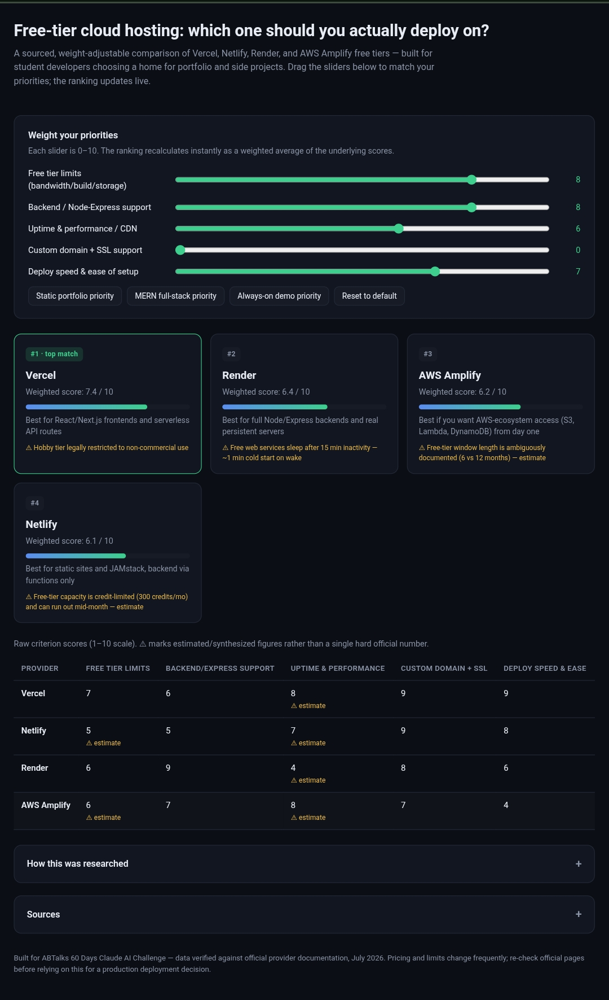
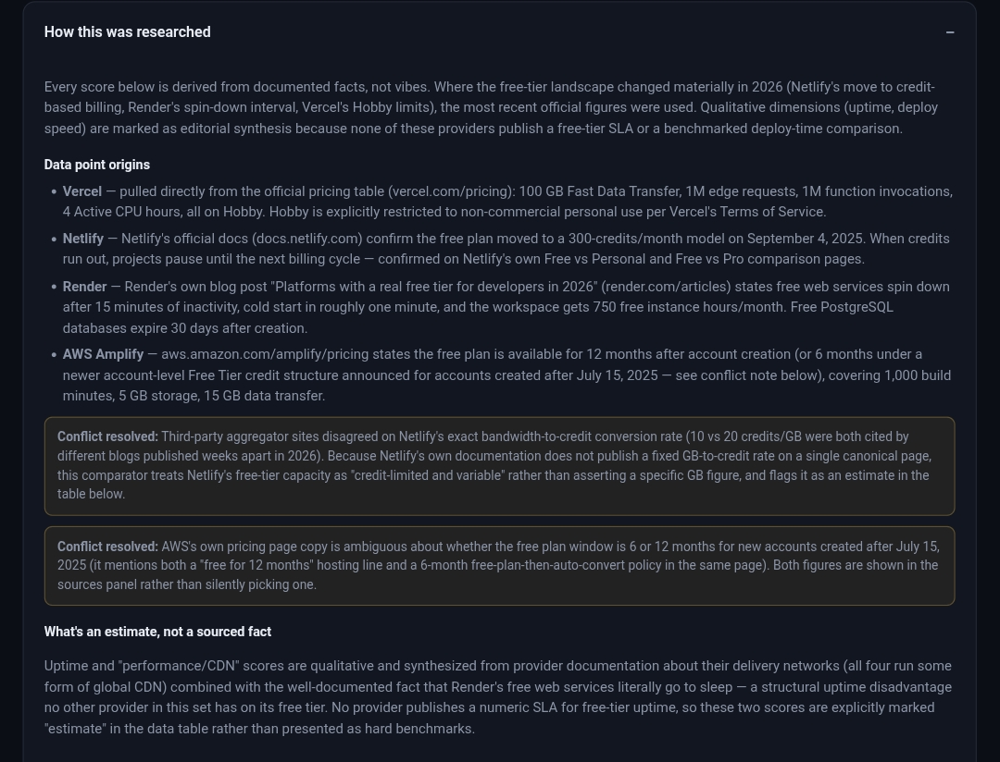
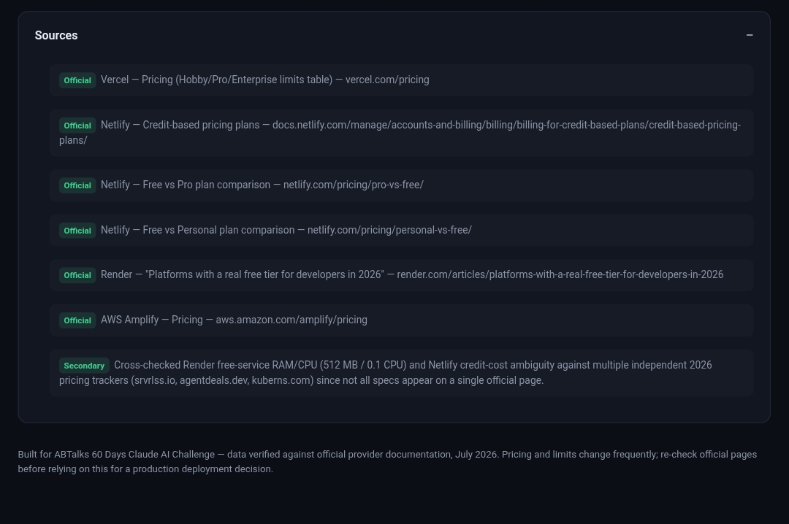

# Day 48 – The Verdict Engine: Free-Tier Cloud Hosting Comparator

## 🚀 Overview

Day 48 of the **ABTalks 60 Days Claude AI Challenge** focused on building **The Verdict Engine**, an interactive decision-support application that compares the free-tier cloud hosting platforms most commonly used by developers.

Instead of presenting generic recommendations, this application allows users to assign custom importance (weights) to multiple deployment criteria and instantly recalculates provider rankings.

The project emphasizes:

- Evidence-based decision making
- Transparent research methodology
- Source verification
- Interactive weighted scoring
- Real-world deployment guidance

---

# 🎯 Objective

Create a browser-based decision engine that helps developers determine the most suitable free hosting platform by comparing:

- Vercel
- Render
- Netlify
- AWS Amplify

using verified documentation rather than subjective opinions.

---

# ✨ Features

- Interactive weight sliders
- Live ranking updates
- Weighted scoring engine
- Provider comparison cards
- Detailed comparison table
- Expandable research methodology
- Verified source references
- Conflict resolution documentation
- Responsive dark UI
- Pure HTML/CSS/JavaScript implementation

---

# ⚙️ Technologies Used

- HTML5
- CSS3
- Vanilla JavaScript
- Responsive Design
- Weighted Decision Algorithm

---

# 🧠 What I Learned

During this project I learned:

- Designing weighted decision engines
- Building interactive scoring systems
- Dynamic DOM updates
- Ranking algorithms
- Research verification techniques
- Documenting assumptions and estimates
- Comparing cloud hosting platforms using official documentation
- Creating transparent AI-assisted decision tools

---

# 📊 Evaluation Criteria

The Verdict Engine compares providers using adjustable weights for:

- Free Tier Limits
- Backend / Express Support
- Uptime & Performance
- Custom Domain + SSL
- Deployment Speed & Ease

Users can modify priorities and instantly see updated rankings.

---

# 📚 Research Highlights

The application is backed by official provider documentation and clearly distinguishes between:

- Verified facts
- Editorial synthesis
- Estimated values
- Resolved documentation conflicts

This improves transparency and makes the recommendation process more trustworthy.

---

# 📸 Project Screenshots

## Main Interface

## Research Methodology

## Sources Panel

---

# 💡 Key Takeaways

- Good engineering decisions should be evidence-driven.
- Transparent sourcing builds trust.
- Interactive decision tools provide more value than static comparisons.
- AI can accelerate development while documentation ensures reliability.
- Weighted scoring systems help users tailor recommendations to their own priorities.

---
