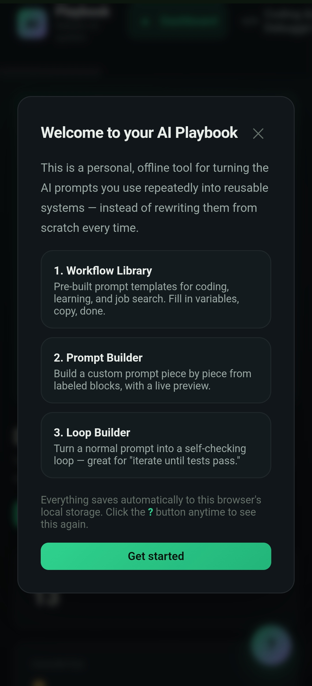
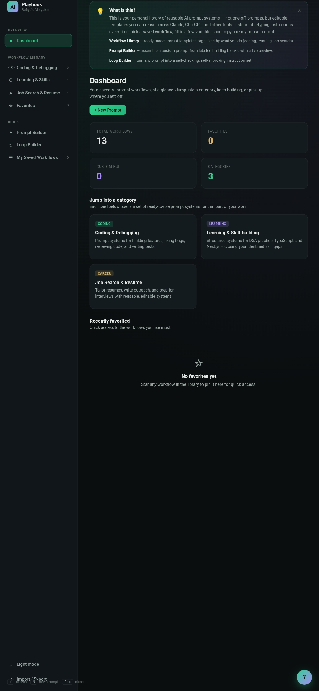
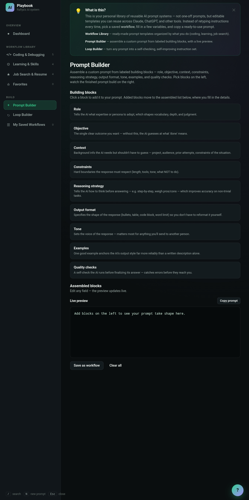
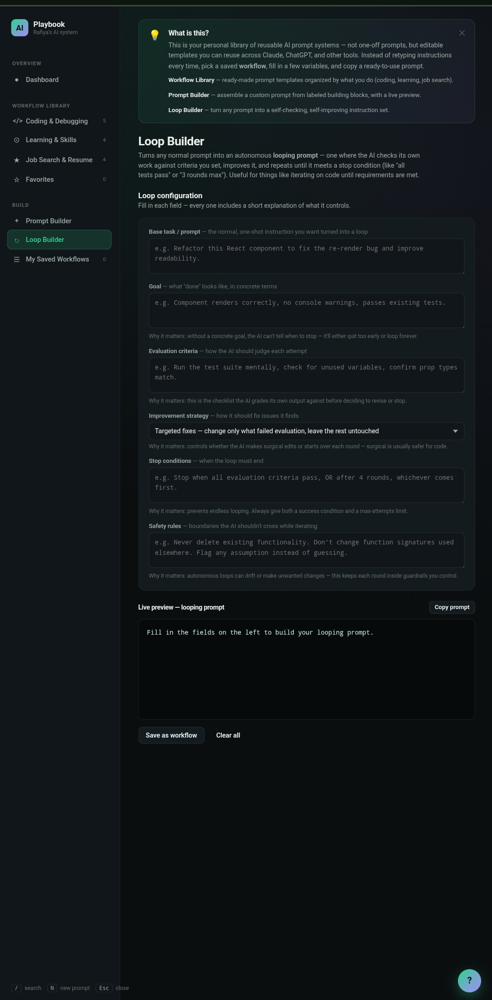
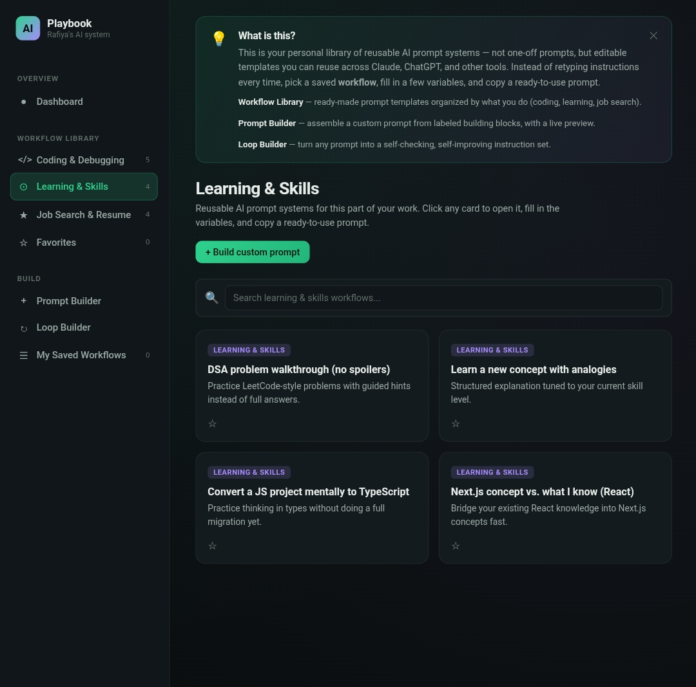

# Day 49 – Personal AI Playbook

## 📌 Overview

Today I built my **Personal AI Playbook**, a reusable prompt management system that transforms repetitive AI prompts into organized, reusable workflows.

Instead of writing prompts from scratch every time, this application helps create, organize, save, favorite, search, and export AI workflows for different use cases such as Coding, Learning, and Job Search.

The project also includes a visual Prompt Builder and Loop Builder for creating structured prompts and self-improving prompt loops.

---

## 🚀 Objective

Build a personal AI prompt management system that allows users to:

- Store reusable prompt workflows
- Build prompts block-by-block
- Convert prompts into autonomous improvement loops
- Organize prompts by category
- Search and favorite workflows
- Export workflows for backup

---

# ✨ Features

## 🏠 Dashboard

- Workflow statistics
- Category overview
- Favorite workflows
- Recent activity
- Quick navigation

---

## 📚 Workflow Library

Organized prompt collections for:

- Coding & Debugging
- Learning & Skills
- Job Search & Resume

Each workflow can be:

- Opened
- Edited
- Favorited
- Reused
- Searched instantly

---

## 🧩 Prompt Builder

Build prompts visually using reusable blocks.

Available blocks include:

- Role
- Objective
- Context
- Constraints
- Reasoning Strategy
- Output Format
- Tone
- Examples
- Quality Checks

Live preview updates while building the prompt.

---

## 🔄 Loop Builder

Transform ordinary prompts into autonomous AI loops.

Configuration includes:

- Base prompt
- Goal
- Evaluation criteria
- Improvement strategy
- Stop conditions
- Safety rules

Ideal for iterative prompt refinement and self-checking AI workflows.

---

## ⭐ Workflow Management

- Save custom workflows
- Favorite important prompts
- Search workflow library
- Organize by category

---

## 💾 Export & Backup

Export the complete workflow library as a JSON backup file for portability and recovery.

---

# 🛠 Tech Stack

- HTML5
- CSS3
- JavaScript (Vanilla)
- LocalStorage
- Responsive UI
- Dark Theme

---

# 📷 Project Screenshots

## Welcome Screen

## Dashboard

## Learning & Skills Library

## Prompt Builder

## Loop Builder

---

# 🎯 Key Learnings

- AI prompts become significantly more useful when converted into reusable systems instead of one-off instructions.
- Structured prompt components improve consistency and output quality.
- Prompt libraries save time for repetitive workflows.
- Loop-based prompting enables iterative refinement without manually rewriting prompts.
- Organizing prompts by category makes AI workflows easier to manage and scale.
- Local storage and export functionality provide a lightweight, offline-first workflow management experience.

---

# ✅ Outcome

Successfully created a reusable **Personal AI Playbook** that centralizes AI workflows, supports modular prompt engineering, enables autonomous prompt refinement through loops, and provides exportable backups for long-term productivity.

---
