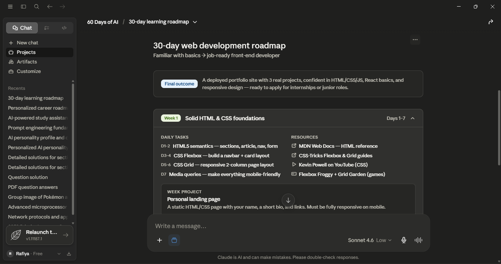
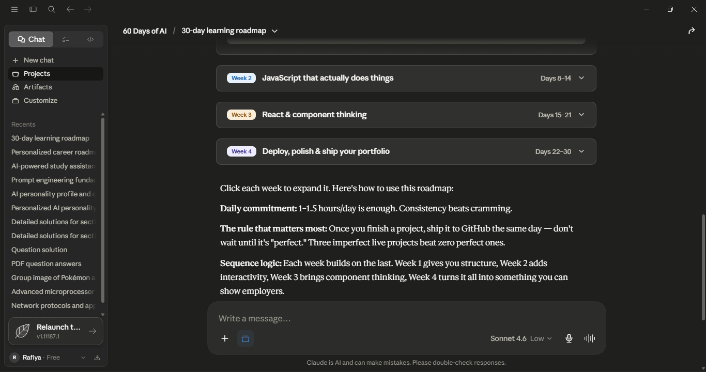
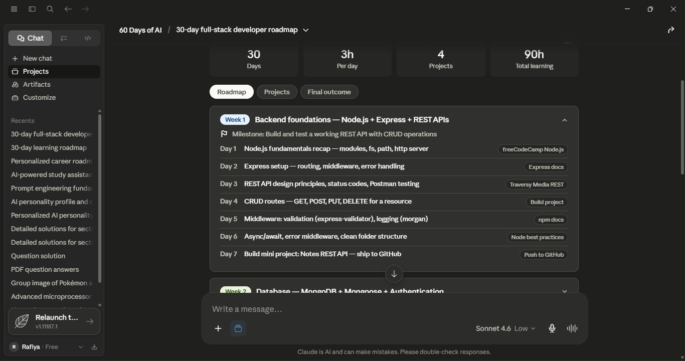
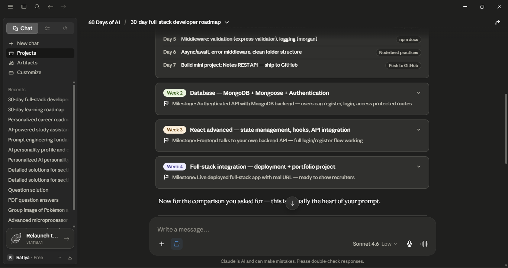
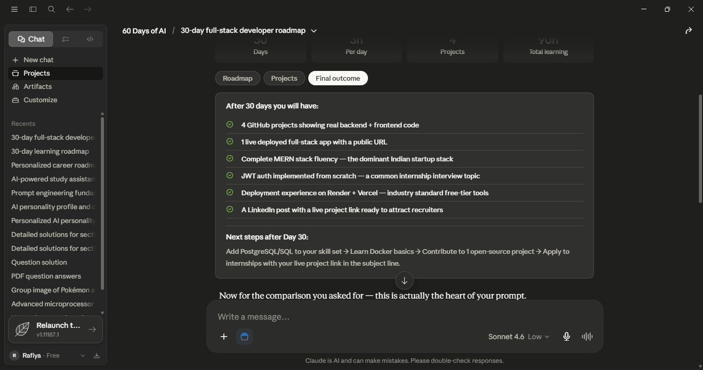

# Day 5 – Context Engineering

## Objective

Understand how Context Engineering improves AI outputs by providing relevant background information, constraints, and user-specific details.

---

## Prompt A (Without Context)

### Prompt Used

Create a 30-day learning roadmap.

Include:
- Weekly milestones
- Daily tasks
- Resources
- Projects
- Final outcome

Make it practical and beginner-friendly.

### Output

[Paste Claude's output here]

### Screenshot

---

## Prompt B (With Context)

### Prompt Used

Create a 30-day learning roadmap.

Context:
- Current Situation: Engineering Student
- Current Skills: HTML, CSS, JavaScript, React, Git, GitHub, Basic Node.js, Basic MongoDB
- Goal: Become a Full-Stack Developer and build industry-ready projects for internships and placements
- Available Time: 3 Hours per Day
- Experience Level: Intermediate
- Preferred Learning Style: Projects + Videos

Include:
- Weekly milestones
- Daily tasks
- Resources
- Projects
- Final outcome

Make it practical and beginner-friendly.

### Output

[Paste Claude's output here]

### Screenshot

---

## Comparison

### Prompt Used

Compare both outputs and identify:

Which roadmap feels more personalized?
Which roadmap would you actually follow?
What role did context play in improving the result?

###Output

| Aspect          | Prompt A          | Prompt B                         |
| --------------- | ----------------- | -------------------------------- |
| Personalization | Generic           | Highly personalized              |
| Relevance       | Broad suggestions | Tailored recommendations         |
| Detail Level    | Limited           | More detailed and specific       |
| Actionability   | General advice    | Practical steps based on context |

## Comparison & Analysis

### 1. Which roadmap feels more personalized?

The roadmap generated using Prompt B feels significantly more personalized because it considers my current skills, learning goals, available study time, and preferred learning style. The roadmap aligns with my objective of becoming a Full-Stack Developer and preparing for internships.

### 2. Which roadmap would you actually follow?

I would follow the roadmap generated from Prompt B because it is tailored to my background and constraints. The tasks are more relevant, realistic, and directly connected to my career goals.

### 3. What role did context play in improving the result?

Context helped the AI understand my situation and generate a roadmap specifically designed for me. Instead of giving generic learning advice, it provided targeted recommendations, appropriate projects, and a realistic schedule. This made the roadmap more actionable, practical, and useful.

---

## Key Learnings

1. Context significantly improves response quality.
2. AI produces more relevant and actionable outputs when given specific information.
3. Personalized prompts reduce ambiguity and increase accuracy.
4. Context Engineering is one of the most effective ways to improve AI-generated results.
5. The same AI model can produce very different outputs depending on the context provided.

---

## Biggest Insight

Providing detailed context transforms AI from giving generic answers into delivering personalized, practical, and high-value recommendations. The quality of the output depends heavily on the quality of the context supplied.
