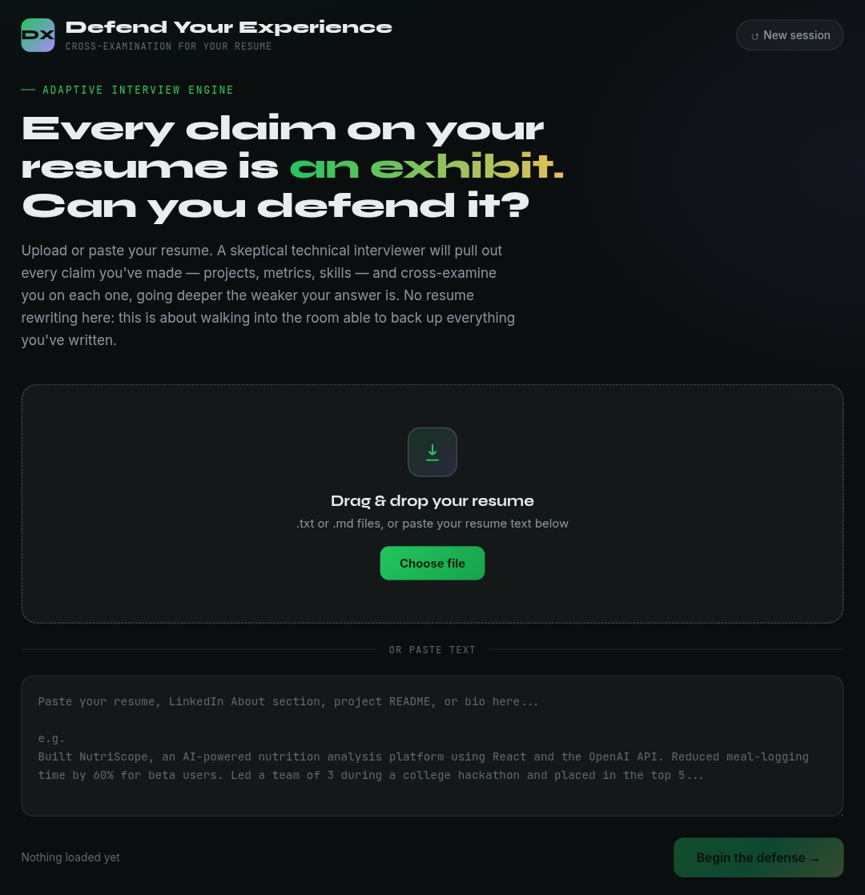

# Day 50 – Defend Your Experience

## 🚀 Challenge Overview

Today's challenge was to build and test **Defend Your Experience**, an AI-powered interview preparation application that goes beyond resume optimization. Instead of improving the resume, it challenges every claim made in it through an AI-driven cross-examination, helping users confidently defend their real experience during interviews.

---

## 🎯 Objective

Create an AI application that:

- Uploads or accepts pasted resume/portfolio content.
- Extracts important experience claims.
- Conducts AI-powered interview cross-examination.
- Evaluates the strength of each response.
- Generates a detailed Defense Report.
- Helps users identify weak interview answers before actual interviews.

---

## 🛠️ Tech Stack

- HTML5
- CSS3
- Vanilla JavaScript
- Claude API
- Local Storage
- Responsive UI
- Dynamic Report Generation

---

## ✨ Key Features

- 📄 Resume / Portfolio Upload
- 🧠 AI Claim Extraction
- 🎤 Interactive Mock Interview
- 📊 Live Confidence Scoring
- 📈 Progress Tracking
- 📑 Defense Report Generator
- 💾 Session History
- 📤 Export Defense Report
- 📱 Responsive Design

---

## 📚 Learning Outcomes

This project helped me understand:

- How AI can simulate real interview scenarios.
- Designing conversational AI workflows.
- Structuring multi-step interview interactions.
- Confidence scoring based on user responses.
- Building report-generation systems.
- Creating professional interview preparation tools.

---

## 📷 Project Screenshots

### 1️⃣ Upload Screen

---

## 💡 Key Takeaways

- Every resume claim should be defendable.
- Metrics and project ownership matter during interviews.
- AI can effectively simulate technical interview pressure.
- Practice improves confidence and communication.
- Honest experience backed with specifics is stronger than exaggerated achievements.

---

## 🎯 Final Thoughts

Day 50 focused on preparing for interviews in a practical way. Instead of editing resumes, this application challenged me to explain and defend every project, achievement, and technical decision. It highlighted weak areas, encouraged deeper preparation, and reinforced the importance of clear, evidence-based communication.

---
