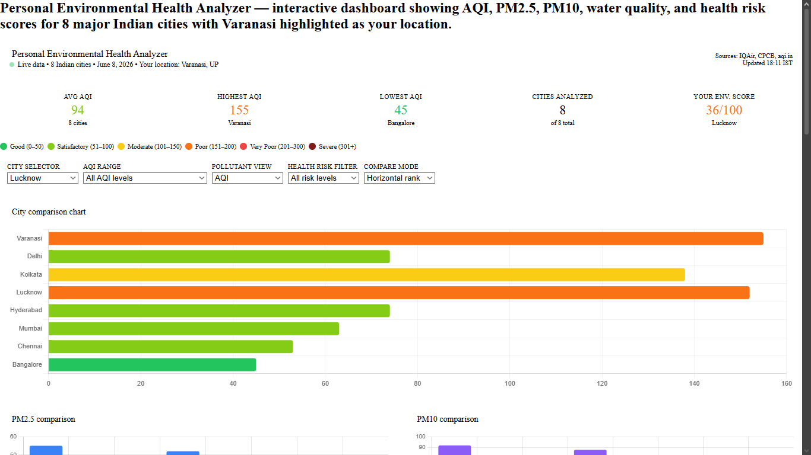
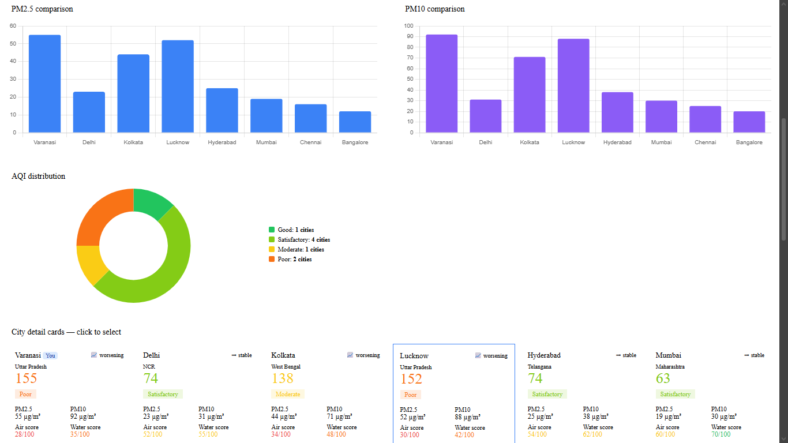
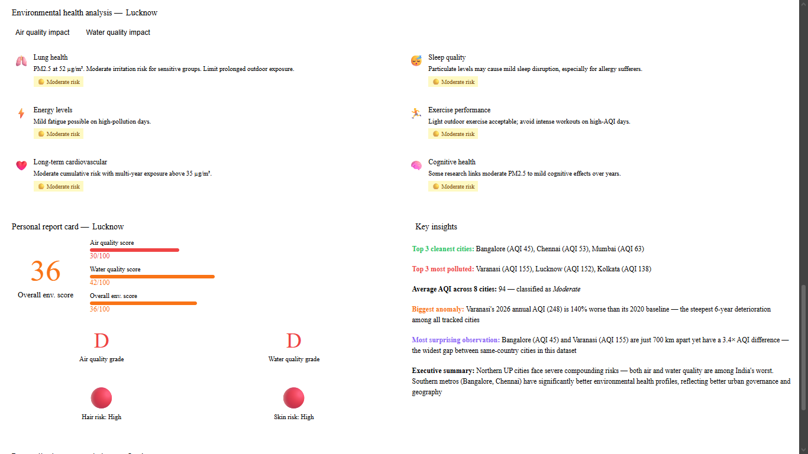

# Day 8 – Environmental Health Analyzer Dashboard

## Objective

Build an interactive Environmental Health Analyzer dashboard using Claude, generate a downloadable HTML application, test its functionality, and document the learning process.

## Tools Used

* Claude AI
* HTML, CSS, JavaScript
* Git & GitHub

## What I Built

I used Claude to generate an Environmental Health Analyzer Dashboard that allows users to:

* Visualize environmental health data
* Filter records using interactive controls
* Analyze trends through charts and graphs
* Explore insights through a user-friendly interface
* Interact with dynamically updated visualizations

## Features

* Interactive Dashboard
* Data Filtering Options
* Health & Environmental Metrics Visualization
* Responsive Design
* Downloadable Standalone HTML Application
* Real-Time Chart Updates

## Screenshots

### Dashboard Overview

### Interactive Charts

### Filter Functionality

## Testing Performed

### Dashboard Loading

* Successfully loaded in browser
* No rendering issues observed

### Filters

* Verified all filters update data correctly
* Confirmed dynamic chart refresh

### Charts

* Visualizations rendered properly
* Data updates reflected instantly

## Key Learnings

1. AI can generate complete interactive web applications from detailed prompts.
2. Well-structured prompts lead to more accurate and feature-rich outputs.
3. HTML applications can be created and tested without a backend.
4. Interactive dashboards improve data exploration and decision-making.
5. Claude can accelerate rapid prototyping and dashboard development.

## Challenges Faced

* Understanding the generated code structure.
* Testing multiple dashboard interactions.
* Organizing project files for GitHub submission.

## Outcome

Successfully generated, tested, documented, and uploaded an Environmental Health Analyzer Dashboard using Claude. The project demonstrated how AI can assist in building practical data visualization tools with minimal development effort.

