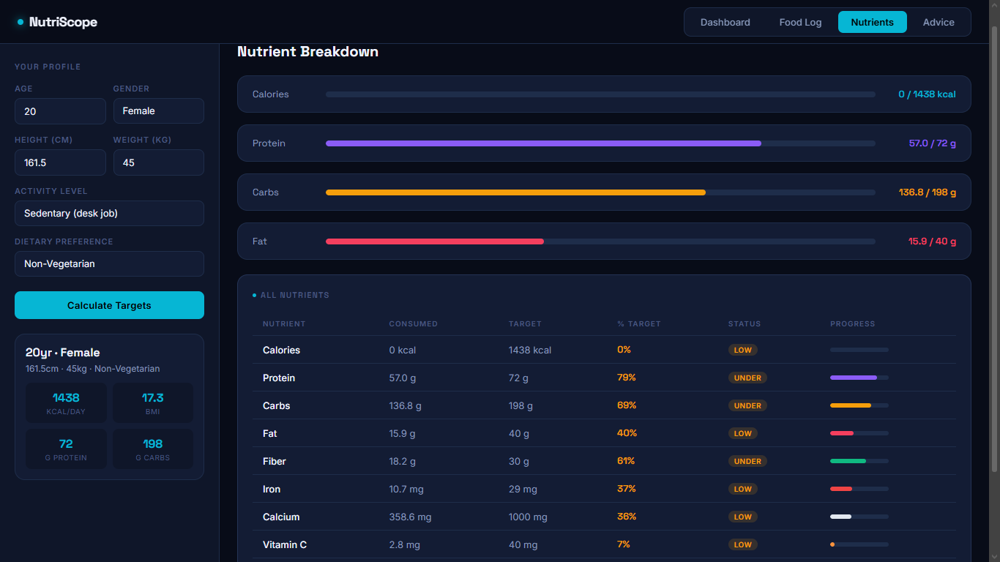
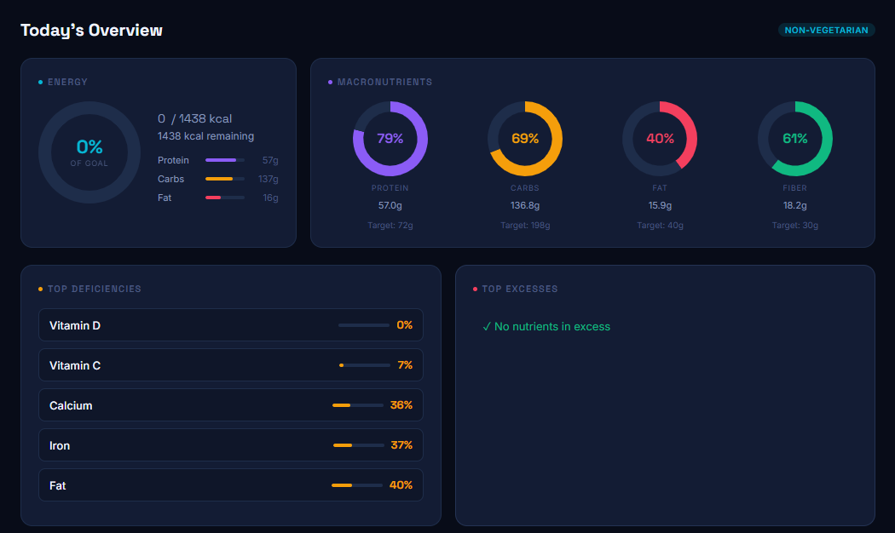
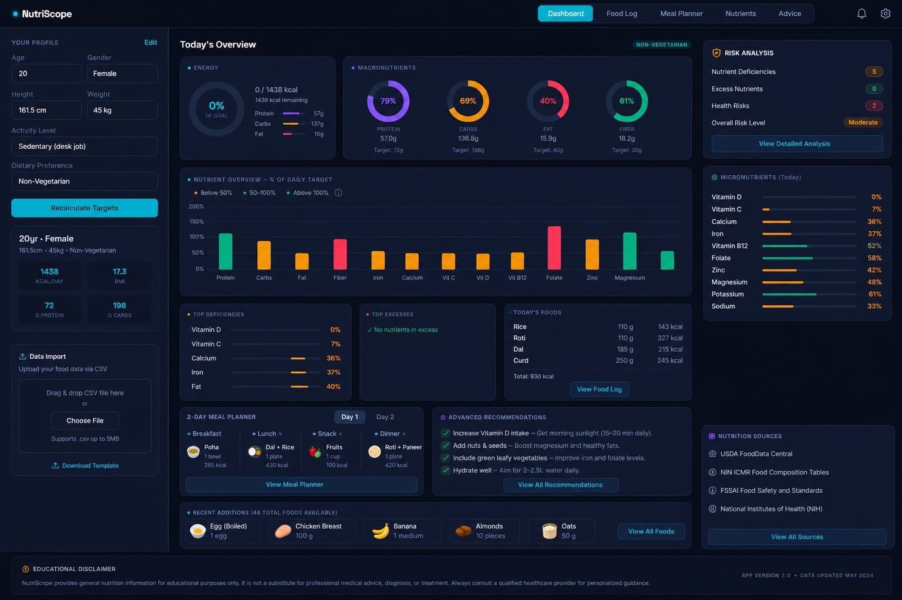
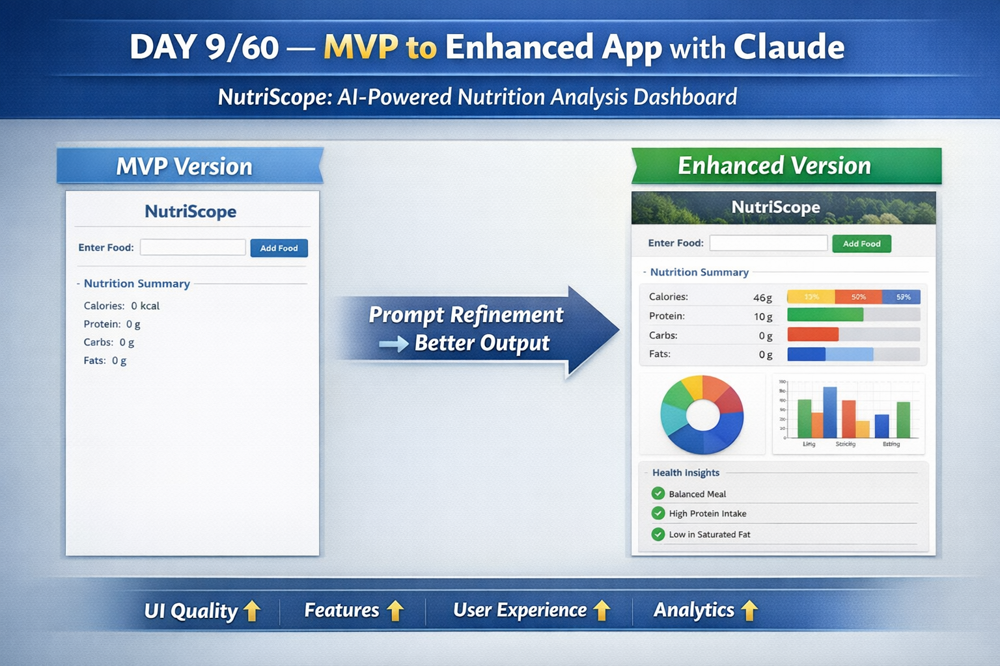

# Day 9 – NutriScope: From MVP to Enhanced AI-Generated Application

## Objective

The goal of this exercise was to build **NutriScope**, a nutrition analysis web application, using Claude AI. The project began with a Minimum Viable Product (MVP) generated from an initial prompt and was later enhanced using a refinement prompt to improve functionality, design, and user experience.

This activity demonstrated how iterative prompting can transform a basic prototype into a more polished and feature-rich application.

---

# Application Screenshots

## 1. NutriScope MVP Version

**Description:**
The MVP version focuses on core functionality, allowing users to input food-related information and view basic nutritional data. The interface is simple and functional, making it a good starting point for rapid prototyping.

---

## 2. NutriScope Enhanced Version

**Description:**
The enhanced version introduces a more polished user interface, improved visualizations, better responsiveness, and additional nutritional insights. It demonstrates how prompt refinement can significantly improve application quality.

---

## 3. Side-by-Side Comparison (Recommended)

**Description:**
A side-by-side comparison clearly highlights the improvements in design, usability, analytics, and overall user experience between the two versions.

---

# Comparison Notes

## MVP Version

### Features

* Basic nutrition calculator
* Food input functionality
* Nutrient information display
* Simple layout and navigation
* Minimal styling and visual elements

### Strengths

* Quickly generated using AI
* Functional proof of concept
* Easy to understand and modify
* Demonstrates the core application workflow
* Suitable for rapid prototyping

### Limitations

* Basic user interface
* Limited nutritional insights
* Minimal visual feedback
* Lack of advanced analytics
* Few interactive elements

---

## Enhanced Version

### Features

* Modern and improved user interface
* Advanced nutrition analytics
* Interactive charts and visualizations
* Better data presentation
* Responsive design for different screen sizes
* Enhanced user experience
* Additional recommendations and insights

### Improvements Over MVP

| Area            | MVP Version | Enhanced Version      |
| --------------- | ----------- | --------------------- |
| User Interface  | Basic       | Modern & polished     |
| Analytics       | Limited     | Advanced insights     |
| Visualizations  | Minimal     | Interactive charts    |
| User Experience | Functional  | Engaging & intuitive  |
| Responsiveness  | Basic       | Mobile-friendly       |
| Overall Quality | Prototype   | Near production-ready |

### Key Enhancements

* Improved visual appeal
* Better organization of information
* Increased interactivity
* Enhanced usability
* More professional presentation
* Greater scalability for future development

---

# Key Learnings

### 1. AI Accelerates Prototyping

Claude can generate a functional web application within minutes, significantly reducing development time for initial prototypes.

### 2. Iterative Prompting Improves Results

The quality of the application improved substantially after refining the prompt and providing additional requirements.

### 3. Prompt Engineering Matters

Well-structured prompts lead to better outputs, cleaner code, and more useful features.

### 4. UI/UX Can Be Enhanced Through Refinement

The enhanced version demonstrated how AI can improve design, usability, and user engagement through iterative development.

### 5. AI Supports End-to-End Development

Claude was able to generate HTML, CSS, and JavaScript components, enabling the creation of a complete web application.

### 6. Comparison Helps Identify Improvements

Evaluating multiple versions makes it easier to understand the impact of prompt changes and identify areas for further enhancement.

### 7. AI Works Best as a Development Partner

Rather than replacing developers, AI acts as a powerful collaborator that accelerates ideation, prototyping, and refinement.

---

# Biggest Insight

The most valuable takeaway from this exercise was understanding the power of **iterative AI-assisted development**.

The first prompt generated a working MVP that successfully demonstrated the core concept of NutriScope. However, the second prompt transformed the application into a significantly more polished and user-friendly product with improved design, analytics, and usability.

This experience reinforced an important lesson:

> **The quality of AI-generated applications is directly influenced by the quality of prompts and the refinement process.**

Small improvements in prompting can lead to substantial improvements in the final product.

---

# Reflection

This exercise highlighted how AI can dramatically accelerate the software development lifecycle—from idea generation and prototyping to enhancement and refinement.

By leveraging Claude effectively, it was possible to move from a simple concept to a more sophisticated application in a fraction of the time required for traditional development.

The transition from MVP to Enhanced Version clearly demonstrated the importance of experimentation, iteration, and prompt engineering when building AI-assisted applications.

---
