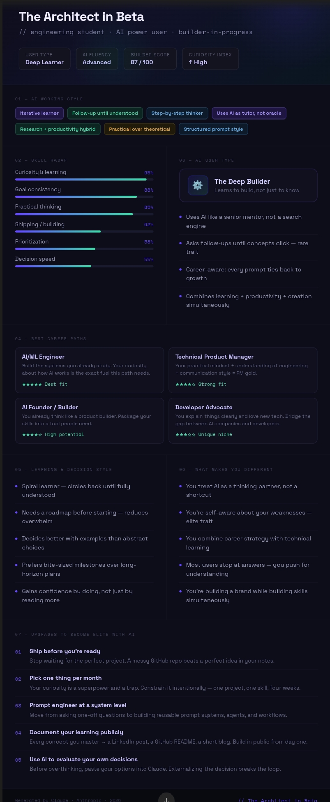

# 60-Days-Claude-Challenge

## About Me

Hi, I'm Rafiya, an engineering student passionate about AI, software development, and emerging technologies.

## Why I'm Doing This Challenge

I want to:

- Improve my AI skills
- Learn prompt engineering
- Build real-world projects
- Document my growth publicly
- Become a better software engineer

## Day 1: AI Personality Profile

### AI Title
**The Architect in Beta**

### AI User Type
Deep Builder

### Key Traits

- Iterative learner
- Research + productivity hybrid
- Structured thinker
- Practical problem solver
- High curiosity

### Best Career Paths

1. AI/ML Engineer
2. Technical Product Manager
3. AI Founder / Builder
4. Developer Advocate

### Growth Areas

- Ship projects faster
- Focus on one skill at a time
- Build reusable AI workflows
- Document learning publicly

## Day 1 Assets

### AI Personality Profile

### AI Portrait

#60DayClaudeChallenge
